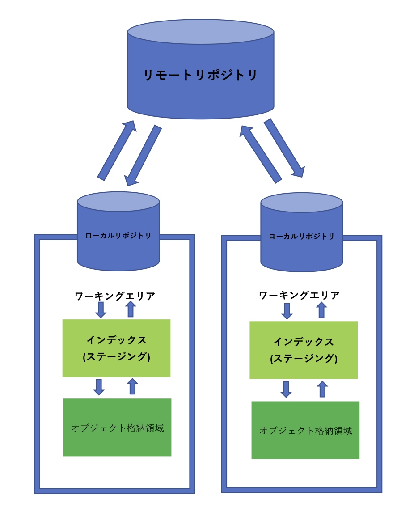

# Section-1. Gitとは

Gitとはバージョン管理システムの１つです。  
バージョン管理システムとはファイルやフォルダに対して時間と共に加えられていく変化を  
記録・管理するもので、あとで特定のバージョンに戻すことや修正の履歴を見ることができるシステムです。  
さらにGitは分散型のバージョン管理システムであり、  
リモートリポジトリと呼ばれる場所で管理されているファイルやフォルダを、  
作業を行うPC内のローカルリポジトリと呼ばれる場所にコピーしてくることで、  
万が一リモートリポジトリが故障したとしても、リカバリーできるという特徴を持っています。  



## 1-1 Gitを始める

gitローカルリポジトリを作るには

### ・既存のリモートリポジトリをコピーしてくる(クローン)
### ・git initコマンドを使う

の二通りの方法があります。  
リモートリポジトリがないため、まずgit initでローカルリポジトリを作成してます。  
新しくフォルダを作成し、そのフォルダ内でgit initを行います。  

```
$ mkdir git-training
$ cd git-training
$ git init
$ ls -a
. .. .git
```

git initを行うことで.gitという隠しフォルダが生成されました。  
この.gitフォルダが存在するフォルダがGitリポジトリとして管理されます。  
逆に言えば、この.gitフォルダを削除することで、フォルダは管理対象から外されます。  

## 1-2 リモートリポジトリの作成

次にリモートリポジトリを作成し、先ほど作成したローカルリポジトリを同期してみましょう。  
今回はリモートリポジトリとして、 *Bitbucket*を利用します。以下のURLにアクセスし、  
アカウント、リポジトリを作成しましょう。

<https://bitbucket.org/>

作成できたら、以下のコマンドで登録を行います。  

```
$ git remote add origin https://stone-shun-oyama@bitbucket.org/stone-shun-oyama/git-training.git
```

これでリモートリポジトリの場所(URL)をoriginという名前でGitに記録させることができました。  

ローカルリポジトリの内容をリモートリポジトリにアップロードする際に、リモートリポジトリの場所(URL)を指定しなければならないのですが、  
この設定によって、URLとoriginという文字列を紐づけてくれるため、毎度URLを直接指定しなくても済むようになります。  

## 1-3 gitの設定

gitではリポジトリに変更を加えた人物を特定するために、ユーザーの名前やメールアドレスを用います。  
Gitにおける様々な共通情報を設定するgit configコマンドを用いて設定しましょう。  

```
$ git config user.email "メールアドレス"
$ git config user.name "ユーザ名"
```

※ gitでは複数の場所(ファイル)にユーザの設定値を設定しています。  

### ・/etc/gitconfig: システム上の全てのユーザの設定 → "git config --system"

### ・~/.gitconfig: ユーザごとの設定 → "git config --global"

### ・.git/config: リポジトリごとの設定 → "git config"

優先度はシステム<ユーザ<リポジトリとなり、優先度の高いものの設定で上書きされます。  


### 補足)

実際のプロジェクトでは既存のリモートリポジトリをクローンして開発に加わることがほとんどです。  
既存のリモートリポジトリのクローンは以下のコマンドで実行できます。  

```
$ git clone <url> // コマンドを実行した時点のカレントディレクトリ配下に、プロジェクトのフォルダが作成される。
```
