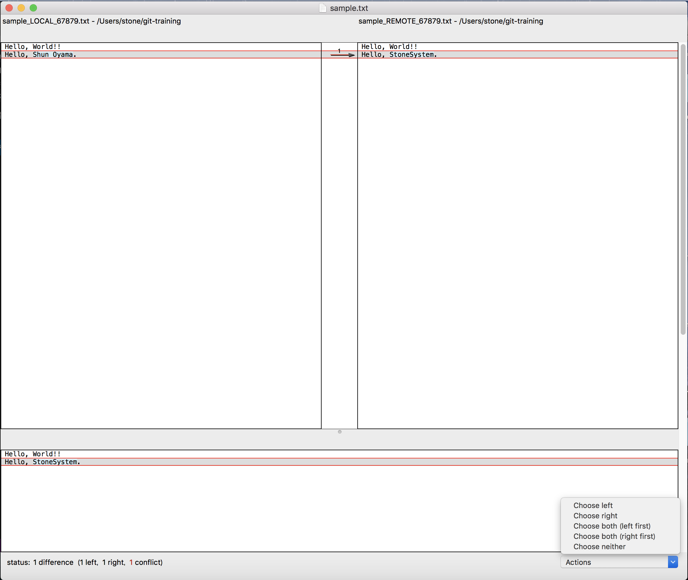

# Section-3. ブランチ

## 3-1 作業用ブランチの作成

すでにSection2でも紹介したように、gitではブランチ(branch)という仕組みによって変更履歴を分岐させ、  
作業を分担して進めることができます。  

今までは練習のため、masterブランチで作業を行ってきましたが、  
実際の開発ではmasterにそのまま変更を加えて行くことはせず、各作業ごとにbranchを切り、  
節目ごとにその変更をmasterに*merge(統合)*することで開発を進めて行きます。 

まずは、新しくブランチを作成してみましょう。  
git branchコマンドでブランチの作成・確認が行えます。  

```
$ git branch dev
$ git branch // 現在のブランチの確認
  dev
* master
```

ブランチを切り替えるには*チェックアウト(checkout)*という操作を行います。(インデックスの変更をワーキングエリアにコピーする動作と混同しないようにしましょう。)  

```
$ git checkout dev
Switched to branch 'dev'
$ git branch
* dev
  master
$ git push -u origin dev // リモートにdevブランチを作成
```

[](TODO: HEADの説明)

この状態でsample.txtに変更を加えコミットすると、devブランチの方にコミットされます。

```
$ touch sample-3.txt // 何らかの変更を加える
$ git add . // ディレクトリ内変更を全てインデックスに加える
$ git commit -m "sample-3.txtの追加"
$ git log --graph // --graphオプションをつけることでグラフィカルな表示に
```

## 3-2 ブランチのmerge

あるブランチに加えた変更を別のブランチに取り込むことを*merge(統合)*と呼びます。  
先ほどdevブランチに加えた変更をmasterブランチに取り込んでみましょう。  

```
$ git checkout master // masterブランチにcheckoutする
$ git merge dev
Merge made by the 'recursive' strategy.
 sample-3.txt | 0
 1 file changed, 0 insertions(+), 0 deletions(-)
 create mode 100644 sample-3.txt
$ git log --graph // mergeもひとつのコミットになっている。
```

ここで、ブランチごとに同じファイルの同じ部分へ別々の変更を加えていた場合はどうなるでしょう?  
masterブランチでsample.txtの一番最初の行へ変更を加えた後に、  
devブランチをcheckoutして同じ行に変更を加え、２つのブランチをmergeしてみましょう。  

```
$ vi sample.txt // sample.txtの編集
$ git add sample.txt
$ git commit -m "masterでの変更"
$ git checkout dev
$ vi sample.txt // masterブランチで変更した箇所を変更
$ git add sample.txt
$ git commit -m "devでの変更"
$ git checkout master
$ git merge dev
Auto-merging sample.txt
CONFLICT (content): Merge conflict in sample.txt
Automatic merge failed; fix conflicts and then commit the result.
```

*conflict(競合)*が発生しました。  
２つのブランチでの変更のどちらを反映すれば良いのか、git側では判断できないためです。  
git statusコマンドでconflictが起きたFileを確認することができます。  

```
git status
On branch master
Your branch is ahead of 'origin/master' by 2 commits.
  (use "git push" to publish your local commits)

You have unmerged paths.
  (fix conflicts and run "git commit")
  (use "git merge --abort" to abort the merge)

Unmerged paths:
  (use "git add <file>..." to mark resolution)

	both modified:   sample.txt  //  conflictが発生したファイル

no changes added to commit (use "git add" and/or "git commit -a")
```

また、この時点でsample.txtを開いてみると、記述した覚えのない行が追加されています。

```
<<<<<<< HEAD
// masterでの変更
=======
// devでの変更
>>>>>>> dev
```

これは、conflictが起きた部分に対してgitが自動で付加した行です。  
上が現在のブランチの変更、下がmergeしたブランチの変更です。  
この状態でcommitを行おうとするとエラーになります。  

```
$ git commit -m "Conflict"
U	sample.txt
error: Committing is not possible because you have unmerged files.
hint: Fix them up in the work tree, and then use 'git add/rm <file>'
hint: as appropriate to mark resolution and make a commit.
fatal: Exiting because of an unresolved conflict.
```

Conflictを解決するには以下の手段があります。

#### ・手動で該当箇所を修正する  
#### ・git mergetoolを使用する  

今回はgit mergetoolを用いて解決を行ってみましょう。  
コンソールでgit mergetoolを用いると、設定されているmergetoolでconflictの解決を行います。  
(macのデフォルトでは、opendiffが開きます。)  

```
$ git mergetool

This message is displayed because 'merge.tool' is not configured.
See 'git mergetool --tool-help' or 'git help config' for more details.
'git mergetool' will now attempt to use one of the following tools:
opendiff tortoisemerge emerge vimdiff
Merging:
sample.txt

Normal merge conflict for 'sample.txt':
  {local}: modified file
  {remote}: modified file
Hit return to start merge resolution tool (opendiff): // Enter
```

### opendiffの操作画面


conflictの解決ができたら改めてcommitを行います。  

```
git commit // すでにcommitメッセージが編集されており、conflictがおきたファイルの情報などが記載されている。
git push // リモートへ反映
```

・ 注意  
conflictが発生した状態でgit addを行ってしまうと、gitが付加した部分まで変更とみなされてしまうため、  
注意が必要です。(git mergetoolも使えなくなります)

[](TODO: pullの補足)

## 3-3 リベース

2つのブランチを統合する方法はmergeの他に*リベース(rebase)*と呼ばれる操作があります。  
この操作はrebaseの対象となるコミットの内容をrebase先のコミットの上にコピーしてコミットし、  
対象のコミットは削除するという動作になります。  

devブランチとmastetブランチでconflictが起きないようにsample.txtに変更を加えた後、  
devブランチのコミットをmasterブランチの最新コミットにrebaseしてみましょう。  

```
$ vi sample.txt // 何らかの変更を加える。(テキストファイルの編集でなくても良い。)
$ git add sample.txt
$ git commit "masterでの変更"
$ git checkout dev
$ vi sample.txt // 何らかの変更を加える。(テキストファイルの編集でなくても良い。)
$ git add sample.txt
$ git commit -m "devでの変更"
$ git rebase master dev // チェックアウトせずに実行できる
$ git log --graph
```

logからも確認できるようにdevブランチのコミットの親がmasterブランチの最新のコミットになっていることが確認できます。  

rebaseを行うことで、煩雑になりがちなmergeの履歴をキレイにすることはできますが、  
注意点として、一度リモートにpushしたコミットをrebaseすることは絶対にしてはいけません。  
自分がリモートにpushしたコミットを誰かが取得して作業した場合に、  
自分がそのコミットをrebaseしてしまうと、rebase前のコミットが消滅してしまうため、混乱が起きます。  

rebaseはあくまでもローカルでのコミットをきれいにするための手段として捉え、  
まだ公開していないコミットのみに行うようにしましょう。  

rebaseもmergeと同様にconflictが起こる可能性があります。  
rebaseではconflictの解消後の操作がmergeの場合と若干異なります。  
先ほどと同じようにdev,masterに変更を加えrebaseしてみましょう。  

```
$ vi sample.txt // 何らかの変更を加える。
$ git add sample.txt
$ git commit "masterでの変更"
$ git checkout dev
$ vi sample.txt // 何らかの変更を加える。
$ git add sample.txt
$ git commit -m "devでの変更"
$ git rebase master dev
First, rewinding head to replay your work on top of it...
Applying: masterでの変更
Using index info to reconstruct a base tree...
M	sample.txt
Falling back to patching base and 3-way merge...
Auto-merging sample.txt
CONFLICT (content): Merge conflict in sample.txt
error: Failed to merge in the changes.
Patch failed at 0001 masterでの変更
The copy of the patch that failed is found in: .git/rebase-apply/patch

Resolve all conflicts manually, mark them as resolved with
"git add/rm <conflicted_files>", then run "git rebase --continue".
You can instead skip this commit: run "git rebase --skip".
To abort and get back to the state before "git rebase", run "git rebase --abort".
```

rebaseでconflictが起きた場合は、  
まず、該当箇所のcoflictを解消した後、  
それらのファイルをaddしてからgit rebase --continueを行います。  

```
git mergetool
git add .
git rebase --continue
```