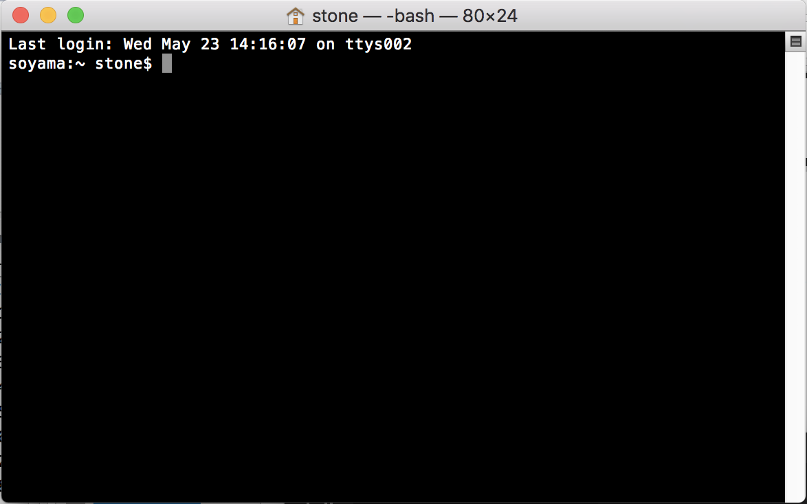

# Terminal研修

## CUI(CommandLine User Interface)について

普段PCを操作するときにはマウスポインタ、Finder、各種アプリケーションなど<br>
GUI(Graphical User Interface)と呼ばれる操作体系を用いた操作がほとんどだと思います。<br>
<br>
しかし、PCの黎明期にはマウスなどの装置はなく、PCへの主要な命令は全てキーボードから行っていました。<br>
キーボード入力のみでPCを操作する操作体系をCUI(CommandLine User Interface)と呼びます。<br>
<br>
現代でも開発の分野ではCUIでのPC操作は広く行われています。<br>

## CUIでPCを操作してみる

CUIでPCを操作するには、Macの場合はTerminalというアプリケーションを利用します。<br>
これはMacPCにデフォルトで入っているアプリケーションのひとつです。<br>
<br>
Launchpad > その他 > ターミナル<br>
<br>
でターミナルを開いてみましょう。<br>
このような画面が表示されるはずです。<br>



この画面に色々なコマンドを入力することでPCに様々な命令を行うことができます。<br>
※ Terminalは実際には<font color="red">シェル</font>と呼ばれるプログラムを起動し、それを介してPCに命令を出しています。以下で紹介するコマンドや機能は実際には<font color="red">bash</font>というシェルの機能です。<br>

## lsコマンド

Terminalを開いた時点ではFinderでHomeを表示している状態と同じ状態です。<br>
この状態で

```
$ ls
```

と入力してみましょう。<br>
Homeの中にあるファイルやフォルダの名前が表示されたと思います。<br>
*lsコマンド*は現在開いているフォルダ(ディレクトリ)の内容を表示するコマンドです。<br>
<br>
コマンドの後に`'-(ハイフン)' + 特定の文字`を続けると、デフォルトの機能を拡張した動作を行わせることができます。(<font color="red">オプション</font>)
lsコマンドでよく用いるオプションには以下のようなものがあります。<br>

```
$ ls -l // 通常のファイルやディレクトリの詳細も一緒に表示
$ ls -a // '.(ピリオド)'から始まる隠しファイルや隠しディレクトリも表示
$ ls -R // ディレクトリの内容を再起的に表示
$ ls -X // 拡張子のアルファベット順に表示
$ ls -la // 隠しファイルや隠しディレクトリの詳細も一緒に表示
```

## touchコマンド

新たにファイルを作成するためには<font color="red">touchコマンド</font>が使えます。<br>

```
$ touch <ファイル名>
```

lsコマンドで確認してみるとファイルが作成されていることがわかると思います。<br>

## mkdirコマンド

フォルダを作成するためには<font color="red">mkdirコマンド</font>を用います。<br>

```
$ mkdir <フォルダ名>
```

こちらもlsコマンドで確認してみるとファイルが作成されていることがわかると思います。<br>

### 補足)ファイルの情報

`ls -l`を利用してファイル情報を確認すると、名前の他に様々な情報が付加されて表示されます。<br>

```
$ ls -l
-rw-r--r-- 1 root root   11 Dec 23 13:11 a.txt
drwxr-xr-x 3 root root 4096 Dec 23 13:24 test
```

半角空白ごとにセクションが分かれており、最初のセクションはファイルの種類・権限情報となります。<br>
これは1桁目、2~4桁目、5~7桁目、8~10桁目がそれぞれセットになっており、以下のような対応となっています。<br>

|  キー | 動作 |
|  ------ | ------ |
|  1桁目 | ファイルの種類(-: 通常ファイル、d: ディレクトリ など)  |
|  2~4桁目 | 所有者に対する権限。2桁目は読出し権限、4桁目は書込み権限、5桁目は実行権限 |
|  5~7桁目 | 所有グループに対する権限。(読み方は2~4桁目と同じ)|
|  8~10桁目 | 所有者・所有グループ以外に対する権限。(読み方は2~4桁目と同じ)|

また、2つ目のセクションはハードリンク数、3つ目、4つ目のセクションは所有者、所有グループを示し、<br>
5つ目はファイルサイズ、6~8つ目は更新日時を示しています。<br>
<br>
開発現場ではファイルの所有権などは特に重要な情報となるので、ファイル情報の読み方は覚えておくようにして下さい。<br>

## lessコマンド

ファイルの内容を確認するためには<font color="red">lessコマンド</font>が使えます。<br>

```
$ less <ファイル名>
```

これでファイルの内容を表示できましたが、画面の様子が違うと思います。<br>
lessコマンドでファイルを開いた場合は通常のTerminal操作とは別の操作方法となり、<br>
基本的な操作は以下の表のようになります。<br>

|  キー | 動作 |
|  ------ | ------ |
|  スペース or f | 1ページ分下にスクロール |
|  b | 1ページ分上にスクロール |
|  g | ファイルの先頭に移動 |
|  Shift + g | ファイルの最後に移動 |
|  q | 終了 |
|  /(pattern) | 下方検索 |
|  ?(pattern) | 上方検索 |
|  n | 検索結果の次のマッチへ |
|  N | 検索結果の前のマッチへ |

qで終了することができます。<br>
こうした操作は慣れが必要です。使いながら覚えていきましょう。<br>
<br>
lessコマンドには以下のようなオプションが用意されています。<br>

```
$ less -N <filename> // 行番号を表示
```

## cdコマンド

ディレクトリ感を移動するには<font color="red">cdコマンド</font>を使います。<br>

```
$ cd <ディレクトリ名>
```

※何も指定しなければ、homeに移動します。<br>

### 補足) パス(PATH)

パス(PATH)とはファイルやディレクトリのシステム上の位置を示すものです。<br>
パスには<font color="red">絶対パス</font>と<font color="red">相対パス</font>が存在し、<br>
絶対パスとはroot(ルート)からの位置を示し、相対パスとはあるディレクトリからみた相対的な位置を示します。<br>

```
$ cd /Users/stone/Documents // 絶対パス
$ cd ./Doucment // 相対パス(homeにいた場合)
```

ここで、相対パス指定の'.(ピリオド)'はカレントディレクトリ(現在いるディレクトリ)を指しています。<br>
以下に相対パス指定の省略記法を示します。<br>

|  記号 | 指し示しているもの |
|  ------ | ------ |
|  / | ルートディレクトリ(PC全体のファイルが格納されている大元のディレクトリ) |
|  . | カレントディレクトリ(現在いるディレクトリ) |
|  .. | 親ディレクトリ(現在いるディレクトリの１つ前のディレクトリ) |
|  ~ | home |

## pwdコマンド

今いるディレクトリのパスを確認するには<font color="red">pwdコマンド</font>が使えます。<br>

```
$ pwd
/Users/stone/
```

## mvコマンド

ファイルやディレクトリのパスを変更(移動やrename)するには<font color="red">mvコマンド</font>を使います。<br>

```
$ mv <変更したいファイルもしくはディレクトリのパス> <変更後のファイルもしくはディレクトリのパス>
$ mv sample.txt ./sample/ // sample.txtをsampleディレクトリに移動
$ mv sample.txt sample-2.txt // 名前変更
```

## cpコマンド

ファイルやディレクトリをコピーするには<font color="red">cpコマンド</font>を使います。<br>

```
$ cp <コピーしたいファイル> <コピーするファイル>
$ cp <コピーしたいファイル> <コピーしたファイルを格納したいディレクトリ>
```

-rオプションを使うことで、ディレクトリの内容をそっくりコピーすることも可能です。<br>

```
$ cp -r <コピーしたいディレクトリ> <コピーするディレクトリ>
```

## rmコマンド

ファイルやディレクトリを削除するには<font color="red">rmコマンド</font>を使用します。<br>


```
$ rm <コピーしたいファイル>
```

-rオプションを使うことで、ディレクトリを削除することも可能です。<br>

```
$ rm -r <コピーしたいディレクトリ> <コピーするディレクトリ>
```

## findコマンド

ファイルやディレクトリの検索を行う場合は<font color="red">findコマンド</font>が使えます。<br>

```
$ find <検索をかけたいディレクトリ> -name <検索したいファイル>
```

## grepコマンド

ファイルやディレクトリから特定の文字列を検索したい場合は<font color="red">grepコマンド</font>が使えます。<br>

```
$ grep <検索したい文字列> <対象のファイル>
```

実行すると一致した行があった場合それを出力します。<br>
オプションをつけることで特定の文字列を持つファイルを表示したり、特定の単語を検索することができます。<br>

```
$ grep -r <検索したい文字列> <検索したいディレクトリ> // 指定した文字列を含むファイルとそれを表示
$ grep -w <検索したい単語> <検索したいファイル> // 指定した単語を含む場合それを表示
```

## その他機能

- control + Cで現在実行中のコマンドを停止できます。
- control + Aでコマンドラインの最初にカーソルを持っていくことが出来ます。
- control + Eでコマンドラインの最後にカーソルを持っていくことが出来ます。
- contorl + P、N(十字キーの上下)で、コマンドの入力を遡ることができます。

この他にも装飾キーを用いた様々な機能が存在するので、各自で調べて使用してみください。<br>

### 補足) パイプライン処理

コマンドの出力結果を別のコマンドへ渡し、出力を加工していくこと<font color="red">パイプライン処理</font>呼びます。<br>
パイプライン処理は「|(バーティカルバー, パイプ)」や「>(大なり, リダイレクト)」などを用いて組み立てます。<br>

- | → あるコマンドの出力結果を別のコマンドの入力に引き渡す
- \> → あるコマンドの出力結果をファイルに出力する

```
// パイプラインの例
/**
 * カレントディレクトリの中から名前に'D'を含むファイル or ディレクトリを表示する。
 */
$ ls | grep -r "D"
```

### 補足) シェルスクリプト

あらかじめ実行するコマンド群をファイルとして残しておき、繰り返し利用できるようにしたものを<font color="red">シェルスクリプト</font>と呼びます。<br>
シェルスクリプトは".sh"という拡張子を持つファイルに記述します。<br>

```sh
#!/bin/sh → 保存場所を記入

# コメント
# sample.sh
# シェルスクリプトの例: "Hello, World!!"を出力するスクリプト

echo "Hello, World!"
```

※ echoコマンドは標準出力に指定された文字列を出力するコマンド

ファイルと同じ階層でTerminalから

```
$ sh sample.sh
// もしくは
$ ./sample.sh
```

で実行

## 課題1. homebrew, vim, gitをインストールする

homebrew, vim, gitのインストール方法について調べ、インストールしておく。<br>

## 課題2. シェルスクリプトの練習

実行すると、指定したディレクトリ配下に現在時刻を記載したファイルが生成されるスクリプトを作成してください。<br>
作成時には以下の点に気をつけて作成してください。<br>

- ディレクトリが存在しない場合は、ディレクトリも一緒に作成するようにしてください。
- ファイルを作成した際、その内容を標準出力に出力するようにしてください。
- 最後に作成したファイルの確認をlsコマンドで行い、その内容を標準出力に出力するようにしてください。