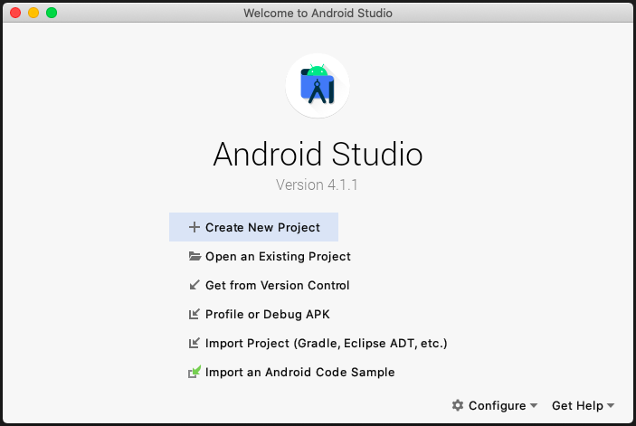
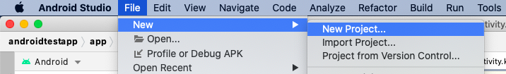
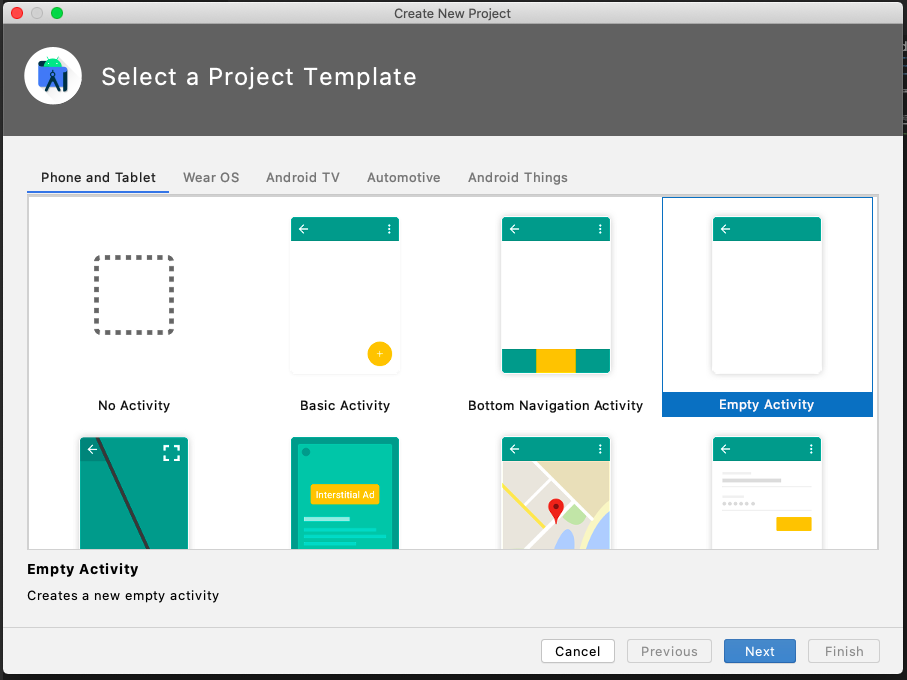
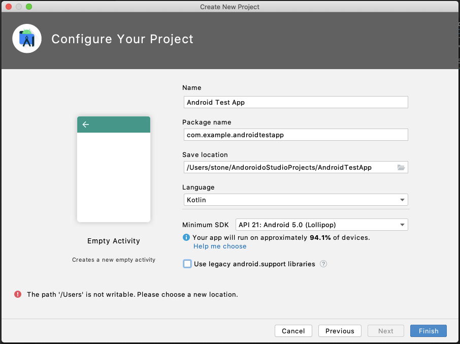

#### 1. Android Studioをインストールしてアプリケーションを起動する  

#### 2. 起動パネルから「**Start a new Android Studio project**」を選択する

#### 

起動パネルが表示されていない場合は、上部メニューから「File → New → New Project...」を選択する

  

#### 3. Select a Project Templateの設定  

これから作成するアプリのテンプレートを指定します。
今回は「**Empty Activity**」を選択し、Nextを押下します。

#### 

#### 4. Configure your Projectの設定

今回は下記のように設定します。  

  

※Minimum API level・・・これから作るアプリが対応する最小のAPIレベルを指定します。
　　　　　　　　　　　　設定する最小APIレベルにより、非対応なメソッドやプロパティが存在するので要注意。
　　　　　　　　　　　　（プロジェクト作成後でも変更できます）

設定ができたらFinishを押下し、プロジェクトを作成します。

<!-- ここで自己紹介 -->
<!-- どのバージョンをどのくらいの人が使っているかの説明 -->
<!-- テンプレートの説明 -->