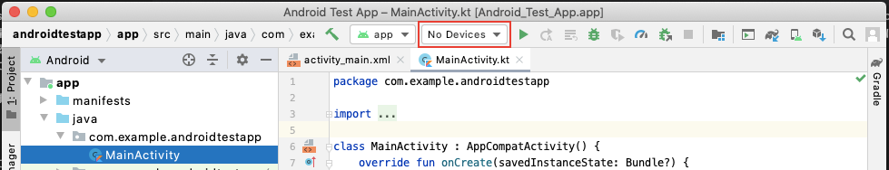
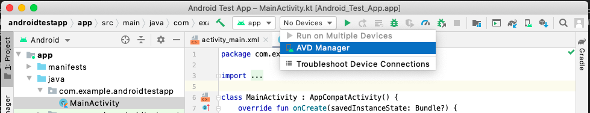
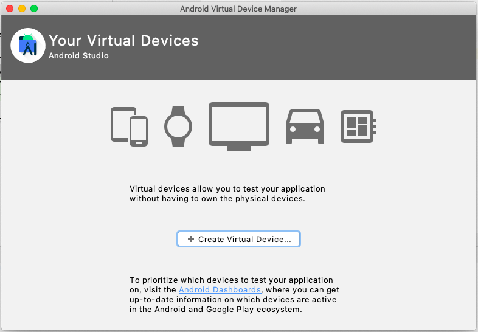
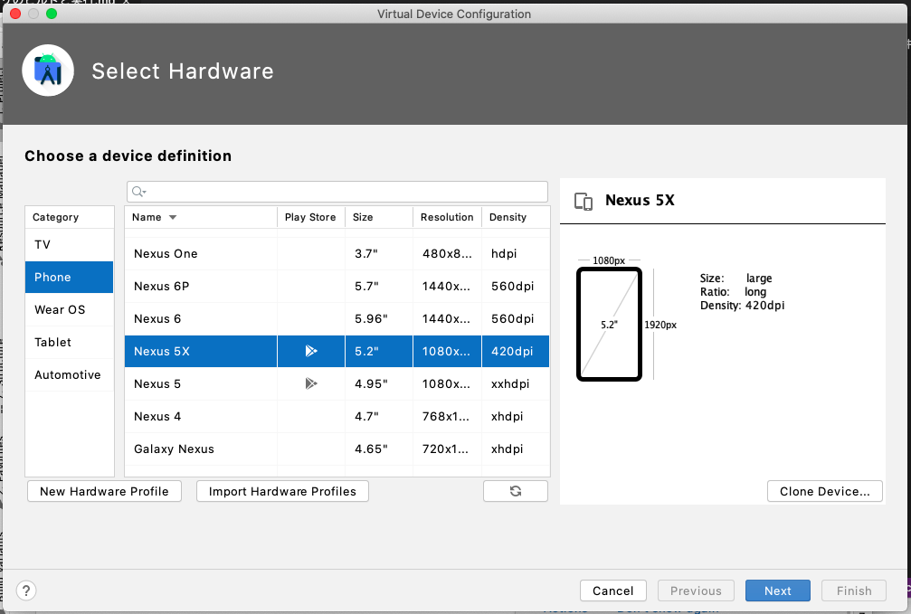
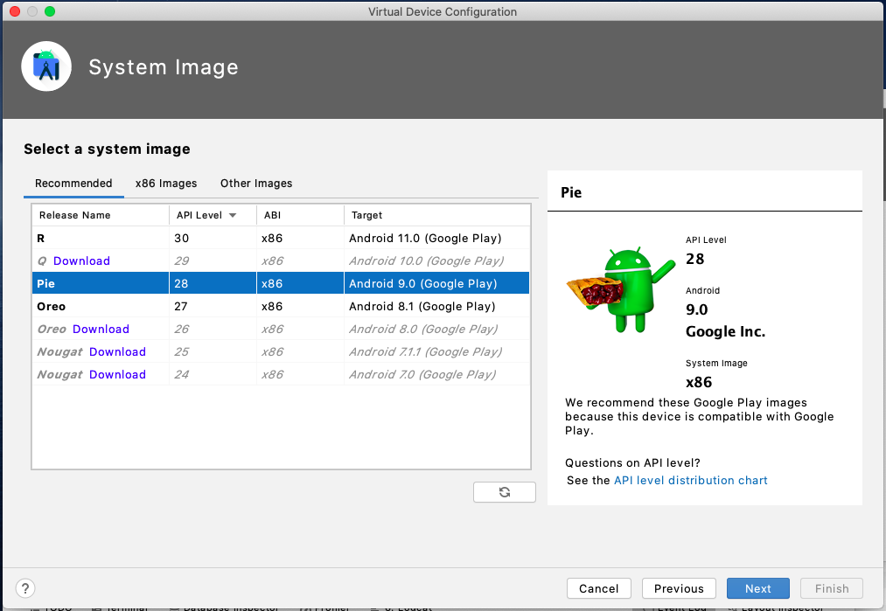
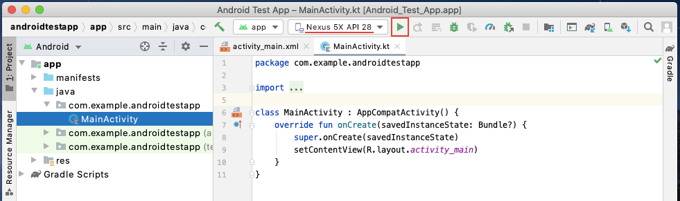
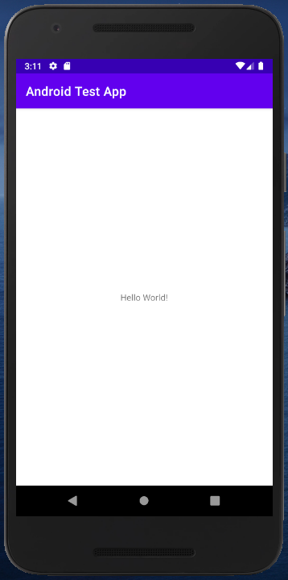

早速ですが、まずは作成したプロジェクトを実際に動かしてみましょう。PC上でエミュレータを使用、もしくはAndroid端末をPCに接続し端末側でデバッグを許可することで、簡単に作成中のアプリの動作を確認することができます。 
ここではエミュレータを使用してアプリをビルド・実行する方法をご紹介します。

まず、以下の赤枠に注目してください。

ここに「**No devices**」と表示されている場合は今起動できるエミュレータが存在しないことを示しており、エミュレータを作成して追加する必要があります。
「**No devices**」をクリックし、プルダウン内の「**Open AVD Manager**」をクリックします。

Android Virtual Device Managerが開かれるので、「**＋ Create Virtual Device...**」をクリックしてエミュレータを作成しましょう。

#### 

次の画面では作成するエミュレータのデバイスの種類を指定します。
今回は「**Phone**」の「**Nexus 5X**」を選択して、Nextを押下します。

#### 

次に、エミュレータのバージョンを指定します。
今回は「**Pie**」を選択して、Nextを押下します。

#### 

ここでPieの横に「Download」と表示されている場合はそのエミュレータをダウンロードする必要があるため、Downloadを押下します。
ダウンロードが完了したらNextを押下します。

<!-- ダウンロード中はandroidのバージョンの説明をする -->

次の画面ではエミュレータの名前や向きを設定出来ますが、今回はデフォルトのままで大丈夫ですので、Finishを押下し、エミュレータを作成・追加します。Android Virtual Device Managerにエミュレータが追加されたことを確認しましょう。

確認できたら先ほどの「No devices」がエミュレータ名に変わっているはずなので、隣の**▶︎(Run)ボタン**を押下することでそのエミュレーターが別ウィンドウで起動し、自動的にアプリが立ち上がります。 

以下のように表示されたでしょうか？  

#### 