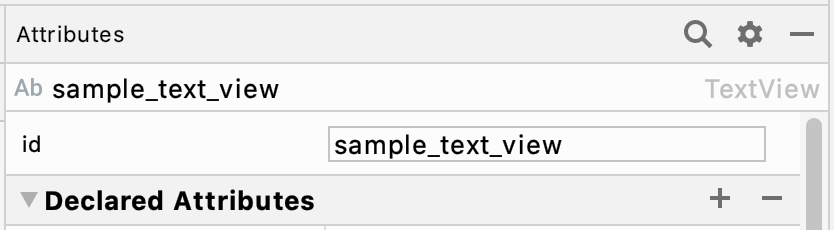
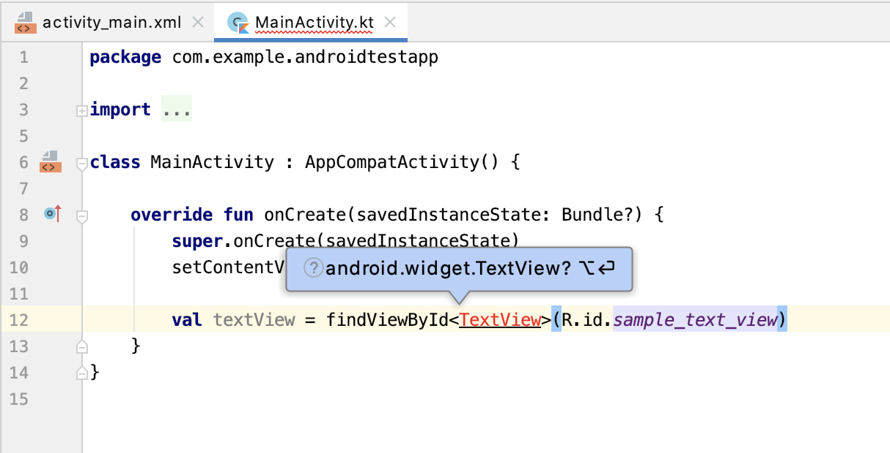
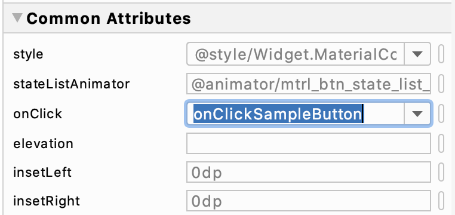

<!-- この辺りで秋山さんからkotlinの基本文法の説明をしてもらう -->

## レイアウトリソースの参照

ここでは、先程配置したレイアウトをプログラム側から操作する方法を示します。  
まず、先程配置したTextViewとButtonのID属性に以下を付与します。  
ID属性もAttributesから編集が可能です。

####    

* TextView -> `sample_text_view`
* Button -> `sample_button`

これらの要素をプログラム上から参照するために、その要素を含むレイアウトリソースを読み込んだクラス（今回はMainActivity）のonCreateメソッド内で、setContentView(R.layout.activity_main)の後に  

```kotlin
    val textView = findViewById<TextView>(R.id.sample_text_view)
```

と記述してみましょう。   

※記述した際に以下のようなエラーが出る場合、macのoptionキーを押しながらEnterキーを押すことで必要なソースがインポートされ、エラーは無くなります。

#### 

次に、LogCat（Android Studio下部で表示するコンソール部分）でtextViewのtextを出力してみましょう。  
LogCatに出力するには`println()`と記述し、括弧内には出力したい文字列を入力します。

また、textViewのテキストは`textView.text`で取得できます。

`textView.text`内の文字列が出力できたら、次に`textView.text`の文字列を編集してみましょう。  
先ほど書いた`println()`の次の行に、  
```kotlin
textView.text = "任意の文字列"
```
と記述します。  
こうすることで、`textView.text`の文字列を任意の文字列で上書きすることができます。  
次の行でもう一度`println()`と書き、文字列が上書きされていることを確かめてみましょう。

--------
しかしこの`val textView = findViewById<TextView>(R.id.sample_text_view)`という記法、かつてJavaで記述していたときからの名残なのですが（実際にはもっと煩雑でした）、Kotlinには便利な拡張機能があり、もっとラクに記述することができます。  
onCreate内で直接 sample_text_view と入力すると入力候補が現れるので、そのままEnterを押します。
するとimportファイルとして

```kotlin
import kotlinx.android.synthetic.main.activity_main.*
```

という記述が自動的に追加されると思います。  
これはKotlin Android Extensionsと呼ばれるもので、id名から直接UIを（キャスト不要で）参照することができます。  

-------------

**さて、今度はsetContentView(R.layout.activity_main)の手前でtextViewのtextをprintlnしてみましょう。**  

無事、アプリがクラッシュしたことと思います。これはつまり、setContentView(R.layout.activity_main)によってレイアウトをセットしているので
それよりも前に参照しようとすると参照すべき要素が見つからずNull Pointer Exceptionとなってしまいます。


## ListenerおよびHandlerの実装

さて、TextViewを参照・編集できることはわかりました。  
今度はButtonが押されたときに、textViewに現在時刻が表示されるようにしましょう。  
activity_main.xmlを開いてください。

Buttonを選択した状態でCommon Attributesの**onClick**を編集します。  
この属性にメソッド名を記述すると、Buttonがクリックされた際にそのメソッドが実行されるようになります。  
また、こういった何らかのイベントに応じて呼ばれるメソッドを**Listener**と言います。  
今回はonClickSampleButtonと入力します。

####    

ここでButtonに赤色のエラーが現れますが、これは指定のメソッドが見つからないというエラーなので、今度はそのメソッドを作成します。  
MainActivity.ktを開いて、`onCreate(savedInstanceState: Bundle?)`メソッドの下に、以下のように記述してください。  
`println()`の中の文字列はなんでも構いませんが、文字列として扱うためにダブルクォーテーションで括る必要があります。

```kotlin
    fun onClickSampleButton(view: View) {
        println("出力")
    }
```

ここまで記述できたら一度Runして、動作を確認してみましょう。  
LogCatに`println()`内の文字列が出力されていれば成功です。  

また、**Listener**の実際の処理内容を**Handler**と言います。  
**Listener**がイベントの通知を受け取り、その際の処理を**Handler**が受け持ちます。  
今回の場合は、**onClickSampleButton**というListenerのHandlerが**println("出力")**ということになります。


## 課題  
Buttonが押されるたびに、TextViewに現在時刻が表示されるようにしましょう。  
現在時刻は`Date().toString()`で文字列として取得することができます。  
※Dateのimport候補が2種類出てきた場合は、`java.util.Date`を選択してください。
    
----
#### Kotlinでの省略記法
上記の方法は下記のようにクロージャを用いることで、xmlを編集せずにMainActivityのみで記述を完結させることができます。   
以降の研修ではこちらの方法で進めていきます。

```kotlin
    sample_button.setOnClickListener { v ->  
        // TODO
    }
```
