# Navigation

さて、ここで今回作成する**ToDoリストアプリ**の説明をします。

「**ToDoを追加・編集して一覧で表示できる**」というのが主な機能となります。

#### 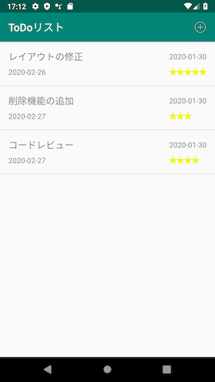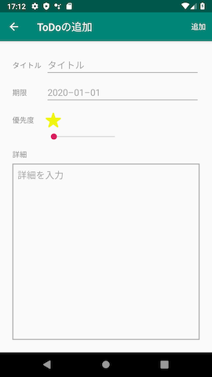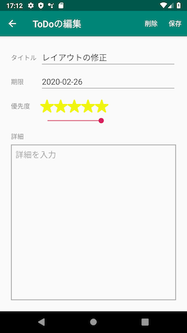  

- アプリを起動すると登録されているToDoのリストが表示される。
- 新しいToDoを登録できる。
- ToDoはそれぞれタイトル・登録日時・期限・優先度(5段階)・詳細の5つの情報を持ち、このうちリストの各項目にはタイトル・登録日時・期限・優先度が表示される。
- それぞれのToDoをタップするとToDoの詳細画面へ遷移し、情報の確認・編集することができる。(オプション)
- ToDoを削除することができる。(オプション)

## プロジェクトの新規作成
　まずは、新規プロジェクトを作成します。
- Select a Project Template: Empty Activity
- Name: ToDoList
- Language: Kotlin

## Navigation

今回作成するアプリは画面が複数あるので、当然**画面から画面への遷移**を実装しなければいけません。
画面遷移の実装方法は複数ありますが、今回は実装を比較的楽にしてくれる**Navigation**という名前のライブラリを用いて実装していきたいと思います。

---

ライブラリとは、特定の機能を楽に実装できるようにするために準備されたプログラム群のことです。
本来であればたくさんコードを記述しなければいけないような複雑な処理を、ライブラリに任せることができます。

ライブラリを使用するには、プロジェクトにどのライブラリのどのバージョンを使うかという記述しなければいけませんが、今回は既にそのような記述がされているプロジェクトを準備しましたので、そちらを使用してください。

（具体的には、Android Studioの場合『build.gradle』というファイルに記述します）

---

Navigationでの画面遷移は以下のような構造になっています。

#### 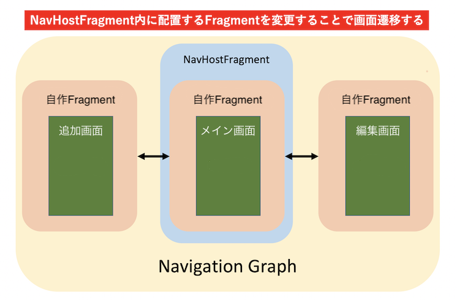

Navigationライブラリには**NavHostFragment**という、内側に一つ別のFragmentを持つようなFragmentが用意されています。
NavHostFragment自体は画面に表示されるようなレイアウトを持っておらず、内側のFragmentが持つレイアウトを表示しようとするので、この内側のFragmentを切り替えることによって表示の変更が可能となっています。
つまりこのNavHostFragmentを画面いっぱいに表示するようにすれば、画面遷移としての動きが可能となるわけです。

またこの構造単位を**NavigationGraph**と言い、内容の大きなアプリでは画面遷移を複数のNavigationGraphに分類したりといった手法が取れますが、今回作るアプリでは一つで十分なので一つだけ使います。

<!-- ここから担当水口 -->

## NavHostFragmentの追加

まずはNavHostFragmentをMainActivityに配置してみましょう。activity_main.xmlを開いてください。

ここにはNavHostFragmentだけを配置するので、デフォルトで配置されているTextViewを削除し、LayoutがConstraintLayoutである必要もないので、FrameLayoutに変更します。

※Layoutを変更するには、変更したいLayoutを右クリックして『**Convert view...**』を選択します。

#### 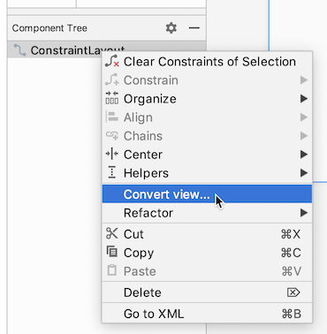

Layoutを変更したら、FrameLayoutのidに**main_layout**を設定してください。

#### 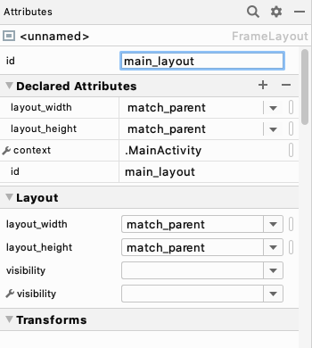

次に実際にNavHostFragmentを配置します。
上のPalleteでFragmentと検索するとNavHostFragmentが検索結果に表示されますので、FrameLayoutの下に配置しましょう。
すると以下のようなダイアログが出てきますが、ここでこのNavHostFragmentが属するNavigationGraphを選択する必要があります。

#### 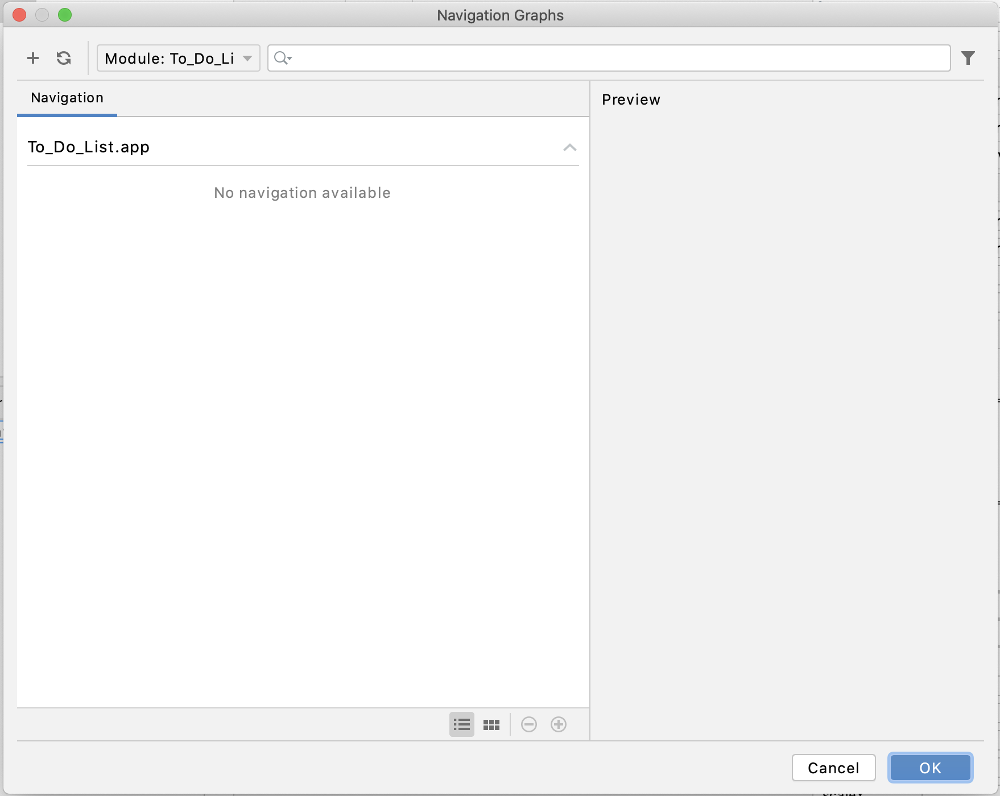

まだNavigationGraphは存在しないので、ダイアログ内左上にある+マークから**Add new resource**を選択し、NavigationGraphを作成しましょう。
File nameをnav_graphとして、OKを押下します。

#### 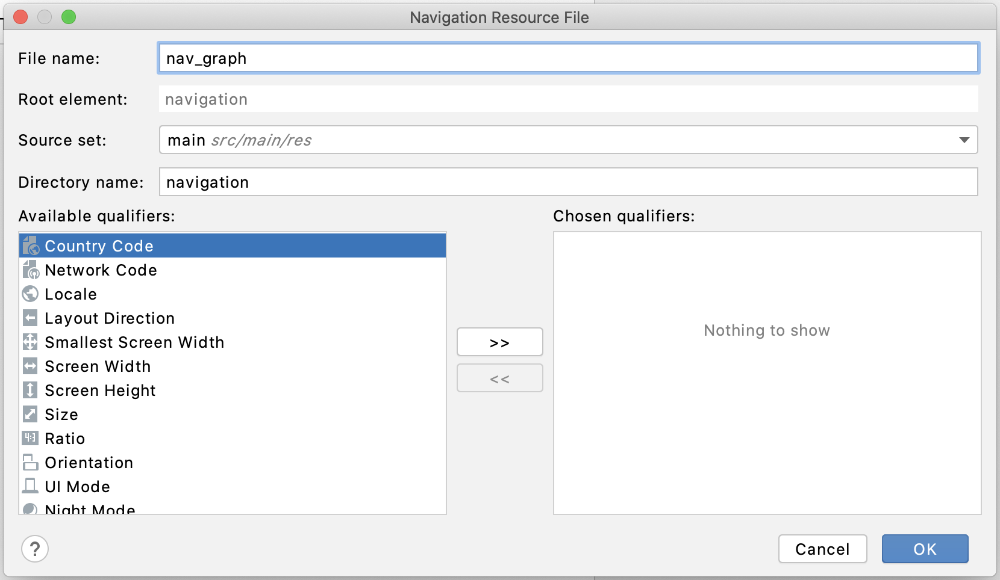

すると左のファイル一覧のapp/res以下に**navigation**ディレクトリが作成されます。
その中にあるnav_graph.xmlが、今回使うNavigationGraphとなります。

これでNavHostFragmentの配置が完了しました。
NavHostFragmentは特別なフラグメントなので、わかりやすいようにidを**nav_host_fragment**に変更しておきましょう。

## Fragmentとレイアウトの追加

NavigationGraphとNavHostFragmentの設定ができたので、次にNavHostFragment内に配置するためのFragmentとレイアウトを作成しましょう。
先ほど作成された**nav_graph.xml**を開いてください。以下のような画面が表示されます。

#### 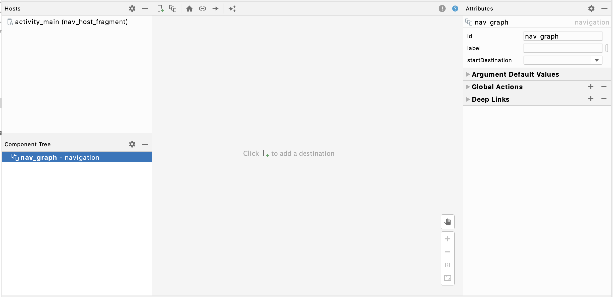

この画面では主に『どのFragmentからどのFragmentへ遷移するか』『どのFragmentが最初に表示されるか』『遷移するときのアニメーションはどうするか』等の画面遷移に関する設定が行えますが、同時にこのNavigationGraphで扱うFragmentとレイアウトの追加も可能です。
まずは以下の＋マークから**Create new destination**を選択してください。

#### 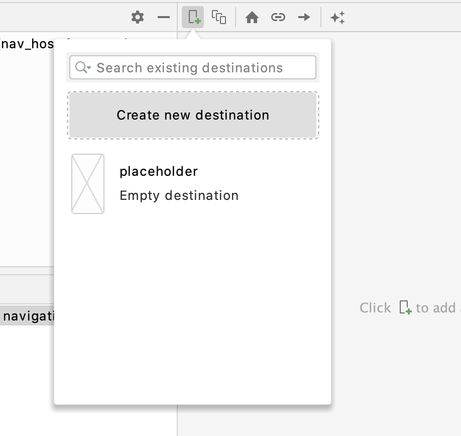

ダイアログが表示されるので、以下のような設定をしてFinishを押下してください。

#### 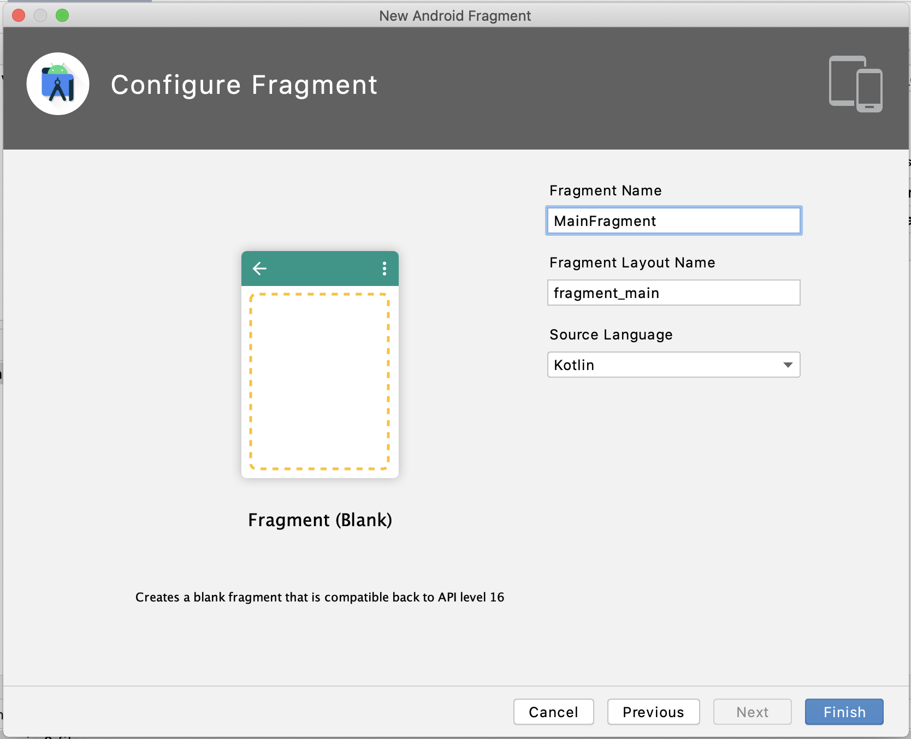

するとNavigationGraphの画面に今追加したFragmentが表示され、そして以下のファイルが追加されました。

- app/java/com.example.todolist/MainFragment
- app/res/layout/fragment_main.xml

NavigationGraph画面で家マークが付いているFragmentは、NavHostFragmentが最初に表示するFragmentを意味しています。

#### 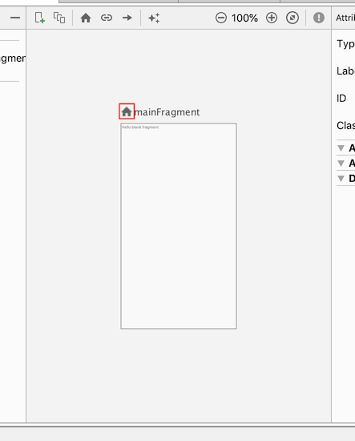

たった今追加されたFragmentに家マークが付いているので、アプリを起動すればこのFragmentが表示されるはずです。このFragmentのレイアウトファイルであるfragment_main.xmlを開いてみるとデフォルトでTextViewが置いてあるので、アプリを実行して実際にこのTextViewが表示されるか確かめてみましょう。

<!-- ここで秋山さんから「画面遷移は後でやるので先にメイン画面のレイアウトを組む」ということの説明が入る -->