<!-- 秋山さんからこの章の流れを簡単に説明をもらう -->
## 準備

 ListViewの作成に入る前に、今回のアプリの作成に必要なプラグイン、クラスを追加・作成します。  

 ### プラグインの追加

 まずは、必要なプラグインを追加します。  
プロジェクトのファイル一覧の下に**Gradle Scripts**の項目があるかと思います。
その下にある**build.gradle**を開いてください。  
build.gradle(Project)とbuild.gradle(Module)の2つがあるので、気をつけてください。  

#### 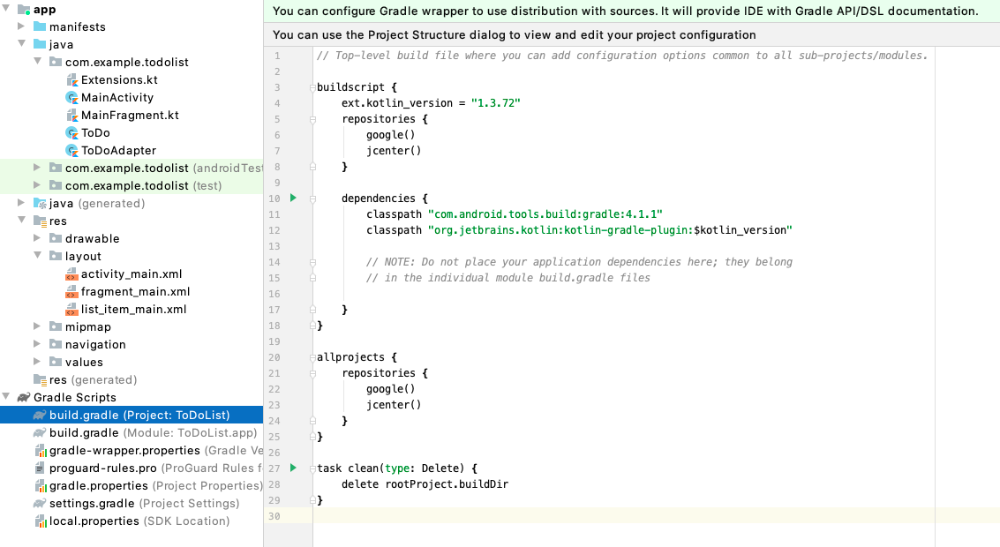

build.gradleの内容を以下の通りに修正してください。ProjectとModuleのどちらも修正するので、編集するファイルを間違えないように気をつけてください。  

- build.gradle(Project)

```Groovy
buildscript {
    // 省略

    dependencies {
        classpath "com.android.tools.build:gradle:4.1.1"
        classpath "org.jetbrains.kotlin:kotlin-gradle-plugin:$kotlin_version"

        // NOTE: Do not place your application dependencies here; they belong
        // in the individual module build.gradle files

        classpath "androidx.navigation:navigation-safe-args-gradle-plugin:2.2.0" // この行を追加
    }
}
```

- build.gradle(Module)

```Groovy
apply plugin: 'com.android.application'

apply plugin: 'kotlin-android'

apply plugin: 'kotlin-android-extensions'

apply plugin: "androidx.navigation.safeargs.kotlin" // この行を追加

android {
    // 省略

    kotlinOptions {
        jvmTarget = '1.8'
    }
    // ここから追加
    androidExtensions {
        experimental = true
    }
    // ここまで追加
}

dependencies {
    // 省略

    // ここから追加
    implementation "android.arch.navigation:navigation-fragment-ktx:1.0.0"
    implementation "android.arch.navigation:navigation-ui-ktx:1.0.0"
    implementation "com.google.code.gson:gson:2.8.6"
    implementation "android.arch.navigation:navigation-fragment:1.0.0"
    implementation "android.arch.navigation:navigation-ui:1.0.0"
    implementation "android.arch.navigation:navigation-fragment-ktx:1.0.0"
    implementation "android.arch.navigation:navigation-ui-ktx:1.0.0"
    // ここまで追加
}
```

- プロジェクトとの同期  
 gradleファイルを修正した場合、プロジェクトとの同期が必要です。  
ファイルの内容を修正すると画面の上に**Sync Now**が出てくるので、ここをクリックしてプロジェクトとの同期を行ってください。

#### 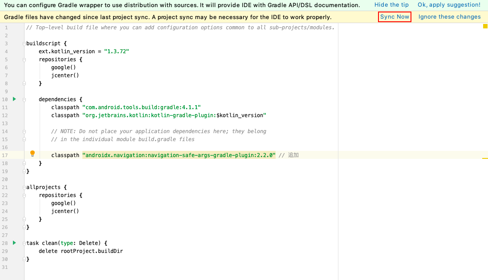

### ToDoの作成  

 **com.example.todolist**フォルダを右クリックし、**New -> Kotlin file/Class**を選択し、Classを選択してToDoのクラスファイルを作成します。  

#### 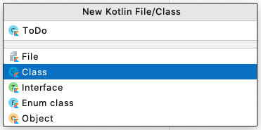

作成したら、classを以下のように編集してください。

```kotlin
package com.example.todolist

import android.os.Parcelable
import kotlinx.android.parcel.Parcelize
import java.util.*

// Edit画面への遷移時に引数として渡すためにParcelableを継承する
@Parcelize
data class ToDo(
    var title: String = "",
    var detail: String = "",
    var priority: Int = 1,
    var limitDate: Calendar = Calendar.getInstance(),
    var registrationDate: Calendar = Calendar.getInstance()
): Parcelable
```
### Extentionsの作成

 次に、ToDoの時と同じように**Extentions**ファイルを作成してください。  
 << 画像を追加する >>

#### 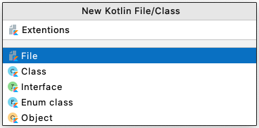
 
ここでは、作成日・期限日の日付についてCalendar型をStting型に変換、String型をCalendar型に変換するための関数を作成します。
ファイルの内容を以下のように編集してください。

```kotlin
package com.example.todolist

import java.text.ParseException
import java.text.SimpleDateFormat
import java.util.*

// CalendarをString型に変換するメソッド
fun Calendar.toStrByAppDefStyle(): String {
    return SimpleDateFormat("yyyy-MM-dd", Locale.US).format(this.time)
}

// StringをCalendar型に変換するメソッド
fun String.toCalByAppDefStyle(): Calendar? {
    try {
        val cal = Calendar.getInstance()
        cal.time = SimpleDateFormat("yyyy-MM-dd", Locale.US).parse(this)
        return cal
    } catch(_: ParseException) {
        return null
    }
}
```

---

## ListView

アプリ起動時に最初に表示されるレイアウトがfragment_main.xmlなので、ここにToDoリストを表示するためのレイアウトを組んでいきます。fragment_main.xmlを開いてください。
デフォルトで配置されているTextViewを削除し、Palleteから**ListView**を探してFrameLayoutの下に配置しましょう。
そしてListViewのidを**main_list_view**に変更してください。

#### 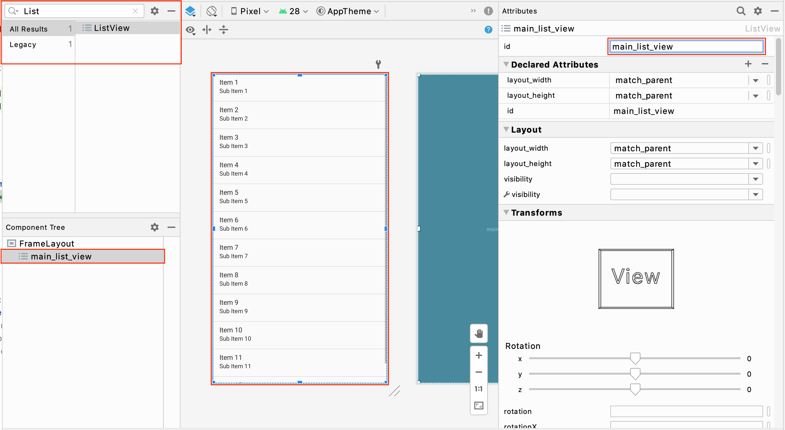

ListViewを配置するとエディター上でリストが表示されますが、これはサンプルとしてエディター上でのみ表示されるものなので、アプリを実行しても画面は真っ白のままです。

ListViewでリストを表示するには、ListViewの他に**行のレイアウト**と**Adapter**、そして**実際に表示したいToDoリストの内容**が必要になります。
まずはリストにToDoのタイトルだけ表示してみましょう。


## 行のレイアウト

エディター上で表示されるサンプルのようにListView上にはたくさんの項目を並べることができますが、これらの項目ごとにレイアウトを作る必要はなく、一つのレイアウトを共有しつつ表示させる文字列だけを変えてリストを表示します。
では早速その共有するレイアウトを作成していきましょう。layoutディレクトリの上で右クリックをし、**New -> Layout resource file**を選択します。

#### 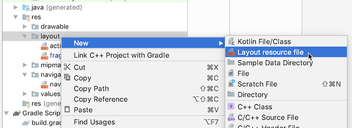

File nameとRoot elemmentを以下のように設定してOKを押下してください。
Root elemmentは『ConstraintLayout』と入力すると入力候補が出てきます。

#### 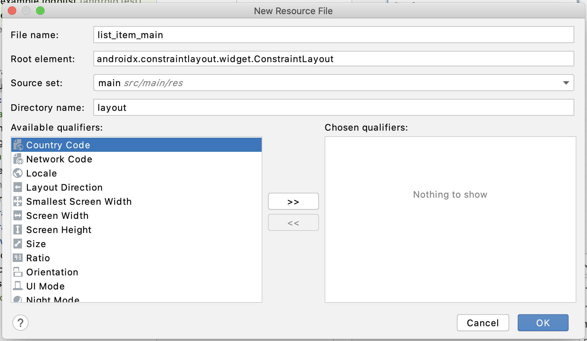

ここに、ToDoのタイトルを表示するための**TextView**（IDは**title_text**としてください）と**Guideline**を以下のように配置してください。
なおこのような縦長のレイアウトであっても、ListViewに表示されるときは制約に従って縦幅が縮まって表示されます。

#### 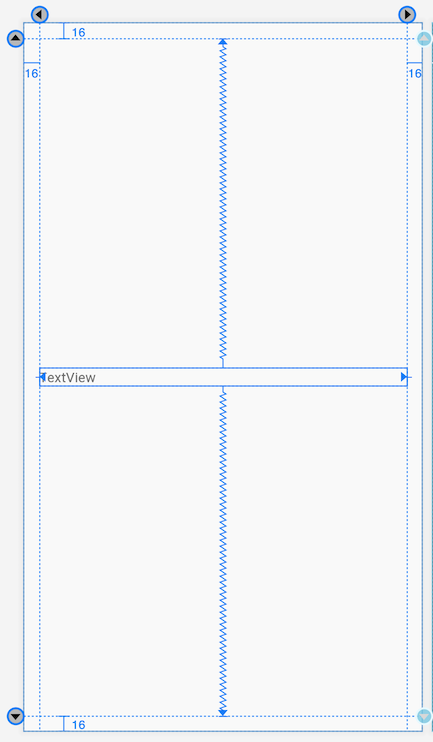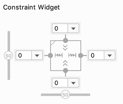


<!-- ここから秋山さんが説明 -->

## Adapterの作成

さて次に**Adapter**を作成します。

 このAdapterはListViewにセットして使用するもので、リスト要素の表示や更新を受け持ちます。  
ListViewに表示したい要素をまずAdapterに渡し、Adapter側は受け取った要素をListViewに表示させます。  
シンプルな表示であれば既存のAdapterを用いてListViewの表示をすることができますが、例えばアバター画像ですとか、カスタムしたレイアウトを表示させる場合は、自身でAdapterを作成します。

BaseAdapterを継承した「ToDoAdapter」を作成しましょう。  

**com.example.todolist**フォルダを右クリックし、**New -> Kotlin file/Class**を選択し、Classを選択してToDoAdapterを作成します。  


#### 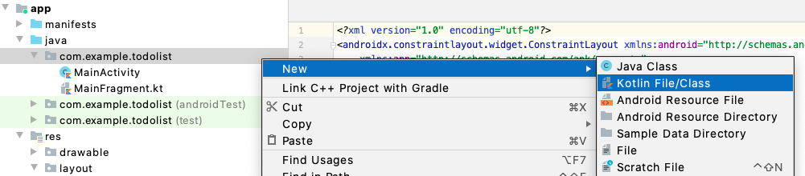

#### 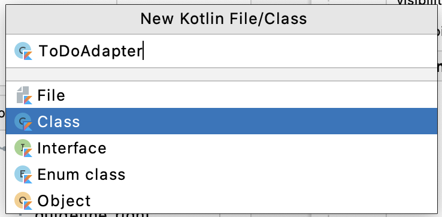  

作成したら、classを以下のように編集してください。

```kotlin
class ToDoAdapter(
  	// ここに書かれる変数は『ToDoAdapter作成時』に『外部からToDoAdapterに渡される必要のあるもの』です
  	private val context: Context,
  	private val toDoList: List<ToDo>
): BaseAdapter() {
  
}
```

ListViewに表示したいToDoリストを、ToDoAdapter作成時にToDoAdapterに渡します。ここでは```toDoList```という変数名で渡しています。
また、BaseAdapterを継承することでAdapterを一から自作することができるようになります。

次にBaseAdapterを継承する際に実装しなければいけないメソッドを追加するため、クラス名（ToDoAdapter）をクリックしてフォーカスを当て赤色の電球マークをクリックし、**Implement members**を選択してください。  

#### 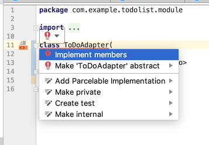

以下のようなダイアログが現れますので、一覧に表示されるメソッドを全て選択しOKを押します。
すると**中身の無いoverrideメソッド**がクラスに追加されます。

#### 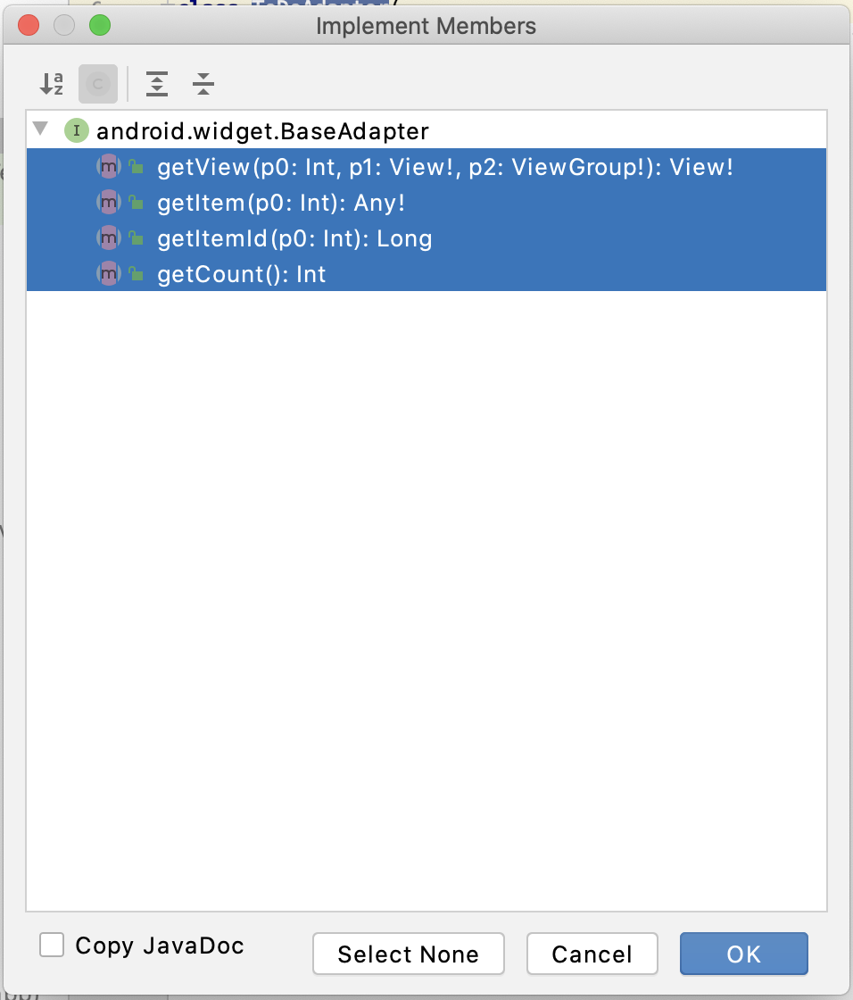

ではこれらのoverrideメソッドの中を埋めていきましょう。

- ```getView```

  ```getView```メソッドでは、Listの行にあたるレイアウトを返却する必要があります。
  つまり、ListViewはAdapterの```getView```メソッドを呼び、返却されたレイアウトを行として表示しているということです。
  では先ほど作成した**list_item_main.xml**を返却してみましょう。```getView```内を以下のように編集してください。

  ```kotlin
  val v = convertView ?: LayoutInflater.from(context).inflate(R.layout.list_item_main, null)
  return v
  ```

  ```getView```メソッドの引数である**convertView**には使い回された行のレイアウトが渡されてくるので、convertViewに値がある場合にはそのままconvertViewを返却します。
  値がない = **null**（後述）の場合には、```LayoutInflater.from(context).inflate```メソッドに**R.layout.list_item_main**（list_item_main.xmlのこと）を渡して取得したレイアウトを返却します。

- ```getItem```
  ```getItem```では引数の```position```に相当する行の情報を返却する必要があります。
  行の情報は先ほど追加した変数```toDoList```にあたるので、```toDoList[position]```を返却します。
  またメソッドが返却する型をToDoに変更しておきましょう。

- ```getItemId```
  引数の```position```に相当する行のIDを返却する必要がありますが、今回はIDを使いませんので0を返却しておきます。

- ```getCount```
  ここで返却した数がリストの行数になります。
  リストに表示したい内容は```toDoList```なので、配列の長さである```toDoList.size```を返却します。

これで必要なメソッドを実装できました。以下のようになりましたか？

#### 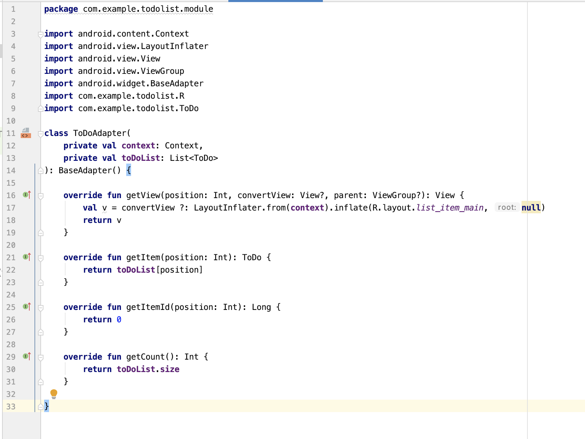


## MainActivityでToDoリストを持つ

ToDoAdapter作成時にはToDoAdapterにToDoリストを渡す必要があります。ToDoリストを作成しましょう。

このToDoリストに対して、追加画面ではToDoの追加、編集画面ではToDoの編集と削除が行われるので、それぞれの画面で同じToDoリストにアクセスできなければいけません。
今回のアプリに関して言えば全ての画面の根幹は**MainActivity**となるので、MainActivityがToDoリストを持つようにし、他の画面からMainActivityにアクセスしてToDoリストを取得する流れにします。

**MainActivity**クラスの中に以下の変数を加えてください。

```kotlin
class MainActivity : AppCompatActivity() {

    var toDoList: MutableList<ToDo> = mutableListOf() // 追加
  // 省略
}
```

先程はList型だったのが**MutableList**型になっています。
実はList型は読み込み専用の型なので、ToDoの追加や削除ができないのです。
ただToDoAdapter内ではToDoリストの変更を行わないので、List型として保持しています。
逆にMutableList型は追加や削除を自由に行える型となっており、MutableList型とList型は相互変換が可能となっています。


## 作成したAdapterをListViewにセット  

今度は**MainFragment**に戻って、AdapterをListViewにセットします。
**onCreateView**メソッド内を以下のように書き換えてください。

```kotlin
val v = inflater.inflate(R.layout.fragment_main, container, false)

// ここから追加
(activity as? MainActivity)?.toDoList?.let {
  	val toDoAdapter = ToDoAdapter(requireContext(), it)
    v.main_list_view.adapter = toDoAdapter
}
// ここまで追加

return v
```
- MainActivityからtoDoListを取得します。取得できなければ次の処理を行いません。
- 取得したリストを用いてToDoAdapterを作成し、それをListViewが持つプロパティ```adapter```に渡します。

さて、これでListViewを表示することが可能となりました。
試しに**ToDoAdapterクラス内の```getCount```メソッドで返却する値を3にして**、アプリを起動してみてください。
以下のように表示されたでしょうか？

#### 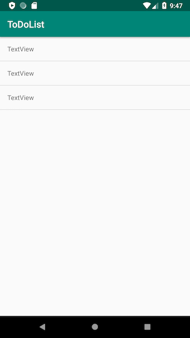

確認ができたらToDoAdapterクラスの```getCount```を元に戻しておきましょう。 


## ToDoデータをListViewに表示する
では実際に**ToDoのタイトルをListViewに表示**してみましょう。

Listに表示されるレイアウトはToDoAdapterクラス内の```getView```メソッドで返却したものと先ほど説明しましたが、このレイアウトの情報をToDoの情報で上書きすることでToDoを表示することができます。
**```getView```**メソッド内を以下のように編集してください。

```kotlin
override fun getView(position: Int, convertView: View?, parent: ViewGroup?): View {
    val v = convertView ?: LayoutInflater.from(context).inflate(R.layout.list_item_main, null)

  	// ここから追加
  
  	// 表示するToDoの取得
    val toDo = toDoList[position]

    // タイトルtextの設定
    v.title_text.text = toDo.title
  
  	// ここまで追加

    return v
}
```

まず```getView```メソッドの引数**position**には返却するレイアウトのインデックス（リストの何行目にあたるかという数字をマイナス1した値）が入ってきますので、**```toDoList[position]```**でtoDoを取得できます。
そして取得したToDoの```title```をタイトルのTextに代入しています。

ここまでできたら以下のようにして**MainActivityのtoDoList**に初期値を与えて、アプリを実行してみましょう。

```kotlin
var toDoList: MutableList<ToDo> = mutableListOf(
  ToDo("タイトル1"), ToDo("タイトル2"), ToDo("タイトル3") // 3つのToDoを作成し配列の初期値とする
)
```

以下のように表示されましたか？

#### 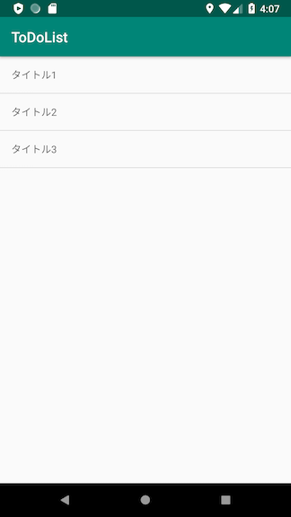


---------------

**課題　下の画像を参考に、リスト要素のレイアウトを良い感じに配置してください。**

#### 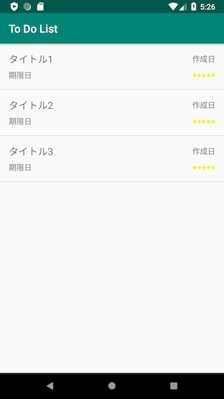

配置する要素は以下の8つです。

- タイトルのTextView・・・１（すでに配置してあるTextViewを使ってください）
- 作成日のTextView・・・１
- 期限日のTextView・・・１
- 優先度のImageView・・・５

また、注意すべき点がいくつかあります。

- TextViewは文字サイズにも拘ってみましょう。**textSize**というプロパティから変更できます。
- また、TextViewには仮データとして『タイトル』『作成日』『期限日』というテキストを設定してください。
  **text**プロパティから設定できます。
- 星の画像は、ImageViewを配置した時に現れるダイアログから選択できます。
  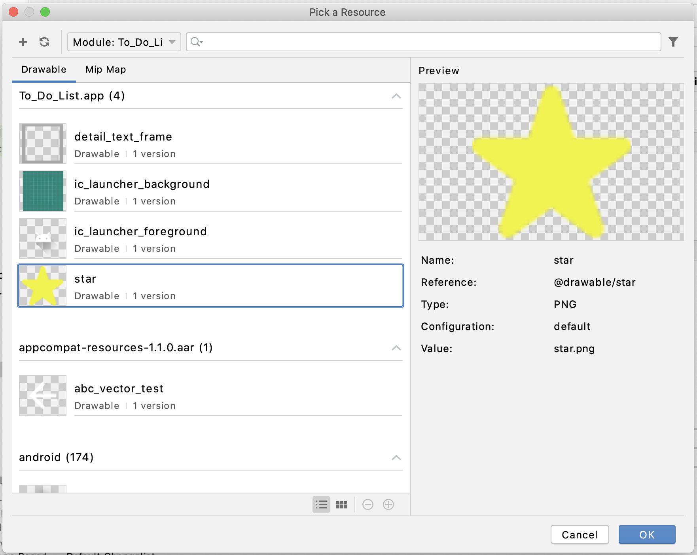

　星の画像（star.png）は別途プロジェクトのなかに取り込む必要があります。  
star.pngをドラッグ&ドロップで**drawable**ディレクトリに追加してください。  
（画像を置く）


---

**課題　```getView```メソッド内で返却するレイアウトがToDoの情報を表示するようにしてください。**

表示したいToDoの情報は以下の4つです。

- ```toDo.title```
- ```toDo.registrationDate```
- ```toDo.limitDate```
- ```toDo.priority```

以下のポイントを参考にしてください。

- Calendar型をString型に変換する際は、Calendar型の**```toStrByAppDefStyle```**メソッドを用いてください。
  例）

  ```kotlin
  val text = toDo.limitDate.toStrByAppDefStyle()
  ```

- 星マークの表示/非表示については、以下の処理を参考にしてください。
  
```kotlin
  // 今回使う星マークのような複数の同じ要素はListとして管理すると楽
  val priorityStars = listOf(
      // 星マークを表示するimageViewたちをカンマで区切って記述する
  )
  
  // priorityStars内の全てのImageViewに同じ処理を施す
  for(i in 0 until priorityStars.size) {
      val visibility = if (/* trueなら表示、falseなら非表示 */) View.VISIBLE else View.INVISIBLE
      priorityStars[i].visibility = visibility
  }
```


完成したらアプリを実行してみましょう。以下のように表示されたでしょうか？

#### 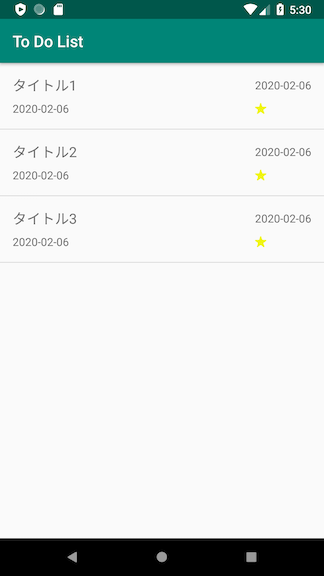


ここまでできたら、**MainActivity**の**toDoList**の初期値を元に戻しておきましょう。

```kotlin
var toDoList: MutableList<ToDo> = mutableListOf()
```

