<!-- 最初に秋山さんから説明・その後担当水口 -->

メイン画面の表示ができたので、次は**ToDoの追加画面**を作成していきます。
追加画面は以下の順で作成していきます。

- メイン画面・追加画面間の画面遷移の実装（この章）
- 追加画面のレイアウトの作成（10章）
- 追加画面で実際にToDoを追加できるような処理の実装（10章）

## NavigationMenuの作成

まずは『クリックしたら追加画面へ遷移する』という役割を担うボタンを作成しましょう。
今回はそのボタンを以下のような**NavigationMenu**という形で実装していきます。
（なお、NavigationMenuが配置されている緑色の部分は**アクションバー**（またはアプリバー）と言います）

#### 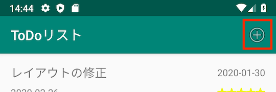

**app/res**ディレクトリの上で右クリックをして**Android Resource File**を選択し、出てきたダイアログで以下のように設定してOKを押下して下さい。

#### 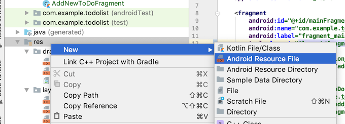

#### 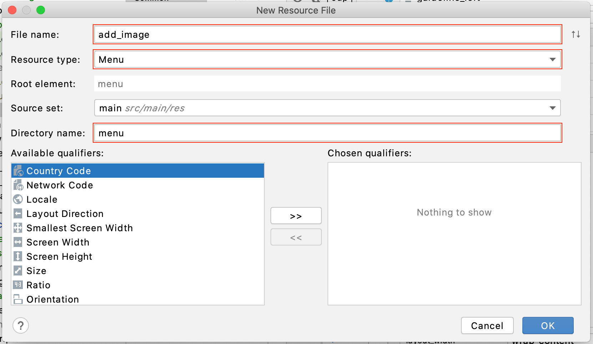

**app/res/menu**ディレクトリが作成され、その中に**add_image.xml**が作成されたことを確認しましょう。

次に、このadd_image.xmlを**直接**編集します。エディター下右上にある『code』をクリックしてください。

#### 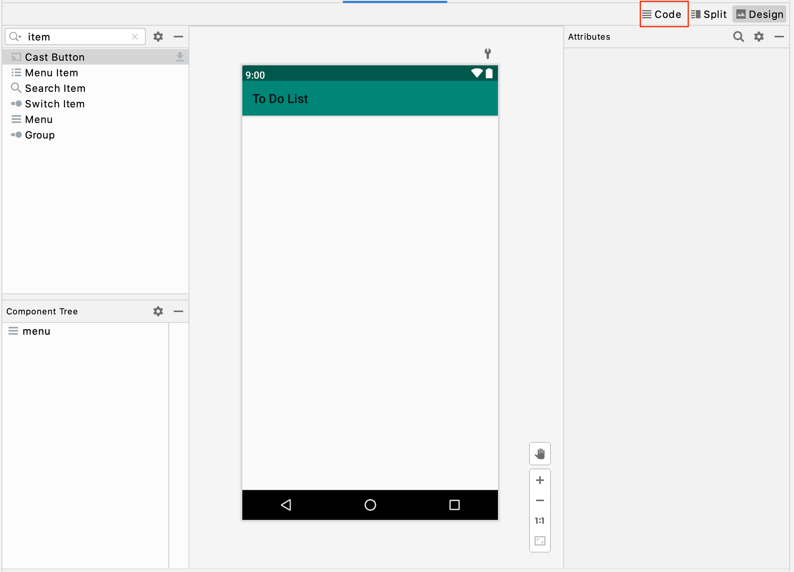

するとxmlが記述された本来の姿のadd_image.xmlを表示することができます。
xmlファイルは以下のようなタグの構造をとっています。

```xml
<!-- コメントはこう書く -->

<!-- 要素ごとに始まりタグと終わりタグがあり、タグの中には別のタグを入れ子にすることができる -->
<!-- また、子タグがないタグでは終わりタグを省略して書くことができる -->
<hoge>
		<fuga />
</hoge>

<!-- Androidのレイアウトでは以下のようにプロパティを伴うことが多い -->
<ListView
    android:id="@+id/main_list_view"
    android:layout_width="match_parent"
    android:layout_height="match_parent" />

```

それでは、表示されたxmlの**menuタグの中**に以下のような記述を追加してみましょう（コピペで大丈夫です）。

```xml
<item
    android:id="@+id/add_image"
    android:icon="@android:drawable/ic_menu_add"
    android:title=""
    app:showAsAction="always" />
```

そうすると右側のPreview画面に丸で囲まれた＋マークが追加されます。
以下の画像のようになったでしょうか？

#### 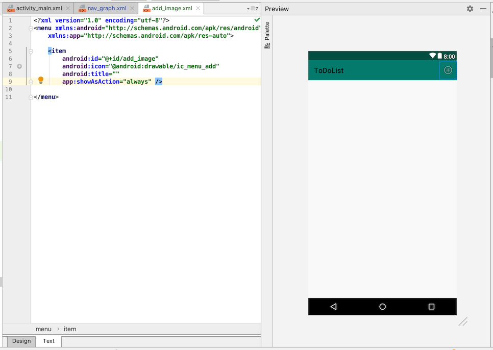

ここで注意していただきたいことが一つあります。
app/res/menu内に作られるxmlファイルはあくまでアクションバー上で表示される要素に対してのレイアウトなので、このadd_image.xmlを読み込んだ時に表示されるのはあくまで＋マークのみです（アクションバーが表示されるわけではありません）。

最後に、今作成したmenuをMainFragmentで読み込みます。MainFragment.ktを開き、クラス内を以下のように編集してください。

```kotlin
override fun onCreateView(
    inflater: LayoutInflater, container: ViewGroup?,
    savedInstanceState: Bundle?
): View? {
    val v = inflater.inflate(R.layout.fragment_main, container, false)
        
    (activity as? MainActivity)?.toDoList?.let {
        val toDoAdapter = ToDoAdapter(requireContext(), it)
        v.main_list_view.adapter = toDoAdapter
    }

    setHasOptionsMenu(true) // この行を追加

    return v
}

// ここから追加
override fun onCreateOptionsMenu(menu: Menu, inflater: MenuInflater) {
    inflater.inflate(R.menu.add_image, menu)
}
// ここまで追加
```

最初に```setHasOptionsMenu```メソッドにtrueを渡すことでこのFragmentが生成された時に```onCreateOptionsMenu```メソッドが呼ばれるようになり、この```onCreateOptionsMenu```メソッドの中で表示するMenuを指定することにより、アクションバー上にMenuを表示することができます。

ここまで出来たら一度アプリを実行してみて、正しく＋マークが表示されているか確認しましょう。


## Navigationによる画面遷移の実装

次に、追加画面にあたるFragmentとレイアウトファイルを作成しましょう。
**app/res/navigation/nav_graph.xml**を開いてください。
第7章でMainFragmentを作成した時と同じ要領で、**AddToDoFragment**を作成しましょう。

Navigation画面にaddToDoFragmentが表示されたら、mainFragmentの右側等わかりやすい場所に移動させます。
次にmainFragmentをクリックして選択状態にし、下の画像のように『◉』マークからaddToDoFragmentまでドラッグします。

#### 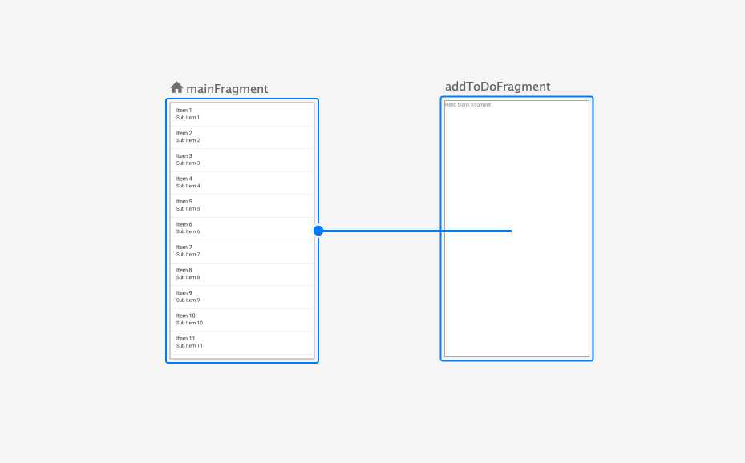

addToDoFragmentの上で指を離すと矢印が表示され、mainFragmentに遷移先を登録することができました。

#### 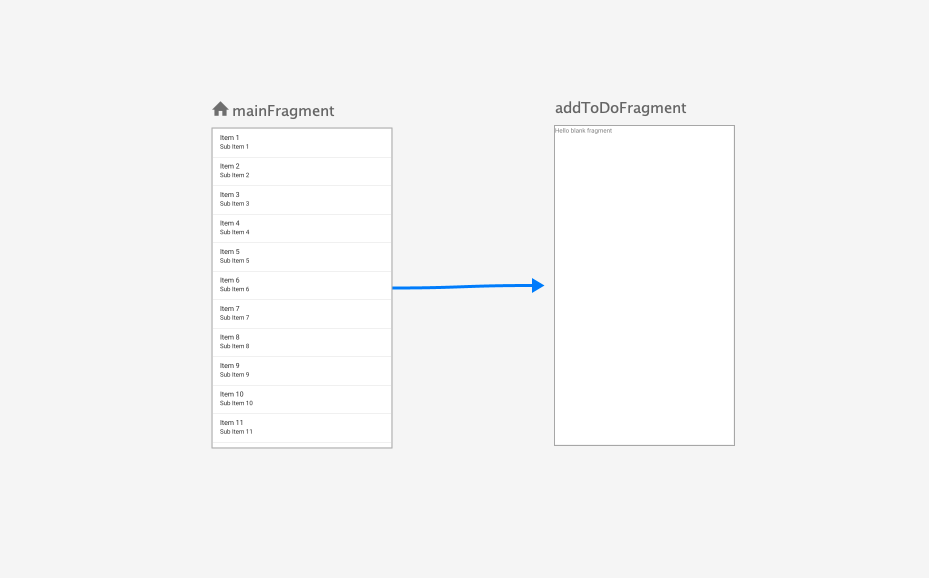

この矢印が選択されている状態で右のAttributes内の**ID**を見てみると、デフォルトで『**action_mainFragment_to_addToDoFragment**』となっていると思います。
後ほど記述しますが、画面遷移用のメソッドを呼ぶ時にこのIDを引数として渡すことでそのIDの矢印が指し示す遷移元から遷移先に遷移することができます。

さて次に、『アクションバー上の＋ボタンをクリックした時』に『遷移IDを指定して画面遷移をする』という処理を記述していきます。
MainFragmentクラス内に以下のoverrideメソッドを追加してください。

```kotlin
override fun onOptionsItemSelected(item: MenuItem): Boolean {
    when (item.itemId) {
        R.id.add_image -> {
            findNavController().navigate(R.id.action_mainFragment_to_addToDoFragment)
            return true
        }
        else -> return super.onOptionsItemSelected(item)
    }
}
```

このメソッドはアクションバー上のMenuが選択された時に呼ばれるメソッドで、引数には選択されたMenuItemが入ってきます。

処理内容としては、選択された```item.itemId```が```R.id.add_image```であれば、画面遷移するために必要なControllerを```findNavController()```で取得し、```navigate```メソッドに先ほどの遷移IDを渡して画面遷移を実行し、```true```を返却しています。
```item?.itemId```が```R.id.add_image```以外の時は、```else```の処理としてsuperメソッド（の返り値）を返しています。

ここまで記述できたら、アプリを起動して実際に画面遷移するか確かめてみましょう。


## Upボタンの実装

さて、無事AddToDoFragmentへ遷移はできましたが、一般的なアプリの場合ここでアクションバーの左側に以下のような**左向きの矢印**が現れるのではないでしょうか？
Androidではこれを**Upボタン**と呼び、タップすることで遷移前の画面に戻ることが期待できます。

#### 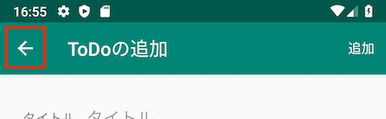

Upボタンはアクションバー上の他のMenuとは違い、レイアウトを作成する必要はありません。
以下のようにMainActivityのonCreateメソッド内で**nav_host_fragment**が持つ**navController**を基にアクションバーをセットアップすることで、Upボタンが状況に応じて自動で表示されるようになります。

```kotlin
override fun onCreate(savedInstanceState: Bundle?) {
    super.onCreate(savedInstanceState)
    setContentView(R.layout.activity_main)

  	// ここから追加
    val navController = findNavController(R.id.nav_host_fragment)
    val appBarConfiguration = AppBarConfiguration(navController.graph)
    setupActionBarWithNavController(navController, appBarConfiguration)
  	// 追加ここまで
}
```

しかし、表示はされたもののまだタップしても何も起こりません。
次はタップされた時の処理を記述する必要があります。が、こちらも単純です。
Upボタンがタップされた時に呼ばれる**```onSupportNavigateUp```**メソッドを、実際に前の画面に戻る処理である**```findNavController(R.id.nav_host_fragment).navigateUp()```**で肩代わりするようにします。

MainActivityクラス内に以下の記述を追加して、実際にUpボタンで前の画面に戻ることを確認してください。

```kotlin
override fun onSupportNavigateUp() = findNavController(R.id.nav_host_fragment).navigateUp()
```

---

<!-- 変数について秋山さんが説明するかもしれない -->

ここで、MainActivityは以下のようになっていると思います。

```kotlin
class MainActivity : AppCompatActivity() {

    override fun onCreate(savedInstanceState: Bundle?) {
        super.onCreate(savedInstanceState)
        setContentView(R.layout.activity_main)

        val navController = findNavController(R.id.nav_host_fragment)
        val appBarConfiguration = AppBarConfiguration(navController.graph)
        setupActionBarWithNavController(navController, appBarConfiguration)
    }

    override fun onSupportNavigateUp() = findNavController(R.id.nav_host_fragment).navigateUp()

}
```

同じ記述```findNavController(R.id.nav_host_fragment)```を二箇所のメソッドで用いてるので、以下のようにクラス直下の変数として統合しましょう。

```kotlin
class MainActivity : AppCompatActivity() {

    // findNavController(R.id.nav_host_fragment) を navController として統合
    private val navController: NavController by lazy {
      findNavController(R.id.nav_host_fragment)
    }

    override fun onCreate(savedInstanceState: Bundle?) {
        super.onCreate(savedInstanceState)
        setContentView(R.layout.activity_main)

        val appBarConfiguration = AppBarConfiguration(navController.graph)
        setupActionBarWithNavController(navController, appBarConfiguration)
    }

    override fun onSupportNavigateUp() = navController.navigateUp()

}
```

```by lazy {}```は、その変数が初めて参照された時に変数の値が{}内の値に決定し、以降の参照では1回目の参照時に決定した値を返すという変数定義の方法です。


## タイトルの変更

次にアクションバーのタイトルを変更しましょう。Navigation画面に戻ってください。
タイトルを変更したいFragmentを選択した状態で右のAttributesから**Label**を編集します。

#### 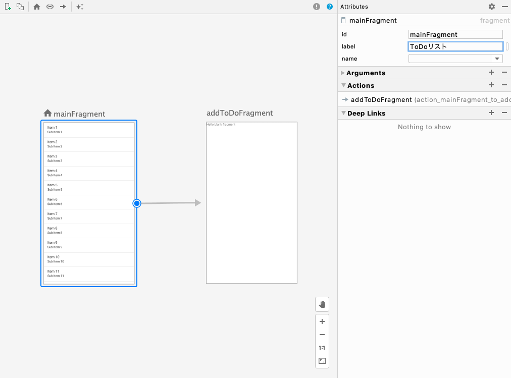

ここではmainFragmentを**ToDoリスト**、addToDoFragmentを**ToDoの追加**に設定します。


## 遷移アニメーションの設定

最後に、画面遷移時にアニメーションで動きをつけます。
Navigationを使った画面遷移でのアニメーションはまずアニメーションの内容をxmlファイルに記述する所から始まりますが、今回は用意したアニメーションファイルを使ってアニメーションを実装していきます。  

以下の手順でアニメーションファイルをプロジェクトの中に追加してください。

### animディレクトリの追加

まずはアニメーションファイルを格納するためのディレクトリを、**app/res**の中に作成します。  
**res**ディレクトリを右クリックし、**New -> Android Resource Directory**を選択すると、ダイアログが表示されます。  

#### 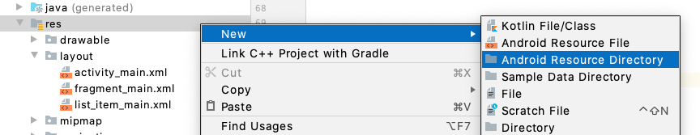

Directory name、Resource type、Source setをそれぞれ以下のように設定してOKを押下してください。  
resディレクトリの中にanimディレクトリが追加されます。  

#### 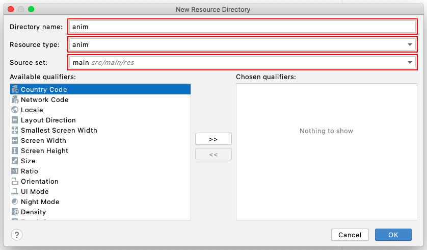

### アニメーションファイルを追加

作成したanimディレクトリに、以下のファイルを追加してください。  
ドラッグ&ドロップで追加できます。  

- slide_from_left.xml
- slide_from_right.xml
- slide_to_left.xml
- slide_to_right.xml

Navigation画面でアンイメーションを設定したい遷移矢印を選択し、右側のAttributes内の**Animations**を見てください。
ここから先ほどの4つのxmlファイルを選択することで、遷移時のアニメーションを設定することができます。

#### 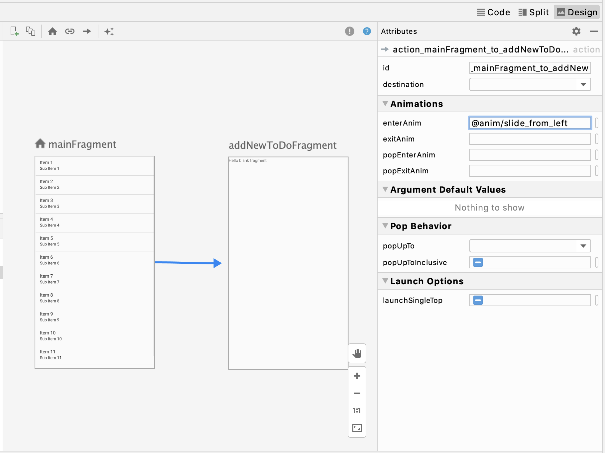

**Animations**には以下の4つの項目があります。

- enterAnim・・・矢印の方向に遷移する時の遷移**先**画面の動き
- exitAnim・・・矢印の方向に遷移する時の遷移**元**画面の動き
- popEnterAnim・・・矢印とは**逆**の方向に遷移する時の遷移**先**画面の動き
- popExitAnim・・・矢印とは**逆**の方向に遷移する時の遷移**元**画面の動き

また、用意してあるアニメーションも4種類です。

- slide_from_left・・・**左**画面外から画面中央にスライドする
- slide_from_right・・・**右**画面外から画面中央にスライドする
- slide_to_left・・・画面中央から**左**画面外へスライドする
- slide_to_right・・・画面中央から**右**画面外へスライドする

---

**課題 画面遷移時のアニメーションを正しく選択してください。**

設定できたらアプリを起動して、実際に確かめてみましょう。
なお、Animationsは4項目全て埋める必要があります。