<!-- ここから担当水口 -->

## 追加画面のレイアウトの作成

メイン画面 <-> 追加画面間でひとまず画面遷移ができるようになったので、次は追加画面のレイアウトを組んでいきます。

先ほど作成した**fragment_add_to_do.xml**を、以下のようにレイアウトしていきましょう。

#### 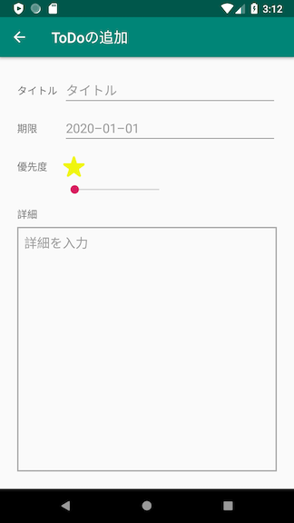

配置する要素は以下の13個です。またその他にGuidelineとBarrierも使います。

- TextView・・・『タイトル』『期限』『優先度』『詳細』の4つ
- EditText・・・『タイトル』『期限』『詳細』の3つ
- ImageView・・・星の画像5つ
- SeekBar・・・1つ

まずは**Guideline**から配置していきましょう。以下のように親ビューから**24dp**離して**上と左右**に配置します。

#### 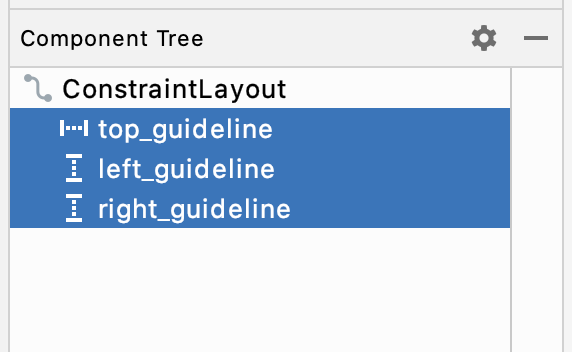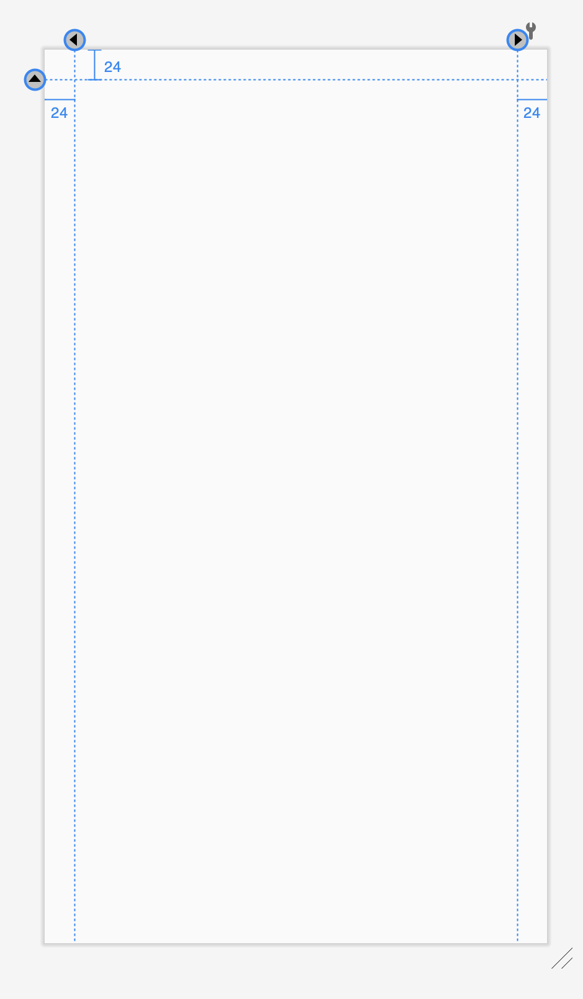

次に**タイトルと期限のEditText**を配置します。EditTextには複数の種類がありますが、今回は最も標準的な**PlaneText**を選択してください。
そしてデフォルトで入力されているtextを削除して、**hint**を以下のように設定しましょう。
『期限』のEditTextは、『タイトル』のEditTextから**8dp**離してください。

#### 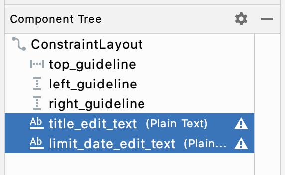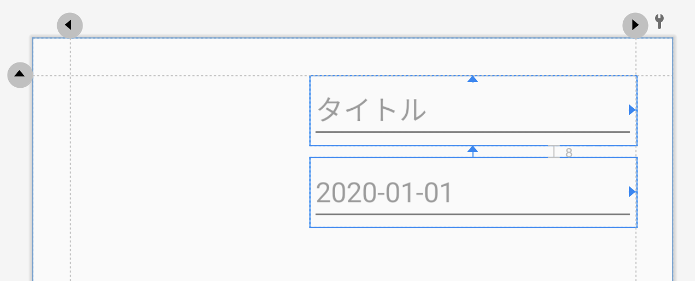

次に、**タイトルと期限のTextView**を配置します。それぞれのEditTextと横軸が合うように配置しましょう。
またtextも変更してください。

#### 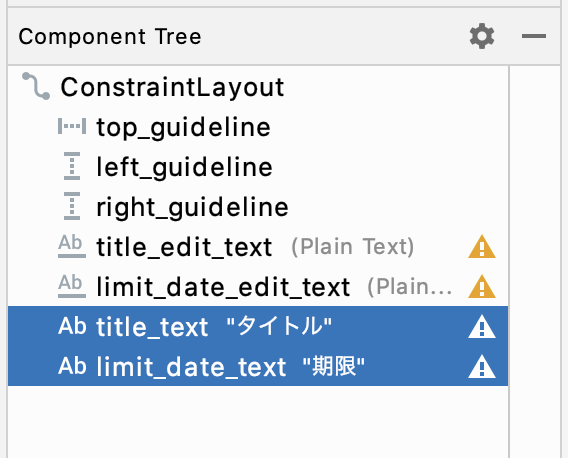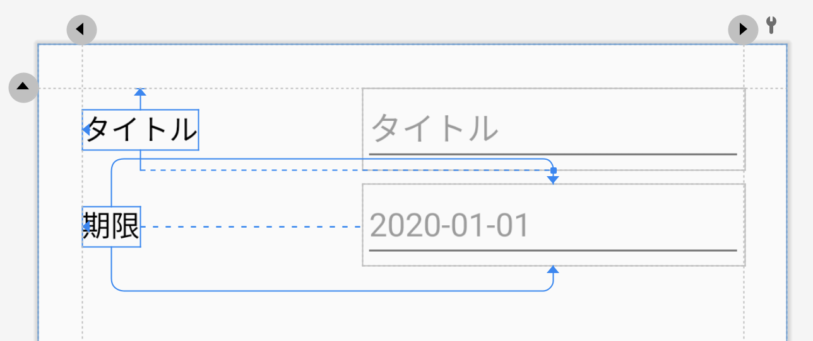

ここで左側にある項目の表示領域を確保するために**Barrier**を追加しましょう。
追加したBarrierの**BarrierDirection**を**right**にし、**『タイトル』と『期限』のTextView**をBarrierの中に入れてください。
そして先ほどのEditTextをBarrierから**8dp**離れるように配置します。

#### 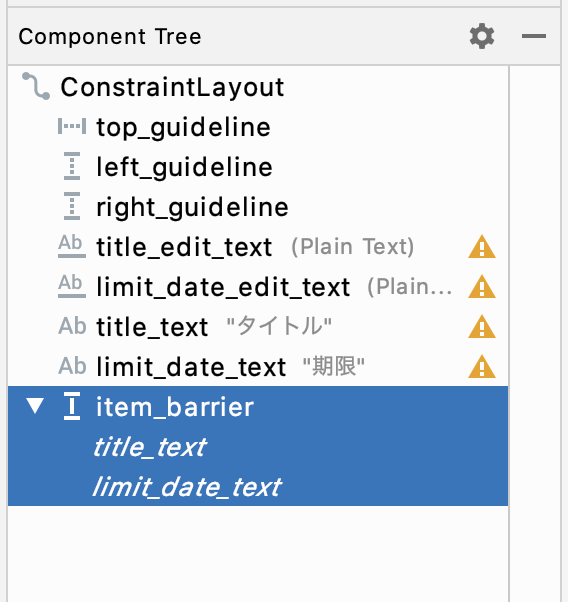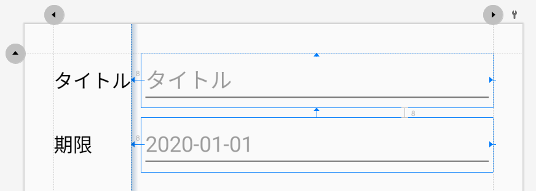

次に**優先度のTextView・ImageView・SeekBar**を以下のように配置します。

- ImageViewを1つ配置し、表示する画像を星に・1辺が**32dp**になるように設定してから、そのImageViewをコピペして5つにします。
- 5つのImageViewのうち一番左に来るものを、『期限』のEditTextから**16dp**、Barrierから**8dp**離して配置します。
- 残り4つのImageViewを、横軸が一番左のImageViewに合うように、右側に並べて配置します。
- 『優先度』のTextViewを追加し、一番左のImageViewと横軸が合うように配置します。またtextを変更し、Barrierの中に入れてください。
- SeekBarを追加し、一番右のImageViewから**8dp**離して配置し、横の長さがImageView群に合うように配置してください。また、値の**max**値を**4**にしましょう。
- SeekBarの初期値が0なので、それに合わせて一番左以外の星画像の**visibility**を**invisible**に設定しましょう。（画像が表示されなくなりますが、後でソースコードから表示/非表示を切り替えます）

#### 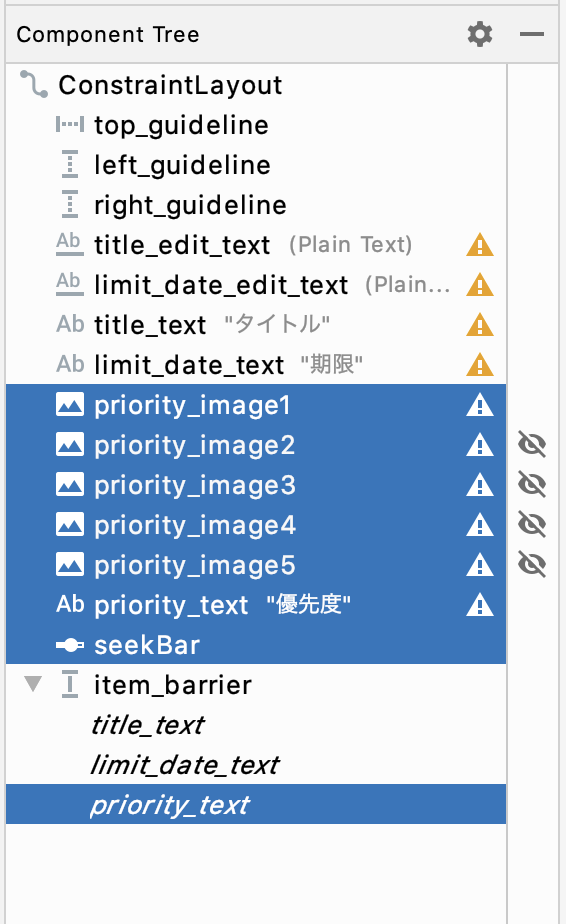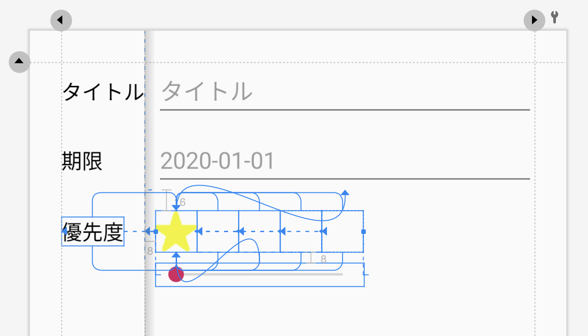

最後に **『詳細』のTextViewとEditText** を配置しましょう。『詳細』のEditTextは **Multiline Text** を選択してください。
『詳細』のTextViewはSeekBarから**16dp**離して配置し、『詳細』のEditTextは『詳細』のTextViewから**8dp**離して配置してください。　　

また今回、『詳細』のEtidTextに**background**を設定しますが、このbackgroundに設定するためのxmlファイルもこちらで用意しています。  
以下のファイルを、ドラッグ&ドロップで**app/res/drawable**のディレクトリ内に追加してください。  

- detail_text_frame.xml

『詳細』のEditTextの**background**に先ほど追加した**detail_text_frame**を指定し、**padding**には上下左右に**8dp**を指定します。
なお『詳細』のTextViewは右側に他のViewが無いので、Barrierの中に入れる必要はありません。

#### 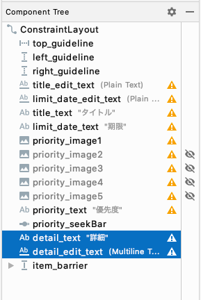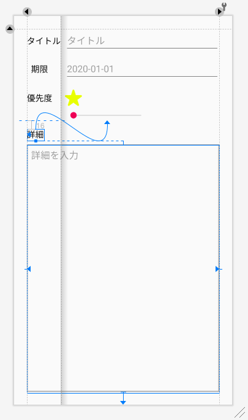


<!-- 『DatePickerDialogを表示する』の担当は秋山さん -->

## DatePickerDialogを表示する

今のままだと『期限』のEditTextには日付以外にも自由に入力できてしまうので、日付しか入力できないようにしましょう。AddToDoFragment.ktを開いてください。

Androidでは以下の画像のような**DatePickerDialog**（日付を入力するためのダイアログ）が用意されています。
『期限』のEditTextをタップした時にこのダイアログを開いて、ダイアログ内で選択した日付がそのEditTextに入力されるようにしましょう。

#### 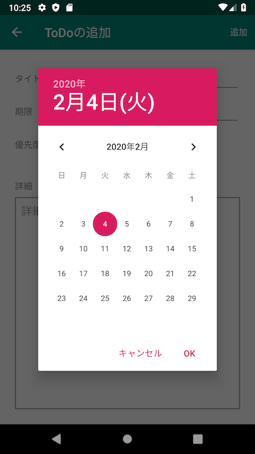

AddToDoFragmentクラスのonCreateViewを以下のように編集してください。コピペで大丈夫です。

```kotlin


    override fun onCreateView(
        inflater: LayoutInflater, container: ViewGroup?,
        savedInstanceState: Bundle?
    ): View? {
        // AddToDoFragmentとして表示するviewを取得
        val v = inflater.inflate(R.layout.fragment_add_to_do, container, false)

        // 期限textがタップされた時に行われる処理を設定
        v.limit_date_edit_text.setOnClickListener {
            // DatePickerDialogというAndroid標準のカレンダーダイアログを作成して表示する処理
            val showDate = v.limit_date_edit_text.text.toString().toCalByAppDefStyle() ?: Calendar.getInstance()
            DatePickerDialog(
                requireActivity(),
                // カレンダーダイアログを確定した時に行われる処理を設定
                DatePickerDialog.OnDateSetListener { _, year, month, dayOfMonth ->
                    // 選択した日付を期限textに設定
                    val selectedDate = Calendar.getInstance()
                    selectedDate.set(year, month, dayOfMonth)
                    v.limit_date_edit_text.setText(
                        selectedDate.toStrByAppDefStyle(),
                        TextView.BufferType.EDITABLE
                    )
                },
                showDate.get(Calendar.YEAR),
                showDate.get(Calendar.MONTH),
                showDate.get(Calendar.DATE)
            ).show()
        }

        return v
    }
```

少し複雑そうに見えますが、大まかな処理としては以下のようなことをしています。

- 『期限』のEditTextがタップされた時に呼ばれるListenerメソッド内に、DatePickerDialogを開く処理を置く
- DatePickerDialogで日付を確定した際に呼ばれるListenerメソッド内に、選択された日付を『期限』のEditTextに入力する処理を置く

次に、『期限』のEditTextにフォーカスが当たらないようにします。

AndroidではEditTextをタップするとフォーカスが当たりますが、この時にキーボードが出てきてEditTextに入力できるようになります。
しかし今回のような**入力をダイアログに任せるEditText**の場合は、逆にキーボードから入力できないようにする必要があるのです。

fragment_add_to_do.xmlを開き、Attributesから**focusable**を探して**false**と入力しましょう。

ここまでできましたらアプリを起動して、DatePickerDialogの動きを確かめてみましょう。


<!-- 『SeekBarと星の表示/非表示を連動させる』の担当は秋山さん -->

## SeekBarと星の表示/非表示を連動させる

次に、SeekBarを動かした時に星の表示数が変わるようにします。
DatePickerDialogと同じく**AddToDoFragment**クラスの**onCreateView**メソッド内に以下を記述してきください。

```kotlin
// seekBarの値が変更された時のListenerを優先度seekBarに設定
v.priority_seek_bar.setOnSeekBarChangeListener(object: SeekBar.OnSeekBarChangeListener {
    // 優先度seekBarの値が変更されたらその値に応じて表示する星マークを制御
    override fun onProgressChanged(seekBar: SeekBar, progress: Int, fromUser: Boolean) {
        val priorityStars = arrayOf(
            v.priority_image1, v.priority_image2, v.priority_image3, v.priority_image4, v.priority_image5
        )
        val priority = progress + 1
        for(i in 0 until priorityStars.size) {
            val visible = if (i < priority) View.VISIBLE else View.INVISIBLE
            priorityStars[i].visibility = visible
        }
    }
    override fun onStartTrackingTouch(seekBar: SeekBar?) {}
    override fun onStopTrackingTouch(seekBar: SeekBar) {}
})
```

先ほどまでの```setOnClickListener```では『要素がクリックされた時』という一つの状況に対してのListenerだったので簡潔に書けましたが、SeekBarのListenerは以下の3つのoverrideメソッドがそれぞれの状況の時に呼ばれるListenerメソッドになっているので、少し書き方が複雑になっています。

- **```onProgressChanged```・・・SeekBarの値が変化した時**
- onStartTrackingTouch・・・SeekBarのドラッグを開始した時
- onStopTrackingTouch・・・SeekBarのドラッグを終了した時

今回はSeekBarの値が変わった時に星の表示/非表示を切り替えたいので、**```onProgressChanged```**内にその処理を記述します。
```onProgressChanged```の引数には変化後の値の**progress**が渡されますので、これに1を足した値を変数**```priority```**とし、```priority```を基にメイン画面での星の表示切り替え方法と同じ処理を施します。

処理がかけたらアプリを起動して動きを確認しましょう。


## 実際にToDoを追加してみる

以上でToDoの記入が可能になったので、実際に記入されたToDoを追加する処理を構築しましょう。
今回はアクションバー上に追加ボタンを作成して、タップしたら記入されたToDoをMainActivityの```toDoList```に追加し、メイン画面に戻るという流れでToDoの追加を行います。

<!-- ここから担当水口 -->

まずは以下のような**NavigationMenu**をapp/res/menuに作成して、表示をしてみましょう。
ファイル名は**add.xml**とします。

#### 

#### 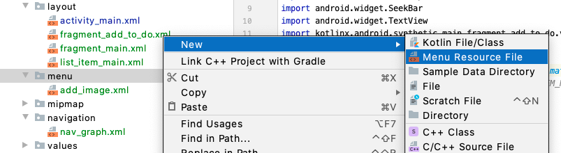

#### 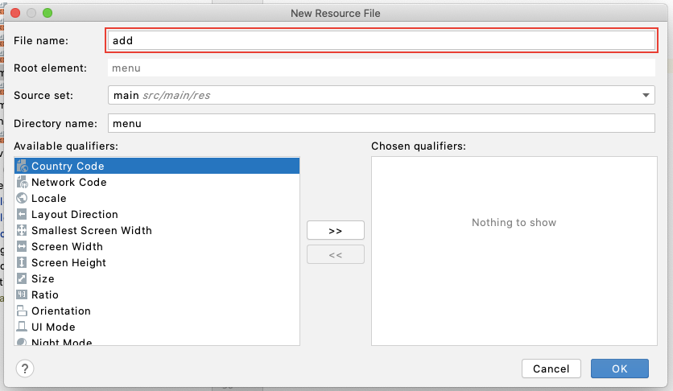

add.xmlファイルは以下のようにしてください。

```xml
<?xml version="1.0" encoding="utf-8"?>
<menu xmlns:android="http://schemas.android.com/apk/res/android"
    xmlns:app="http://schemas.android.com/apk/res-auto">

  <!-- ここから追加 -->
    <item
        android:id="@+id/add"
        android:title="追加"
        app:showAsAction="always" />
  <!-- ここまで追加 -->

</menu>
```

addToDoFragmentクラスは以下のようにしてください。

```kotlin

class AddToDoFragment : Fragment() {

    override fun onCreateView(
        inflater: LayoutInflater, container: ViewGroup?,
        savedInstanceState: Bundle?
    ): View? {
      	// 省略
        setHasOptionsMenu(true) // 追加

        return v
    }
  	
  	// ここから追加
    override fun onCreateOptionsMenu(menu: Menu, inflater: MenuInflater) {
        inflater.inflate(R.menu.add, menu)
    }
  	// ここまで追加

}
```

以上で追加ボタンが表示されるようになったかと思います。

次は、追加ボタンをタップした時の処理を記述していきます。
同じく**addToDoFragment**クラス内に以下を記述してください。

```kotlin
// ヘッダーメニューが選択された時の挙動を設定
override fun onOptionsItemSelected(item: MenuItem?): Boolean {
    when (item?.itemId) {
        R.id.add -> {
            // 入力された値をもとにToDoを作成してListに追加する
            val toDo = ToDo()
            toDo.title = title_edit_text.text.toString()
            toDo.registrationDate = Calendar.getInstance()
            toDo.limitDate = limit_date_edit_text.text.toString().toCalByAppDefStyle() ?: Calendar.getInstance()
            toDo.priority = priority_seek_bar.progress + 1
            toDo.detail = detail_edit_text.text.toString()
            (activity as? MainActivity)?.toDoList.add(toDo)

            // 前の画面に戻る
            findNavController().navigateUp()

            return true
        }
      	else -> return super.onOptionsItemSelected(item)
    }
}
```

以下の点がポイントになります。

- EditTextの文字列の取得方法はTextViewと少し違い、**```edit_text.text.toString()```**で取得できます。
- String型をCalendar型に変換する際は、String型の**```toCalByAppDefStyle```**メソッドを用いてください。
- ```Calendar.getInstance()```で今日の日付をCalendar型で取得できます。
- ```priority_seek_bar.progress```でSeekBarの値を取得できます。
    ただしSeekBarの値は**0〜4**に設定されているので、**+1**して```toDo.priority```に設定したい値**1〜5**に合わせる必要があります。
- ```リスト.add(要素)```でリストに要素を追加できます。
- 前の画面に戻るには**```findNavController().navigateUp()```**を使います。

ここまで記述できたら、アプリを起動して動きを確かめてみましょう。

<!-- 『キーボードの動きを制御する』の担当は秋山さん -->

## キーボードの動きを制御する

画面を移動した時にキーボードを閉じる処理を記述しましょう。
**MainActivity**クラスの**onCreate**メソッド内に以下のように処理を追加してください。コピペで大丈夫です。

```kotlin
navController.addOnDestinationChangedListener { _, _, _ ->
    currentFocus?.let {
        val imm = getSystemService(AppCompatActivity.INPUT_METHOD_SERVICE) as InputMethodManager
        imm.hideSoftInputFromWindow(it.windowToken, InputMethodManager.HIDE_NOT_ALWAYS)

        main_layout.requestFocus()
    }
}
```

**Navigationによって画面遷移した時**に呼ばれるListenerメソッドを、Navigationを司るnavControllerに設定しています。

アプリを起動して、動作を確かめてください。


<!-- 『キーボードの動きを制御する』の担当は秋山さん -->

## 端末にデータを保存する

今の状態だと、アプリを終了した時に追加したToDoが全て消えてしまいます。
アプリを終了してもToDoが消えないように、**端末にToDoデータを保存**しましょう。

**MainActivity**クラスに以下の記述を追加してください。

```kotlin
class MainActivity : AppCompatActivity() {
  	// 省略

    // 現在のToDoListをデバイスに保存する
    fun saveToDoList() {
        val pref = getSharedPreferences("ToDoListApp", Context.MODE_PRIVATE)
        pref.edit().putString("ToDoList", Gson().toJson(toDoList)).apply()
    }

    // デバイスに保存されているToDoListを読み込む
    fun loadToDoList() {
        val pref = getSharedPreferences("ToDoListApp", Context.MODE_PRIVATE)
        pref.getString("ToDoList", null)?.let {
            val type = object : TypeToken<MutableList<ToDo>>() {}.type
            toDoList = Gson().fromJson<MutableList<ToDo>>(it, type)
        }
    }

}
```

```saveToDoList```メソッドでtoDoListを端末に保存し、```loadToDoList```メソッドで端末からtoDoListを読みこみます。
少し複雑ですが、toDoListを```"ToDoList"```という**キー**とともに端末に保存することでキーとリストが対応付けられ、読み込み時には保存時に設定したキーを指定してtoDoListを取り出すことができます。

端末には**Json**という形式で保存する必要がありますので、kotlinのオブジェクト形式とJson形式の相互変換をサポートする**Gson**というライブラリを用いてtoDoListをJsonに/JsonをtoDoListに変換しています。

また、onCreate内でloadToDoListを呼ぶことで、アプリを起動した時に端末からtoDoListを読み込むようにしています。


```saveToDoList```メソッドがToDo追加後に呼ばれるように、**AddToDoFragment**クラス内の**onOptionsItemSelected**メソッドを以下のように書き換えましょう。
```(activity as? MainActivity)?```が複数回参照されることになるので、```?.let```でまとめてあります。 

```kotlin
override fun onOptionsItemSelected(item: MenuItem): Boolean {
    when (item.itemId) {
        R.id.add -> {
            (activity as? MainActivity)?.let { // (activity as? MainActivity)?をまとめる
                val toDo = ToDo()
                toDo.title = title_edit_text.text.toString()
                toDo.registrationDate = Calendar.getInstance()
                toDo.limitDate = limit_date_edit_text.text.toString().toCalByAppDefStyle() ?: Calendar.getInstance()
                toDo.priority = priority_seek_bar.progress + 1
                toDo.detail = detail_edit_text.text.toString()
                it.toDoList.add(toDo)
                it.saveToDoList()
            }

            // 前の画面に戻る
            findNavController().navigateUp()

            return true
        }
        else -> return super.onOptionsItemSelected(item)
    }
}
```

またアプリ起動時に端末内のToDoデータを読み込むようにするため、**MainActivity**の**onCreate**内で```loadToDoList```を呼ぶように記述を追加してください。

```    kotlin
override fun onCreate(savedInstanceState: Bundle?) {
	// 省略
    loadToDoList() // 追加
	// 省略
}
```