# ToDoの編集と削除

最後に、ToDoの編集と削除を実装してみましょう。

## ToDoの編集画面の作成

以下のような編集画面を実装します。

#### 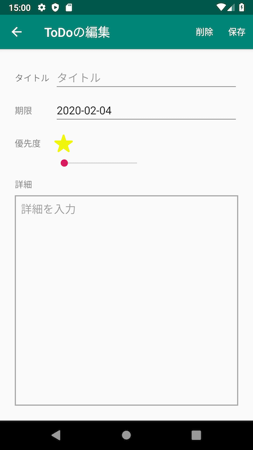

アクションバー以外のレイアウトはToDoの追加画面と全く一緒なので、ToDo追加画面のレイアウトファイル**fragment_add_to_do.xml**をそのまま編集画面でも使うことにします。
そうなるとファイル名としてfragment_add_to_doは正しくなくなってしまうので、**fragment_to_do_form**に変更しましょう。

ただそのままファイル名のみを編集した場合、そのファイルを参照している箇所があるとファイル名が変更されたことによってそのファイルを正しく読み込めなくなってしまうことがあります。
それを避けるため、Android Studioを含むIDEの基本機能である**Refactor**を使って参照元の記述も一括編集して、安全にファイル名を編集しましょう。
Refactorしたいファイル（今回は**fragment_add_to_do.xml**）を右クリックして、**Refactor -> Rename...**を選択します。

#### 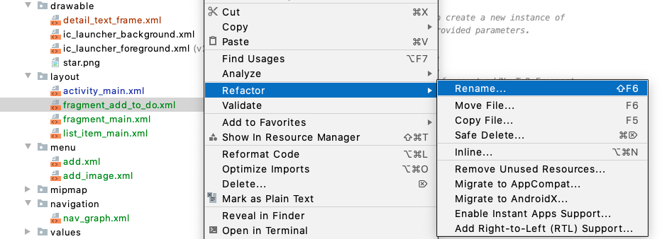

Renameダイアログが表示されるので、**fragment_to_do_form**としてPreviewを押下してください。

#### 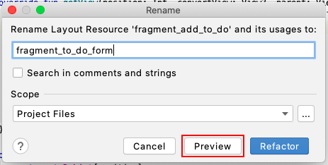

するとAndroid Studioの下の方に**変更されるファイル**が表示されるので、**Do Refactor**ボタンをクリックしてRefactorしてください。

#### 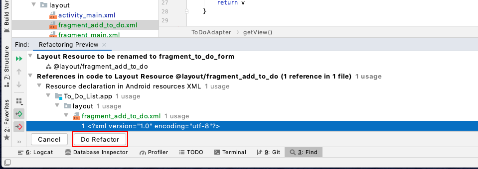

一度アプリを起動してみて、エラーが起きないか確認をしましょう。

---

さて次に、Navigation画面にて**EditToDoFragmnt**を作成しましょう。**app/res/navigation/nav_graph.xml**を表示してください。

これまでと同じようにEditToDoFragmentを追加しましょう。

#### 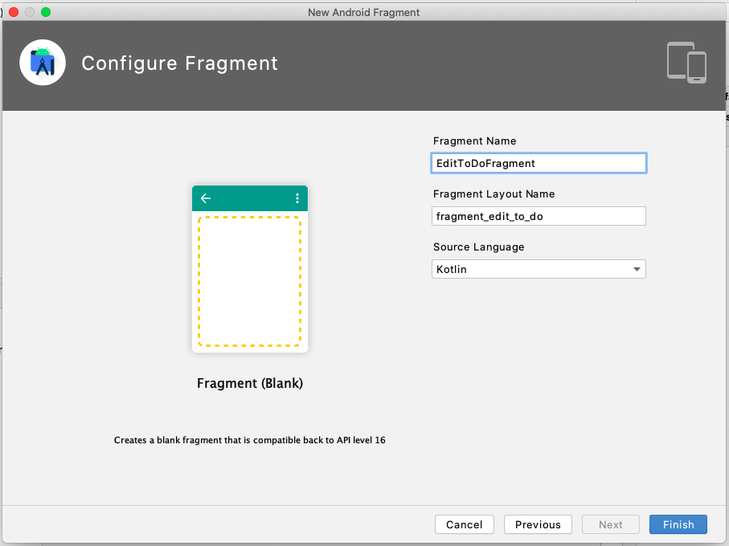

EditToDoFragmentを追加できたら、画面遷移やタイトルを以下のように設定しましょう。

#### 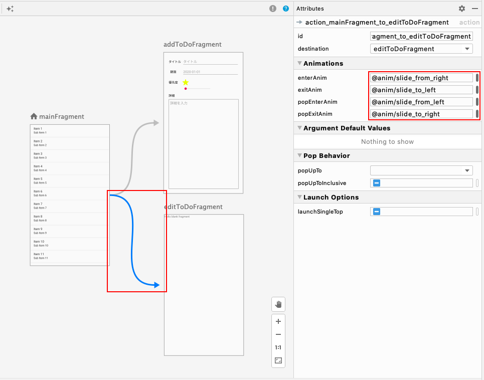

#### 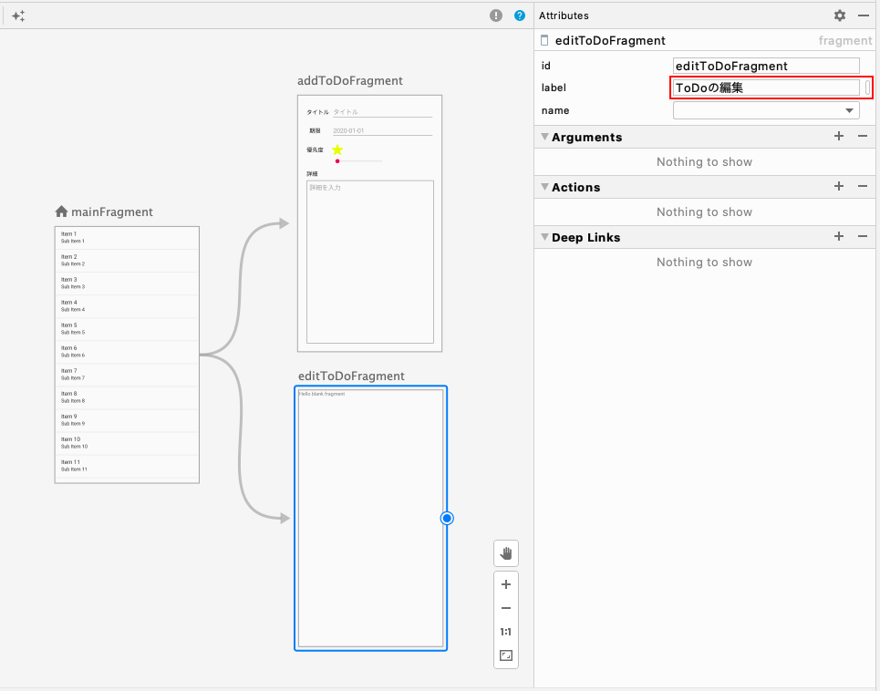

---

次に、メイン画面のListViewの行をタップしたらその行の**ToDoの情報を引き継いで編集画面へ遷移**する処理を記述していきます。
Naivigationでは画面遷移時に遷移元Fragmentから遷移先Fragmentに引数を渡すことができるので、タップされた行のToDoを引数としてEditToDoFragmentに渡すことにしましょう。

まずはEditToDoFragmentが特定の型の引数を受け取れるように設定します。
Navigation画面でEditToDoFragmentを選択し、Attributes内の**Arguments**（日本語で引数という意味）の右にある＋マークをクリックします。
すると以下のようなダイアログが表示されるので、名前と型を指定してOKをクリックし、EditToDoFragmentが受け取る引数を追加します。

#### 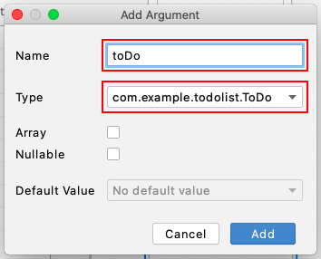

今回はNameを**toDo**、型Typeを**ToDo**に設定しますが、このToDo型はこちらで独自に作成した型なのでプルダウン内にされません。
ToDo型を選択するには、プルダウン内の**Custom Parcelable...**を選択してください。
すると以下のダイアログが開かれ、ToDo型を選択することができます。

#### 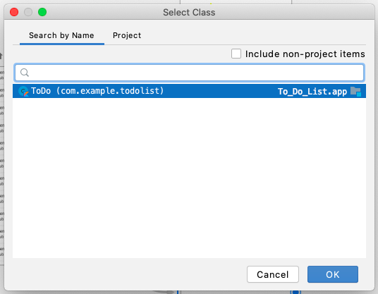

ここでToDoクラスを見てみると、**Parcelable**インターフェースを継承しています。
こうすることで、ActivityやFragmentに引数として渡せるようになります。
またクラスの頭に**@Parcelize**アノテーションをつけることで、Parcelableのoverrideメソッドを実装しなくても良くなります。

#### 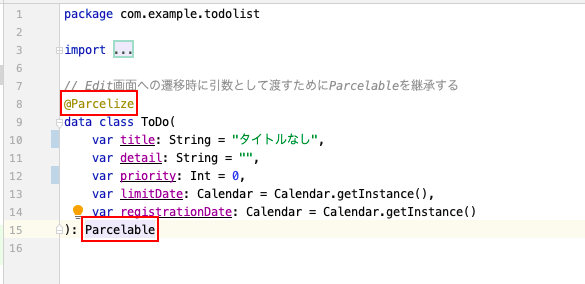

---

EditToDoFragmentにArgumentsを設定できたら、次は実際にEditToDoFragmentへ遷移した時にToDoを渡してみましょう。

**MainFragment**クラスを開いてください。
ListViewに、『**Listの行がタップされた時に呼ばれる**』Listenerメソッドを設定します。
**onCreatedView**内に以下の記述を追加してください。

```kotlin
override fun onCreateView(
    inflater: LayoutInflater, container: ViewGroup?,
    savedInstanceState: Bundle?
): View? {
		// 省略
    (activity as? MainActivity)?.toDoList?.let {
      	val toDoAdapter = ToDoAdapter(requireContext(), it)
        v.main_list_view.adapter = toDoAdapter
          
      	// ここから追加
     		v.main_list_view.setOnItemClickListener { _, _, position, _ ->
         		val action = MainFragmentDirections.actionMainFragmentToEditToDoFragment(
             		toDoAdapter.getItem(position)
         		)
         		findNavController().navigate(action)
     		}
       	// ここまで追加
          
    }
  	// 省略
}
```

追加画面へ遷移する時は```findNavController().navigate()```に遷移IDを渡していましたが、引数ありの画面遷移を行う場合は遷移IDではなく**遷移と引数を伴ったaction**を渡します。

```MainFragmentDirections.actionMainFragmentToEditToDoFragment()```という長い名前のメソッドがありますが、これはNavigation画面で画面遷移を追加した後にビルドすることで自動的に生成されるメソッドで、このメソッドに引数を渡すことでactionを作成できます。

また、```setOnItemClickListener```内で**position**という引数を受け取っていますが、ここにはタップした行がリスト全体の何行目にあたるかという数字をマイナス1した値、つまり**toDoListでのIndex**が入ってきます。
なので```toDoAdapter.getItem(position)```でその行のToDoを取得できます。

---

次にEditToDoFragmentで引数のToDoを受け取って、その内容を編集画面に表示しましょう。
**EditToDoFragment**を以下のように編集してください。コピペで大丈夫です。

```kotlin
class EditToDoFragment : Fragment() {

  	// 引数はnavArgs()でまとめて受け取れる（argsが参照された時の返却値をbyで肩代わりさせている）
    private val args: EditToDoFragmentArgs by navArgs()

    override fun onCreateView(
        inflater: LayoutInflater, container: ViewGroup?,
        savedInstanceState: Bundle?
    ): View? {
        val v = inflater.inflate(R.layout.fragment_to_do_form, container, false)
        val textBufferType = TextView.BufferType.EDITABLE

      	// タイトルの設定
        v.title_edit_text.setText(args.toDo.title, textBufferType)

      	// 期限日の設定
        v.limit_date_edit_text.setText(args.toDo.limitDate.toStrByAppDefStyle(), textBufferType)

      	// 期限日のEditTextがタップされた時にDatePickerDialogを出す処理
        v.limit_date_edit_text.setOnClickListener {
            val showDate = v.limit_date_edit_text.text.toString().toCalByAppDefStyle() ?: Calendar.getInstance()
            DatePickerDialog(
                requireActivity(),
                DatePickerDialog.OnDateSetListener { _, year, month, dayOfMonth ->
                    val selectedDate = Calendar.getInstance()
                    selectedDate.set(year, month, dayOfMonth)
                    v.limit_date_edit_text.setText(
                        selectedDate.toStrByAppDefStyle(),
                        TextView.BufferType.EDITABLE
                    )
                },
                showDate.get(Calendar.YEAR),
                showDate.get(Calendar.MONTH),
                showDate.get(Calendar.DATE)
            ).show()
        }

      	// 星のImageViewをList化
        val priorityStars = listOf(
            v.priority_image1, v.priority_image2, v.priority_image3, v.priority_image4, v.priority_image5
        )

      	// 星のイメージの表示・非表示を設定
        setPriority(priorityStars, args.toDo.priority)

      	// SeekBarの設定
        v.priority_seek_bar.progress = args.toDo.priority - 1

      	// SeekBarの値が変更された時の処理を設定
        v.priority_seek_bar.setOnSeekBarChangeListener(object: SeekBar.OnSeekBarChangeListener {
            override fun onProgressChanged(seekBar: SeekBar, progress: Int, fromUser: Boolean) {
                setPriority(priorityStars, progress + 1)
            }
            override fun onStartTrackingTouch(seekBar: SeekBar?) {}
            override fun onStopTrackingTouch(seekBar: SeekBar) {}
        })

      	// 詳細の設定
        v.detail_edit_text.setText(args.toDo.detail, textBufferType)

      	// アクションバーにMenuを表示するよう設定
        setHasOptionsMenu(true)

        return v
    }

    // 優先度imageの設定
    private fun setPriority(imageList: List<ImageView>, priority: Int) {
        for(i in 0 until imageList.size) {
            val visible = if (i < priority) View.VISIBLE else View.INVISIBLE
            imageList[i].visibility = visible
        }
    }

}
```

```args```を呼ぶことで**```navArgs()```**で引数を受け取れるようにし、編集画面を開いた時にその引数（ToDo）の内容を画面に表示するために```onCreateView```内で設定をしています。
また星の画像の表示/非表示の設定は編集画面を開いた時とSeekBarの値が変更された時の2箇所で必要になる処理なので、処理を```setPriority```というメソッドにまとめています。

ここまでできたらアプリを起動して確かめてみましょう。

---

次に編集画面の内容を保存しましょう。
今回はアクションバー上の保存ボタンをタップしたらToDoが保存され、メイン画面に戻るような処理の流れとします。

まずは保存ボタンのMenuを作成しましょう。ファイル名は**save.xml**とします。

#### 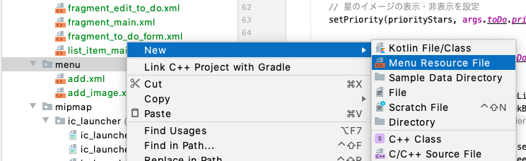

#### 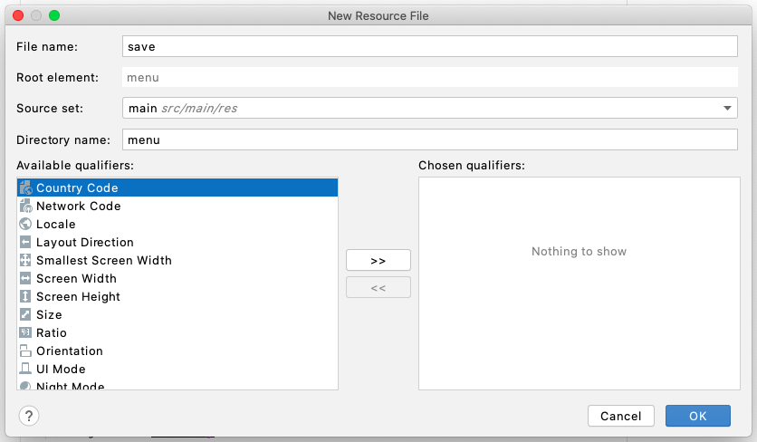

**save.xml**内は以下のようにしてください。

```xml
<?xml version="1.0" encoding="utf-8"?>
<menu xmlns:android="http://schemas.android.com/apk/res/android"
    xmlns:app="http://schemas.android.com/apk/res-auto">

    <item
        android:id="@+id/save"
        android:title="保存"
        app:showAsAction="always" />

</menu>
```

そして**EditToDoFragment**クラス内に以下の記述を追加してください。

```kotlin
override fun onCreateOptionsMenu(menu: Menu, inflater: MenuInflater) {
    // 表示するアクションバーMenuを設定
    inflater?.inflate(R.menu.save, menu)
}

override fun onOptionsItemSelected(item: MenuItem): Boolean {
    when (item.itemId) {
        R.id.save -> {
          	// args.toDoを編集しListを保存する
            args.toDo.title = title_edit_text.text.toString()
            args.toDo.registrationDate = Calendar.getInstance()
            args.toDo.limitDate = limit_date_edit_text.text.toString().toCalByAppDefStyle() ?: Calendar.getInstance()
            args.toDo.priority = priority_seek_bar.progress + 1
            args.toDo.detail = detail_edit_text.text.toString()
            (activity as? MainActivity)?.saveToDoList()

            // 前の画面に戻る
            findNavController().navigateUp()
          
            return true
        }
        else -> return super.onOptionsItemSelected(item)
    }
}
```

アプリを起動して、実際に編集した値が保存されているか確かめてみましょう。


## ToDoの削除

今回のアプリはToDo編集画面でToDoの削除ができる想定なので、削除機能を実装しましょう。
アクションバー上の削除ボタンをタップするとToDoが削除されてメイン画面に戻るような処理の流れとします。

編集画面で削除機能を実装する場合、EditToDoFragmentへ渡す引数として**ToDonのIndex**が必要になります。
toDoListからToDoを削除するには、そのToDoのIndexを指定する必要があるからです。

ではNavigation画面を開き、引数に**Integer**を追加しましょう。引数名は**index**とします。

#### 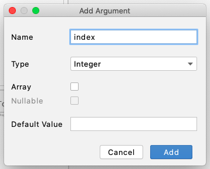

引数を追加したら**MainFragment**クラスを開き、以下のように修正してください。

```kotlin
class MainFragment : Fragment() {

    override fun onCreateView(
        inflater: LayoutInflater, container: ViewGroup?,
        savedInstanceState: Bundle?
    ): View? {
      	// 省略
        (activity as? MainActivity)?.toDoList?.let {
          	// 省略
            v.main_list_view.setOnItemClickListener { _, _, position, _ ->
                val action = MainFragmentDirections.actionMainFragmentToEditToDoFragment(
                    toDoAdapter.getItem(position), position // 引数にpositionを追加
                )
                findNavController().navigate(action)
            }
        }
		// 省略
    }
    // 省略
}
```

---

次に、先ほどと同じように削除ボタンのMenuを作成しましょう。ファイル名は**delete.xml**とします。
作成できたら、xml内を以下のように編集してください。

```xml
<?xml version="1.0" encoding="utf-8"?>
<menu xmlns:android="http://schemas.android.com/apk/res/android"
    xmlns:app="http://schemas.android.com/apk/res-auto">

    <item
        android:id="@+id/delete"
        android:title="削除"
        app:showAsAction="always" />

</menu>
```

そして**EditToDoFragment**内を以下のように編集してください。

```kotlin
class EditToDoFragment : Fragment() {
  	// 省略
    override fun onCreateOptionsMenu(menu: Menu, inflater: MenuInflater) {
        inflater.inflate(R.menu.delete, menu) // 削除ボタンを追加
        inflater.inflate(R.menu.save, menu)
    }

    override fun onOptionsItemSelected(item: MenuItem): Boolean {
      	val mainActivity = activity as? MainActivity // 複数の箇所で使う値を共通変数化
        when (item.itemId) {
        	R.id.save -> {
            	args.toDo.title = title_edit_text.text.toString()
            	args.toDo.registrationDate = Calendar.getInstance()
            	args.toDo.limitDate = limit_date_edit_text.text.toString().toCalByAppDefStyle() ?: Calendar.getInstance()
            	args.toDo.priority = priority_seek_bar.progress + 1
            	args.toDo.detail = detail_edit_text.text.toString()
            	mainActivity?.saveToDoList() // mainActivity（メソッド内先頭で定義した変数）を使う
                // 省略
        	}
            R.id.delete -> {
              	mainActivity?.let {
                	// ToDoを削除してListを保存する
                	it.toDoList.removeAt(args.index)
                    it.saveToDoList()
                    
              		// 前の画面に戻る
                	findNavController().navigateUp()
                }
                return true
            }
			// 省略
        }
    }
}
```


以上でToDoリストアプリの完成です。お疲れ様でした。
