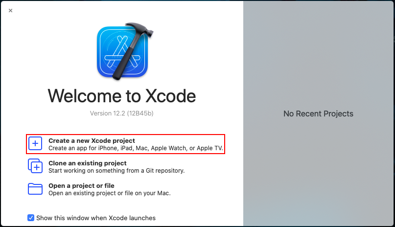
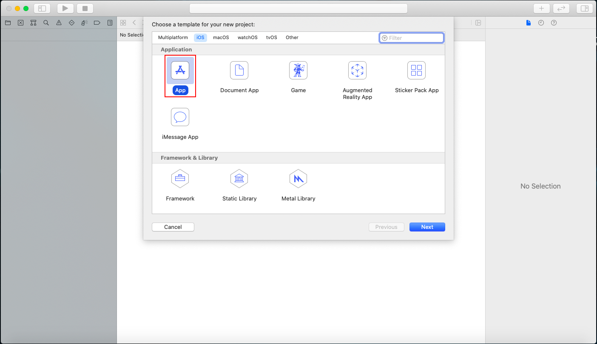
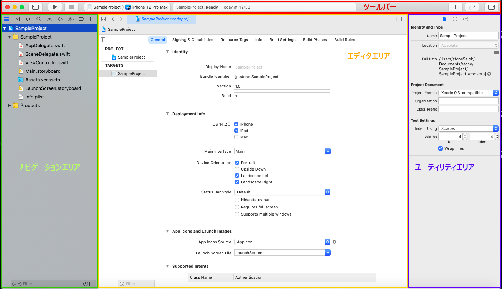
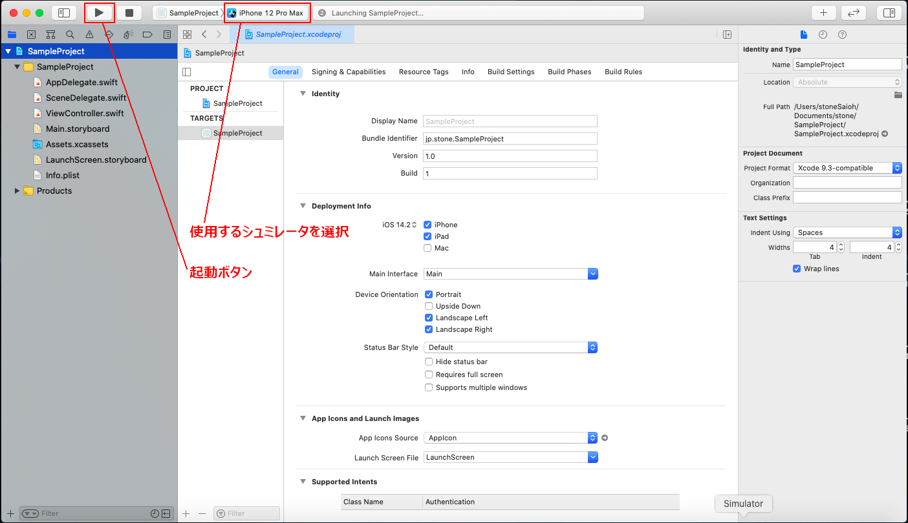
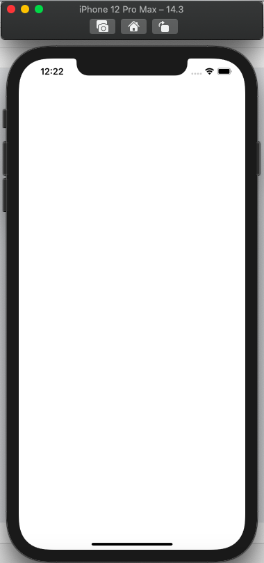

# イントロダクション

## iOSアプリ開発

iOSアプリの開発ではMacで利用可能なIDE(統合開発環境)[^1]のXcodeを使用します。 
また、使用するプログラミング言語はSwiftとObjective-Cのいずれかを選択できますが、現在はSwiftが主流となっています。 
(2019年12月時点でXcodeはVersion 11.0、SwiftはSwift5が最新版となっています。) 

実際にXcodeでアプリを作ってみましょう。 

## 新規プロジェクトの作成

#### 1. Xcodeを起動すると次のような画面が開きます。

#### 2. "Create a new Xcode project"を選択すると、プロジェクトのテンプレートを選択する画面が表示されます。

いくつかのテンプレートが用意されていますが、ここではもっとも基本的な"Single View App"を選択します。 

#### 3. テンプレートを選択し、"Next"を押すとプロジェクトの名前などを設定する画面が表示されます。

※ Xcode 11から、ボタンの配置などUI(User Interface)の作成にStoryboardとSwift UIのいずれかが選択可能となりました。 
今回の研修ではStoryboardを使って開発を行なっていきたいと思います。 

入力を終えて"Next"を押すと、プロジェクトの保存場所を選択になりますが、特にこだわりがない場合はデフォルトで選択されている場所に保存して構いません。 
保存場所決定すると、iOSアプリのプロジェクトが作成されます。 

## Xcodeの各画面の説明

#### 1. ツールバー
アプリの起動・停止などの操作を行うボタンなどが存在するエリアです。 

#### 2. ナビゲーションエリア
プロジェクト(アプリ)を構成するフォルダやファイルの一覧を表示するエリアです。 

#### 3. エディタエリア
ファイルを編集するエリアです。 

#### 4. ユーティリティエリア
ファイルのプロパティなどを設定するエリアです。 

## アプリの起動

プロジェクトを作成した時点でiOSアプリをMac上で起動することができます。 
ツールバーの"▶︎"を押してアプリを起動してみましょう。真っ白な画面が出てきたら成功です。 
※シュミレータがインストールされていない場合は、インストールしてから起動する必要があります。 

### 実機での起動

また、AppleIDとpasswordをお持ちの方は実機でテストすることもできます。 
1.General > SigningのTeamで自分のアカウントを設定する 
2.ツールバーからDeviceを接続している端末に設定し、build 
3.設定 > 一般 > プロファイルとデバイスの管理から、デベロッパAPPで自分のアカウントを信頼する。 

アプリの起動を確認できたので、ここからアプリに様々な変更を加えていきたいと思います。 

<!-- Annotations -->
[^1]:開発に必要なツールがひとまとめになったソフトウェア