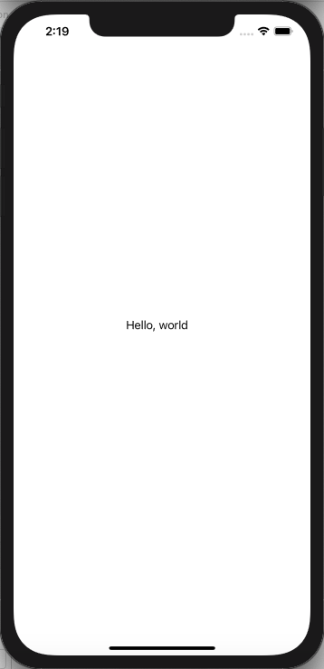
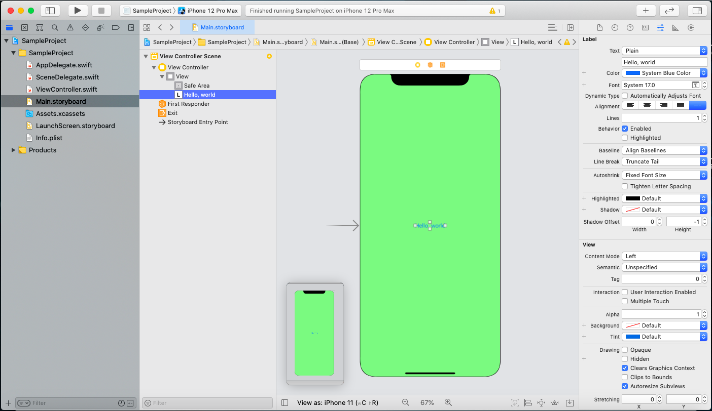
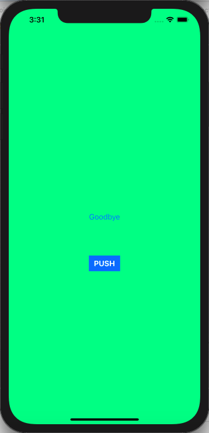
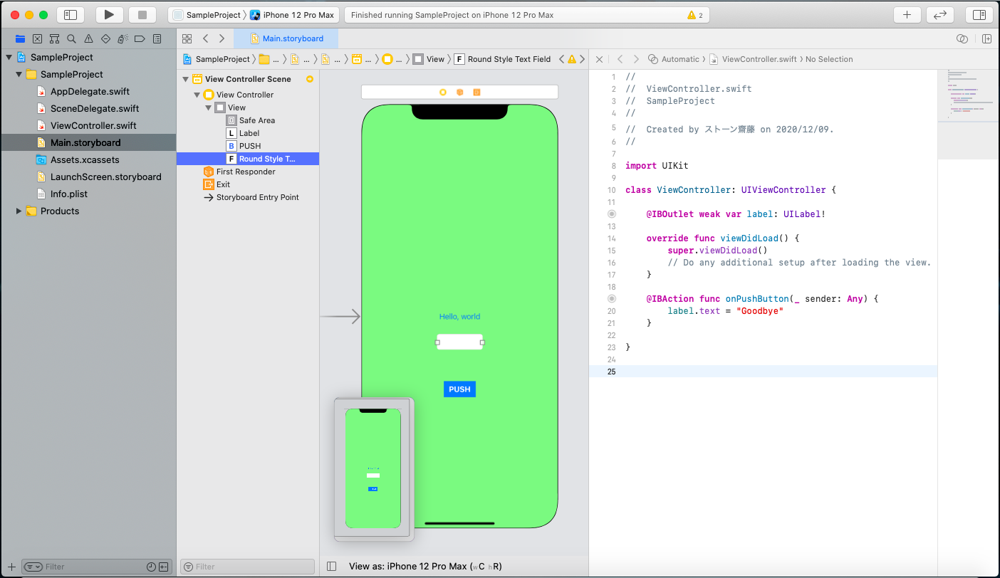
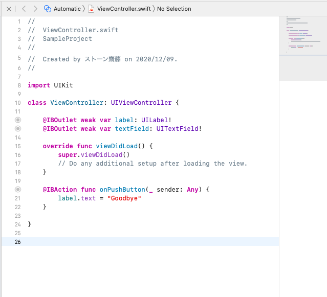
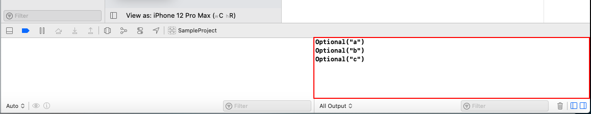

# iOSアプリ開発・プログラミングの基礎

iOSアプリは基本的に以下の手順を繰り返して作り込んでいきます。<br>

#### UIの作成(パーツの配置) → 配置したUIパーツとユーザー(アプリ利用者)のアクションに対して処理を紐づける → 紐づけた処理を実装する(コーディング)

まずは簡単なUIパーツを配置して、アプリを動かしてみましょう。<br>

## ラベル(文字)

#### 1. Main.storyboardを開く


Main.storyboardはアプリの画面を設定するファイルです。<br>
ここに表示されているiPhoneの画面に対してパーツを配置していきます。<br>

#### 2. Labelを配置する

ツールバーの+ボタンを押してメニューを表示し、Labelをドラッグアンドドロップで画面に配置します。<br>


#### 3. 文字を編集する

デフォルトでは「Label」の文字が入っているため、ここに任意の文字を入力してみます。<br>


#### 4. 実行

この状態でアプリを起動してみましょう先ほど入力した文字が表示されるはずです。<br>
※現時点では端末によって配置した場所からずれて表示される場合があります。<br>



#### 5. 色を変更する

右側のユーティリティエリアから画面や配置したパーツの設定をいじることができます。背景色や文字色を変化させてみましょう。<br>
背景色 → 「View」を選択し、ユーティリティエリアから「Background」を変更します。<br>
文字色 → 「Label」を選択し、ユーティリティエリアから「Color」を変更します。<br>



## ボタン

#### 1. Buttonを配置する

ツールバーのLibraryボタンを押してメニューを表示し、Buttonをドラッグアンドドロップで画面に配置します。<br>


配置が終わったら、Labelと同じ様にユーティリティエリアからTitle, Text Color, Background Colorなどを変更して見た目を整えてください<br>


#### 2. ボタンを押した時の処理を実装する

ボタンを配置できたので、このボタンを押した時、Labelの文字を変更する処理を実装してみましょう。(プログラミング)<br>
実装手順はいくつも考えられますが、今回は以下の手順で作っていきます。<br>

1. 画面に紐づくソースコードを開く
2. 変更対象のラベルをソースコードに紐づける
3. <u>「ボタンを押して離す」</u>というアクションをソースコードに紐づける
4. ソースコードに紐づけたラベルのTextにアクセスして、文字を変更する処理を記述する。
5. 実行してみて動作を確認する。

#### ソースコードの表示

まず、画面に紐づくソースコードを表示してみます。<br>
以下のように画面上部のハンバーガーメニューから「Assistant」を選択することで、ソースコードを表示することが可能です。<br>


※ ここで開いたソースコードはナビゲーションエリアに表示されている「ViewController.swift」です。<br>

#### ラベルの紐づけ

Main.storyboard上のLabelをctrlキーを押しながらクリックし、ソースコードに向かって引っ張ります。<br>
メニューが表示されるので、ソースコード上でこのラベルを扱うための名前を入力すると、ソースコード上に一行追加されます。<br>
●がつけば紐づけ完了です。<br>


#### アクションの紐づけ

Main.storyboard上のButtonを選択し、ユーティリティエリアの一番左の「→」ボタンをクリックすると、そのボタンに対するアクションの一覧が表示されます。<br>
この一覧の中の「Touch Up Inside」(UIパーツの上で指を離すアクション)の○マークをクリックし、ソースコードに向かって引っ張ります。<br>
●がつけば紐づけ完了です。<br>


#### 処理の記述

最後にラベルの文字列を変更する処理を記述します。<br>
アクションに紐づけた部分の{}の間に以下の様な記述を加えてください。<br>

```swift
@IBAction func onPushButton(_ sender: Any) {
  label.text = "Goodbye"
}
```

これは<font color="red">代入</font>と呼ばれる処理になります。<br>
ボタンが押された時にラベルのテキスト(表示する文字)に対して"Goodbye"という文字列を代入しています。<br>

#### 3. 実行

ここまでできたら実際に動かして確認してみましょう。ボタンを押した時にLabelの文字が変化するはずです。<br>



## テキストボックス

次にテキストボックスを使ってユーザーから入力された文字列をラベルに設定する処理を実装してみましょう。<br>

#### 1.TextFieldを配置する

ツールバーのLibraryボタンを押してメニューを表示し、Buttonをドラッグアンドドロップで画面に配置します。<br>



#### 2.テキストボックスの紐づけ

ラベルの時と同様に、Main.storyboard上のText Fieldをctrlキーを押しながらクリックし、ソースコードに向かって引っ張って紐付けを行います。<br>



#### 3.処理の記述

先ほどボタンを押した時の処理を記述した部分を、テキストボックスの値を設定するように修正します。<br>

```swift
@IBAction func onPushButton(_ sender: Any) {
  label.text = textField.text
}
```

#### 4. 実行

## 計算機アプリ

ここまでで大体の流れが掴めたと思うので、もう少し実用的なアプリにしてみましょう。<br>
三つのテキストボックスを用意し、二つの入力値を使って四則演算を行うアプリを作ります。<br>

<!-- TODO: 完成イメージのgifを用意 -->

#### 1. TextFieldを配置し、コードに紐づける

まずは、演算子と第二項を入力するためのテキストボックスを二つ用意します。<br>


配置し終えたらコードへの紐づけも行いましょう。<br>

#### 2. 処理の記述

ボタンを押した際の処理を、テキストボックスの入力値を元に四則演算を行う処理に書き換えていきます。<br>
まず、それぞれのテキストフィールドの入力値を取得してみましょう。以下の様に記述してください。<br>
(警告が表示されますが、気にせず記述してください。)<br>

```swift
@IBAction func onPushButton(_ sneder: Any) {
  let text = textField.text
  let text2 = textField2.text
  let text3 = textField3.text
}
```

この`let text = textField.text`は<font color="red">変数定義</font>と呼ばれます。<br>
変数は、処理の中で値に名前をつけて保持しておく為に使用されます。<br>
この変数の中身を見てみましょう。<br>
ラベルの書き換えでは、テキストボックスの値を画面に表示しましたが、xcode上から値を参照することもできます。<br>
以下の様に記述を変更してください。<br>

```swift
@IBAction func onPushButton(_ sender: Any) {
  let text = textField.text
  let text2 = textField2.text
  let text3 = textField3.text
  print(text)
  print(text2)
  print(text3)
}
```

この状態で実行すると、以下の様にエディタエリアの下(デバッグエリア)に文字が表示されます。<br>
printを使用すると()の中に記述した値がデバッグエリアに表示されます。<br>



ここで`Optional("a")`と表示されていますが、Optionalは値が取れるかどうか不確定なものに付与されるもので、<br>
テキストボックスの値を取得した際、その値が確実に取得できることが保証されていないため、この様な表示になっています。<br>

次に取得した値を使って計算を行いますが、このままでは計算を行うことができません。<br>
というのも、swiftには<font color="red">データ型</font>という概念があり、それぞれの値がどういった種類のデータなのかが厳格に区別されているからです。<br>
テキストボックスの値は<font color="red">String型(文字列型)</font>という種類のデータで、計算を行う為には<font color="red">Int型(整数型)</font>に変換する必要があります。<br>
また、Optionalもデータ型の一種で、テキストボックスの値は正確には<font color="red">Optional\<String\>型</font>です。<br>
このため、計算を行う為にはOptional\<String\>型 → String型 → Int型の変換処理をコードに記述する必要があります。<br>
まずはOptional\<String\>型 → String型の変換処理です。<br>

```swift
@IBAction func onPushButton(_ sender: Any) {
  let text = textField.text ?? ""
  let text2 = textField2.text ?? ""
  let text3 = textField3.text ?? ""
  print(text)
  print(text2)
  print(text3)  
}
```

Optional\<String\>型 → String型の変換は`Optional値 ?? 値が取れなかった場合の代替値`とすることで変換可能です。<br>
`let text = textField.text ?? ""`は、テキストボックスの入力値が正しく取得できた場合、その値を、取得できなかった場合""(空文字)を変数textとして保持しておきます。[^1]<br>
次にString型 → Int型の変換処理です。<br>

```swift
@IBAction func onPushButton(_ sender: Any) {
  // 変数名を変更
  let num1 = Int(textField.text ?? "") ?? 0
  let num2 = Int(textField2.text ?? "") ?? 0
  let num3 = Int(textField3.text ?? "") ?? 0
  print(text)
  print(text2)
  print(text3)
}
```

String型 → Int型の変換処理は、`Int(String型の値)`とすれば良いのですが、注意しなければならないのが、この変換後の値がOptional\<Int\>となることです。<br>
String型 → Int型の変換処理では、1という文字を1という数値に変換することはできても、aという文字に対応する数値がないため、値をうまく変換することができないことがあるからです。<br> 
そのため、`?? 0`をつけて代替値を用意する必要があります。<br>
<br>
ここまでできると、四則演算が可能となります。<br>
例えば足し算は以下のようにします。<br>

```swift
@IBAction func onPushButton(_ sender: Any) {
  let num1 = Int(textField.text ?? "") ?? 0
  let num2 = Int(textField2.text ?? "") ?? 0
  let num3 = Int(textField3.text ?? "") ?? 0
  print(num1 + num3)
}
```

その他の演算は以下の通りです。<br>

| 演算子 | 演算 |
| :-: | :-- |
| - | 引き算 |
| * | 掛け算 |
| / | 割り算(商のみ) |

四則演算ができたので、残るは演算子の判定のみです。<br>
textField2.textに演算子が入力されるとして、この値によって行う演算を変化させる処理を記述します。<br>
以下のようにプログラムを変更してください。<br>

```swift
@IBAction func onPushButton(_ sender: Any) {
  let num1 = Int(textField.text ?? "") ?? 0
  let op = textField2.text ?? "" // 演算子は文字列なのでInt型に変換しない
  let num2 = Int(textField3.text ?? "") ?? 0 // 変数名を変更
  // opの値によって処理を分岐させる
  switch (op) {
  case "+":
    label.text = String(num1 + num2) // label.textはString(?)型のため、計算結果をString型に変換してから設定
  case "-":
    label.text = String(num1 - num2)
  case "*":
    label.text = String(num1 * num2)
  case "/":
    label.text = String(num1 / num2)
  default:
    label.text = "エラー" // +, -, *, /のどれにも当てはまらない場合はエラーを設定
  }
}
```

これは<font color="red">switch文</font>と呼ばれる構文で、*switch()*内に指定した値が*case*で列挙した値のどれかに当てはまる場合コロン(:)以降の処理を実行します。<br>
コロン(:)以降の処理については複数行記述でき、以下のように変数定義もできます。<br>

```swift
~ 省略 ~

case "+":
  let result = num1 + num2
  label.text = String(result)

~ 省略 ~
```

また、同じ処理を以下のように記述することもできます。<br>

```swift
@IBAction func onPushButton(_ sender: Any) {
  let num1 = Int(textField.text ?? "") ?? 0
  let op = textField2.text ?? ""
  let num2 = Int(textField3.text ?? "") ?? 0
  if (op == "+") { // opと+が同一の値かどうか比較を行なっている
    label.text = String(num1 + num2)
  } else if (op == "-") {
    label.text = String(num1 - num2)
  } else if (op == "*") {
    label.text = String(num1 * num2)
  } else if (op == "/") {
    label.text = String(num1 / num2)
  } else {
    label.text = "エラー"
  }
}
```

こちらは<font color="red">if文</font>と呼ばれる構文で、最初は*if()*、それ以降は*else if()*に値の値の比較などの実行条件を記述することで、その条件が真の場合に*{}*で囲まれた部分の処理を行います。<br>
*else*はif, else ifのどの条件にも該当しない場合に実行されます。<br>
今回は*==(等号)*を使って値を比較しましたが、他には以下のような比較があります。<br>

| 演算子 | 演算 |
| :-: | :-- |
| a != b | aとbは等しくない |
| a > b | aはbより大きい |
| a >= b | aはb以上 |
| a < b | aはbより小さい |
| a <= b | aは以下 |

## 課題1

ここまでで作った計算機アプリでは、割り算を行なった際に、3つ目のテキストボックスの値が0になるとアプリが停止してしまいます。<br>
これを解決する為に3つ目のテキストボックスの値を判定し、0の場合はラベルにエラーを表示するように修正を行なってください。<br>


## 繰り返し処理

ここでもう一つ重要な構文について触れておきましょう。<br>
ある処理を複数回繰り返す際に用いるfor in文です。<br>
以下のようにコードを編集し、実行しててください。<br>

```swift
@IBAction func onPushButton(_ sender: Any) {
  let num1 = Int(textField.text ?? "") ?? 0
  let num2 = Int(textField2.text ?? "") ?? 0
  for i in 0..<num2 {
    print("\(i): \(num1)") // "\(変数名)"で変数を文字列中に埋め込むことができる
  }
}
```

動作を確認してみると、ボタンを押した際に2つ目のテキストボックスに入力した回数分1つ目のテキストボックスに入力した値がデバッグエリアに表示されます。<br>
改めてコードを確認してみると、`for i in 0..<num2`の部分は0からnum2まで(num2は含めない)の数値を順番にiという変数に代入するという意味で、<br>
{}で囲われた部分は変数iに値が代入されるたびに実行される処理を表しています。<br>
`0..<num2`の部分は`0...num2`とすることもでき、この場合、0からnum2も含めた数値が順番に変数iに代入されます。<br>
また、{}で囲われた部分の処理中に変数iが必要ない場合、`for _ in 0..<num`として変数を省略することも可能です。<br>
<br>
この構文を利用して、以下の課題に取り組んでみてください。<br>

## 課題2

ここまでで作った計算機アプリに累乗を求める機能を追加してください。<br>
演算子に"^"が入力された場合に、1つ目のテキストボックスの数値を2つ目のテキストボックスに入力された数値分かけた値をラベルに表示します。<br>
<br>
ヒント:<br>
計算途中の値を保持しておく必要があるため、変数を利用しますが、一度値を設定した変数に別の値を設定したい場合、<br>
`let 変数名`で変数定義を行うのではなく、`var 変数名`として変数を定義します。<br>

## 関数

ここまでで、onPushButton内のコードがかなり長くなってしまったと思います。<br>
プログラミングではこうしたコードを分割して、名前をつけて処理を小分けにする<font color="red">関数定義</font>という機能が存在します。<br>
小分けにした処理は別の部分からも実行可能であり、処理の再利用が可能となります。<br>
関数にはインプット(<font color="red">引数</font>)とアウトプット(<font color="red">戻り値</font>)が存在し、<br>
処理を実行する前にパラメータとして引数を渡し、処理の結果を戻り値として受け取ることが可能です。<br>
ここでは関数定義の例として、onPushButtonの処理中から、受け取った文字列に応じた演算を行う処理を関数に切り出してみます。<br>
以下のようにコードを修正してください。<br>

```swift
// 省略

@IBAction func onPushButton(_ sender: Any) {
  let num1 = Int(textField.text ?? "") ?? 0
  let op = textField2.text ?? ""
  let num2 = Int(textField3.text ?? "") ?? 0
  label.text = calculate(num1, num2, op: op) // 3.関数の呼び出し
}

// 1. func 関数名(func 関数名(引数列挙) -> 戻り値の型 {}
func calculate(_ num1: Int,  _ num2: Int, op: String) -> String { 
  // 2. 各演算の処理結果をreturnによって呼び出し元に返却
  if (op == "+") { // opと+が同一の値かどうか比較を行なっている
    return String(num1 + num2)
  } else if (op == "-") {
    return String(num1 - num2)
  } else if (op == "*") {
    return String(num1 * num2)
  } else if (op == "/") {
    return String(num1 / num2)
  } else {
    return "エラー"
  }
}

// 省略
```

swiftの関数は`func 関数名(func 関数名(引数列挙) -> 戻り値の型 {}`としてコード中に記述し、{}内に処理を記述します。<br>
戻り値は`return 戻り値`と記述し、呼び出し元ではそれを変数などに代入することによって後続の処理に使用することができます。<br>
引数名は_(アンダースコア)頭につけて定義することによって呼び出し元で引数を設定する際に省略することがきます。<br>
これで、処理を切り出すことができ、onPushButton内の処理もスリムにすることができました。<br>
しかし、関数calculateの再利用性を考えた場合、引数が文字列だと使い勝手が悪いかもしれません。(calulateの値を使って別の計算を行う場合など)<br>
そこで、戻り値の値を整数値にしてみましょう。ただし、失敗した場合も考え、戻り値はOptionalの値とします。<br>

```swift
// 省略

@IBAction func onPushButton(_ sender: Any) {
  let num1 = Int(textField.text ?? "") ?? 0
  let op = textField2.text ?? ""
  let num2 = Int(textField3.text ?? "") ?? 0
  // 2. if let文。オプショナルバインディングと呼ばれる。
  if let reuslt = calculate(num1, num2, op: op) {
    // 演算が成功した場合、変数resultに値が代入され、{}で使用可能となる。
    label.text = String(result)
  } else {
    // 演算が失敗した場合、こちらが実行される。
    label.text = "エラー"
  }
}

func calculate(_ num1: Int,  _ num2: Int, op: String) -> Int? { // 1.戻り値をOptional Intに変更ß
  if (op == "+") { 
    return num1 + num2
  } else if (op == "-") {
    return num1 - num2
  } else if (op == "*") {
    return num1 * num2
  } else if (op == "/") {
    return num1 / num2
  } else {
    return nil // 失敗した場合は値なしを表すnilを返却する。
  }
}

// 省略
```

関数呼び出しの部分で使っている構文は<font color="red">if let文</font>と呼ばれる構文で、<br>
letで定義した変数に値が入っていた場合、if節を、入っていなかった場合else節を実行します。<br>
