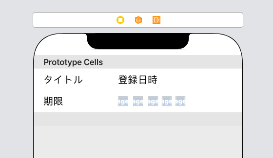
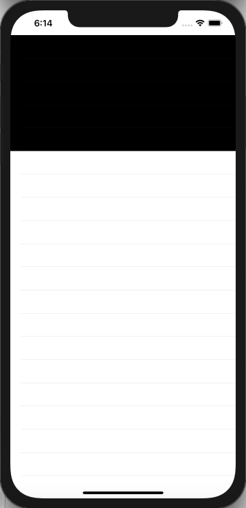
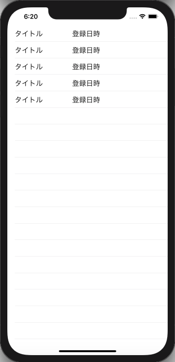

# ToDoリストアプリの作成

ここからはより実用的なアプリの例として、ToDoリストのアプリを作っていきます。<br>

## 主な仕様

- アプリを起動すると登録されているToDoのリストが表示される。
- 新しいToDoを登録できる。
- ToDoはそれぞれタイトル・登録日時・期限・優先度(5段階)・内容の5つの情報を持ち、このうちリストの各項目にはタイトル・登録日時・期限・優先度が表示される。
- それぞれのToDoをタップするとToDoの詳細画面へ遷移し、情報の確認・編集することができる。(オプション)
- ToDoを削除することができる。(オプション)

## 新規プロジェクトの作成

まずは、新規プロジェクトを作成します。

- Product Name: ToDoList
- Language: Swift
- User Interface: Storyboard

## テーブルを表示する

まずは、ToDoを表示するリスト(テーブル)を画面に表示してみます。<br>

#### 1. テーブルの配置

テーブルもUIパーツなので、ツールバーの+ボタンを押してメニューを表示し、Table Viewをドラッグアンドドロップで画面に配置します。<br>


配置が終わったら、TableViewをコードに紐づけます。<br>

```swift
@IBOutlet weak var toDoTable: UITableView!
```

ここで一旦実行してみると、画面上にリストが表示されます。<br>


## テーブルの各行にUIパーツを表示する

#### 1. テーブルセルの配置

テーブルの各行にUIパーツを表示する為には、表示する行の一つ分を表す*テーブルセル*をテーブルに配置する必要があります。<br>
ツールバーの+ボタンを押してメニューを表示し、Table View CellをドラッグアンドドロップでTableViewに配置します。(コードとの紐付けを行いません。)<br>


#### 2. テーブルセルにパーツを配置する

次に、テーブルセルに対してTODOの情報に対応するUIパーツを配置していきます。<br>
テーブルに表示する内容はタイトル・登録日時・期限・優先度なので、

- タイトル → Label
- 登録日時 → Label
- 期限 → Label
- 優先度 → Image(星マークの画像5つで表す)

として考え、それぞれ以下のようにテーブルセルに配置していきます。<br>



※ 作業しやすいようにTableViewCellのrowHightを90 ~ 100程度に設定しておく(定規マークから編集可能)<br>
※ わかりやすいように各Labelにそれぞれのパラメータ名を入れる。<br>
※ ここでimageは20×20の大きさを指定する。<br>

#### 3. 星マークを設定する

[星マーク](https://github.com/stone-shun-oyama/ToDoList/tree/master/images)

アプリで使う画像ファイルはAssets.xcassetsという場所に設定します。<br>
Assets.xcassetsを開き、左側のリスト内で右クリックをしてImageSetを作成します。<br>
次に「1x」に星画像をドラッグ&ドロップし、名前を「Image」から「Star」に変更してください。<br>
これでアプリから画像ファイルを使用する準備ができたので、優先度のImageに星画像を設定していきます。(各ImageのImageプロパティでStarを選択)<br>


#### 4.テーブルセルの表示

ここまでで、必要なUIパーツの配置が完了しましたが、テーブルセルはコードに紐づいていないため、このまま実行してもテーブルには何も表示されません。<br>
これまでコードと紐づけたUIパーツはそれぞれコードと1対1で紐づいていましたが、テーブルセルはToDoの数分紐付けを行わなくてはならないため、これまでと同様の手順ではコードとの紐付けを行うことはできません。<br>
そこで、コード上からテーブルに表示するテーブルセルを生成するという方法を使います。<br>
まず、以下のようにコードを編集してください。<br>

```swift
class ViewController: UIViewController, UITableViewDelegate, UITableViewDataSource { // 1. ", UITableViewDelegate, UITableViewDataSource"を追記

  @IBOutlet weak var toDoTable: UITableView!

  override func viewDidLoad() {
    super.viewDidLoad()
    // 4. 以下の2行を追記
    toDoTable.delegate = self
    toDoTable.dataSource = self
  }

  // 2. 追記
  func tableView(_ tableView: UITableView, numberOfRowsInSection section: Int) -> Int {
  }

  // 3. 追記
  func tableView(_ tableView: UITableView, cellForRowAt indexPath: IndexPath) -> UITableViewCell {
  }

}
```

ここで、2.、3.で記述した部分に警告が表示されます。<br>
追記箇所の2.、3.は、

- テーブルに表示するテーブルセルの個数
- テーブルに表示するテーブルセル(UIパーツ)

の設定箇所に相当し、このままの記述だと、それぞれの設定値がアプリ側に通知されないため、警告が出ています。<br>
それぞれの箇所でアプリ側に設定値を通知する為には`return 設定値`という構文を使います。<br>
それぞれの箇所を以下のように修正して下さい。<br>

```swift
  // 2.の追記箇所
  func tableView(_ tableView: UITableView, numberOfRowsInSection section: Int) -> Int {
    return 5 //　好きな値を設定
  }
```

```swift
  // 3.の追記箇所
  func tableView(_ tableView: UITableView, cellForRowAt indexPath: IndexPath) -> UITableViewCell {
    let cell = UITableViewCell()
    cell.backgroundColor = UIColor.black // セルの色を指定
    return cell
  }
```

ここまで記述したら、動作確認を行なってみましょう。<br>
指定した個数分のセルの背景色が変化するはずです。<br>



追記箇所2.では数値をそのまま記述すれば良いのですが、追記箇所3.ではUITableViewCellという値を設定したcellをreturnしています。<br>
このUITableViewCellはStoryBoard上でUIパーツリストから選んだTableViewCell一つ分に相当しており、各プロパティにはそのテーブルセルを格納した変数からアクセスすることができます。<br>
(ここではテーブルにセルが表示されることを確認するため、セルの背景色を変更しています。)<br>
<br>
これでテーブルにセルを表示することはできましたが、`let cell = UITableViewCell()`の部分で作ったテーブルセルはStoryBoard上で追加したテーブルセルとは別物です。<br>
StoryBoard上で追加したテーブルセルを使用する為にはStoryBoard上のテーブルセルをコード上から呼び出してUITableViewCellの代わりに使う必要があります。<br>
以下のようにコードを修正して下さい。<br>

```swift 
  func tableView(_ tableView: UITableView, cellForRowAt indexPath: IndexPath) -> UITableViewCell {
    let cell = tableView.dequeueReusableCell(withIdentifier: "ToDoTableCell") ?? UITableViewCell()
    return cell
  }
```

さらに、StoryBoard上でテーブルセルのIdentifierにToDoTableCellを設定します。<br>


動作確認を行うと、以下のように表示されるセルが変化します。



tableView.dequeueReusableCell(withIdentifier: "ToDoTableCell")の部分で、StoryBoard上テーブルに配置されたToDoTalbleCellというIdentifierが設定されているテーブルセルを取得しています。<br>
ただし、これは取得したテーブルセルはオプショナルであるため、セクション2で行なったように、`?? UITableViewCell()`をつけて取得できなかった場合はUITableViewCellを設定するようにしています。<br>
cell.backgroundColorなどにアクセスしてセルの背景色を変化させることも可能ですが、配置した各UIパーツにはまだアクセスできません。(セクション5で説明を行います。)<br>