# UIパーツと制約

セクション3ではStoryBoard上に配置したTableCellを表示しましたが、配置したテーブル自体のセルの高さの設定に影響され、表示が切れてしまっています。 
また、今までは端末を縦のまま扱ってきましたが、横向きにするとテーブルが画面の横幅に合わせてうまく広がってくれません。 

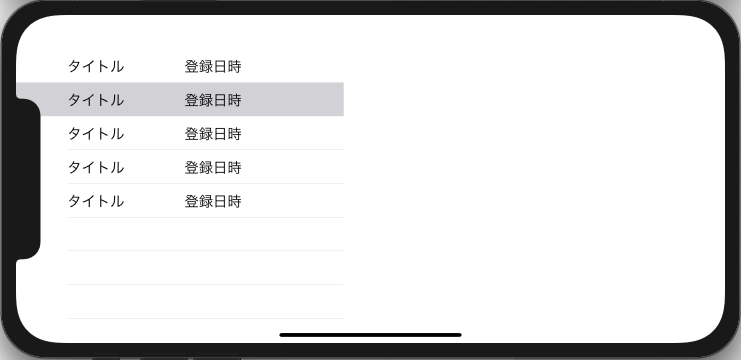

このような問題を解決する為、ロジカルに自動でUIパーツの位置や大きさを設定する為のオートレイアウトという機能が存在します。 
このオートレイアウト機能でUIパーツに対して様々な制約をつけることでアプリがどのような状況(横表示、機種の違い)で起動されても、見た目に一貫性を持たせることができます。 

## テーブルに制約をつける

まずは、TableViewに対して制約をつけていきますが、 
TableViewの表示領域をわかりやすくするため、背景色を設定しておきましょう。 

iPhoneの制約をつける上で気をつけなければならないのはiPhoneX以降の機種です。iPhoneX以降の機種はそれ以前の機種と比べて情報を表示できるスペースが異なります。 
(表示領域が丸角であり、カメラ部分で表示領域が削られているため。画像では緑で示した部分) 
そこでSafeAreaという長方形の領域を決めておくことで、iPhone8に合わせて表示していたアプリなども表示領域の違いによって要素が隠れてしまう問題を回避しました。 
TableViewはデフォルトでこのSafeArea内に表示されるようになっているのですが、今回は画面いっぱいにテーブルを表示するようにしたいので、その為の制約をつけていきます。 
StoryBoard上でCtrlキーを押しながら、TableViewからViewに対してドラッグします。 

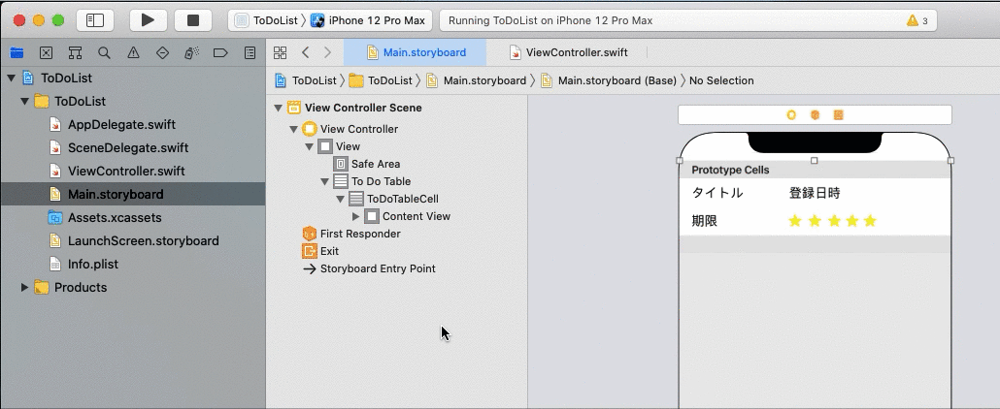

メニューが表示されるので、「Leading Space To SafeArea」を選択します。 
これはTableViewの左端とView中のSafeAreaの左端に対する制約で、この制約をつけると両者の間隔が設定した値に保たれます。(端を合わせたい場合は0を指定します。) 
制約がつくと、以下のようにユーティリティエリアに制約の項目が追加されます。 
また、StoryBoard上にもConstraintsが追加されます。

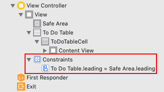

同じようにtop, bottom, trailingを設定していきます。 
 
全ての制約をつけ終えたら次にTableViewの制約の対象をSafeAreaからView本体に変更します。 
追加された制約をStroyBoard上で選択し、First ItemのSafe AreaをSuperViewに変更してください。さらに各制約でConstantを0に設定します。 
これで、画面いっぱいにTableViewが広がるようになるはずです。 

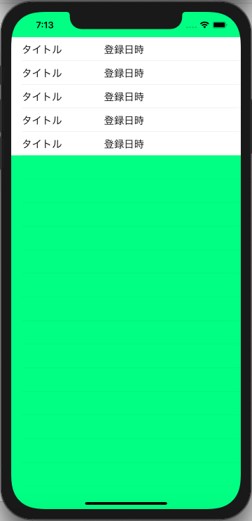

## テーブルセルに制約をつける

次にTableViceCellと各パーツに対して制約をつけていきます。 

#### 1. タイトルへの制約

- Height: 30
- Leading Space: Super View(ContentView) 20
- Top Space: Super View(Content View) 5
- Bottom Space: 期限, 10
- Align Center Y: 登録日時 ※ 登録日時の位置を調整

<!-- TODO: 画像を要修正 --> 

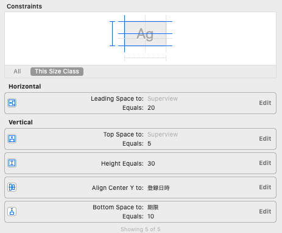

#### 2. 期限への制約

- Height: 30
- Align Leading: タイトル
- Align Center Y: Star(最初の1つのみ)
- Bottom Space: 10

<!-- TODO: 画像を要修正 --> 

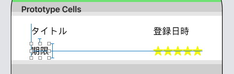

#### 3. 登録日時への制約

- Height: 30
- Trailing Space: Super View(ContentView) 20

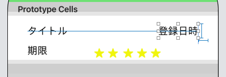

#### 4. 優先度への制約

- height: 20
- width: 20
- Align Trailing: 登録日時 (一番右側のImageのみ)
- Align Center: 期限 (一番左のImageのみ)
- Align Center: 一番左のImage (一番左のImage以外の4つ)
- 各優先度のImageの間隔: 0

※ 位置の調整を適宜行う

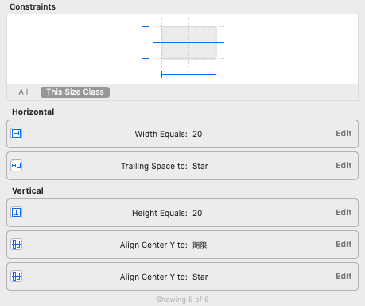

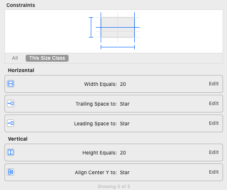

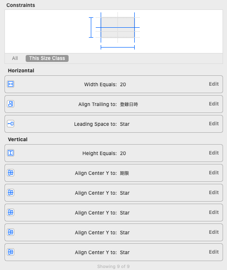

全ての制約をつけ終えて動作確認すると、正しくテーブルセルが表示されるはずです。 

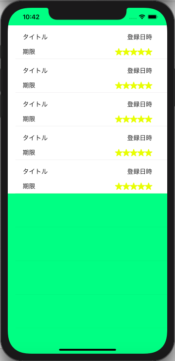

## ラベルの最大幅を指定する

最後に各ラベルの最大幅について制約を考えます。 
登録日時や期限については時刻を表示するため必要な幅は同じ大きさになると思われますが、タイトルは可変長であるため、必要な幅はそれぞれ異なります。 
したがって登録日時と期限には年月日を表示する分の固定幅を持たせ、タイトルは登録日時に被らない程度の長さとなるように制約をつけます。 

#### 1. 登録日時/期限への制約

- Width: 100
- ラベルのテキストに日付を設定

#### 2. タイトルへの制約

- Trailing Space: 登録日時, 10
- タイトルのテキストに長い文字列を設定

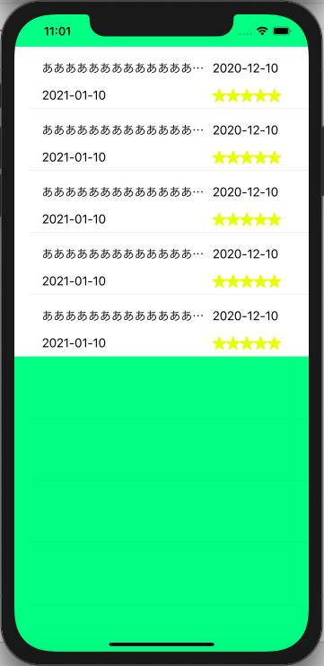

※はみ出る部分は...で置換されるようになります。 
