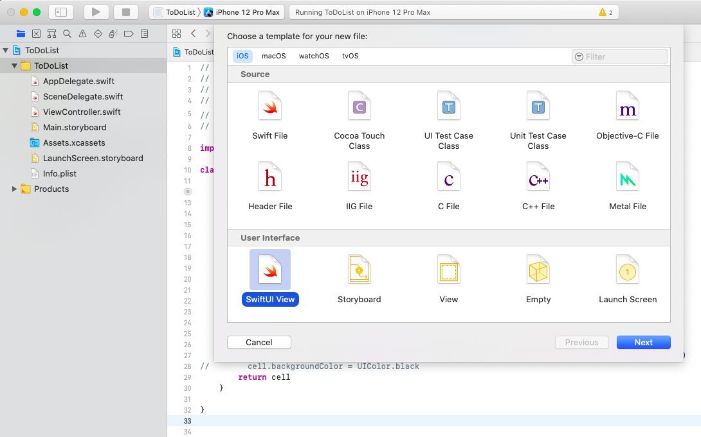

# ToDoデータの表示

セクション4まででToDoリストの見た目に関する部分は整いましたが、現在各テーブルセルに表示している情報はUIパーツに初期設定した値です。<br>
しかし、実際には、登録されているToDoの情報を表示していく必要があるため、アプリ上でToDoデータを取り扱う為の準備行なっていきます。<br>

## ToDoデータ

まず、アプリで扱うToDoデータはタイトル・登録日時といったデータの集合の想定ですが、<br>
アプリ独自の概念のため、Swift標準のデータには存在しません。<br>
このため、開発者自身が、ToDoデータとはタイトル・登録日時などのデータの集合であるということをアプリ上に新しく定義する必要があります。<br>
新しいデータ型を定義するためにSwiftでは<font color="red">Struct(構造体)</font>や<font color="red">Class(クラス)</font>といった機能を提供しています。<br>
これらは内部的なデータの取り扱いが異なるもののどちらもデータ集合をアプリ上に定義する目的で利用されます。[^1]<br>
今回はクラスを使ってToDoデータを定義します。ToDoListディレクトリ(フォルダ)の中にToDo.swiftを作成し、以下のように記述を行なってください。<br>
※　新しいswiftファイルの作成はディレクトリ(フォルダ)を右クリックし、*New File...*から行えます。<br>



```swift
// /ToDoList/ToDo.swift
import Foundation

class ToDo {

    var title: String = "" // タイトル
    var detail: String = "" // 詳細
    var priority: Int = 1 // 優先度
    var limitDate: Date = Date() // 期限
    var registrationDate: Date = Date() // 登録日

    init() {}

    init(_ title: String, _ detail: String, _ priority: Int, _ limitDate: Date, _ registrationDate: Date) {
        self.title = title
        self.detail = detail
        self.priority = priority
        self.limitDate = limitDate
        self.registrationDate = registrationDate
    }

}
```

定義したクラスの内容をみてみると、一行目で`class ToDo`として名前を定義し、<br>
{}内にToDoデータを構成するデータを変数として定義しています。(クラスに定義された変数を<font color="red">クラスフィールド</font>と呼びます。)<br>
変数定義では`: データ型名`とすることで、変数が何型のデータなのか制約を与えることができます。(何もつけなかった場合は代入したデータによって型を決定します。<font color="red">型推論</font>)<br>
また、新しく*Date*が出てきましたがこれは日付を表すデータ型で、`Date()`とすることで、現在の日付を変数に代入することができます。<br>
クラス定義はあくまでデータ集合の構造を定義するだけなので、実際に利用する場所でデータを生成する処理を記述する必要があります。<br>
データを生成する際に各フィールドの初期化を改めて行いたい場合に必要となるのが、<font color=" red">イニシャライザ</font>と呼ばれる特別な処理で、`init`で記述した部分がそれに相当します。<br>

## ToDoテーブルセル

ToDoデータの定義は完了したので、実際にToDoデータを生成してデータを表示したいところですが、もう一つ準備が必要です。<br>
セクション2では、UIパーツに値を設定するためにUIパーツとコードの紐付けを行いましたが、テーブルセル上に配置した各UIパーツとの紐付けは行なっていないため、このままでは値を設定できません。<br>
しかし、テーブルセルは可変個であり、一つ一つ紐づけを行なっていくことはできないため、コード上からテーブルセル上のUIパーツにアクセスするようにしますが、<br>
今のままでは、テーブルセルそのもののプロパティをいじることはできても、中に配置されたUIパーツに対してアクセスすることができません。<br>
そこで、Classの機能を利用し、StoryBoard上のテーブルセルが各UIパーツを保持することを定義します。<br>
ToDoListディレクトリ(フォルダ)の中にToDoTableCell.swiftを作成し、以下のように記述を行なってください。<br>

```swift
// /ToDoList/ToDoTableCell.swift

import UIKit

class ToDoTableCell: UITableViewCell {

}
```

さらに、Main.storyboardを開き、ToDoTableCellを選択します。<br>
ユーティリティエリアからCustom ClassをToDoTableCellに設定することで、テーブルセル上に配置したUIパーツをToDoTableCellクラスに対して紐づけることができるようになります。<br>
セクション2で行なったように、アシスタントエディタを開き、各UIパーツをクラスに紐づけると、最終的に以下のようなコードになります。<br>
(アシスタントエディタでToDoTableCell.swiftを開くためには、optionを押しながらファイル名をクリック)<br>
ここで、優先度の星マークはConnectionでOutlet Collectionを選択し、すべてのUIImageViewを同じ変数に紐付けます。<br>

```swift
// /ToDoList/ToDoTableCell.swift

import UIKit

class ToDoTableCell: UITableViewCell {

  @IBOutlet weak var titleLabel: UILabel!
  @IBOutlet weak var registrationDateLabel: UILabel!
  @IBOutlet weak var limitDateLabel: UILabel!
  @IBOutlet var priorityStars: [UIImageView]!

}
```

クラス定義ができたので、StoryBoard上のテーブルセルを取得している部分の記述を変更して取得したテーブルセルをこのクラスのデータとして扱うようにします。<br>
ViewController.swiftを開いて、以下のように修正を行なってください。<br>

```swift
// 省略

func tableView(_ tableView: UITableView, cellForRowAt indexPath: IndexPath) -> UITableViewCell {
  let cell = tableView.dequeueReusableCell(withIdentifier: "ToDoTableCell") as! ToDoTableCell // ?? TableViewCell　→　as! ToDoTableCellへ変更
  return cell
}

// 省略
```

`as! ToDoTableCell`は、StoryBoard上から取得したテーブルセルをToDoTableCellクラスのデータとして扱うという構文です。<br>
ここまでできると、テーブルセル上に配置した各UIパーツに対してアクセスできるようになります。<br>
試しに以下のようにコードを修正して、タイトルラベルに値を設定し、実行してみましょう。<br>

```swift
// 省略

func tableView(_ tableView: UITableView, cellForRowAt indexPath: IndexPath) -> UITableViewCell {
  let cell = tableView.dequeueReusableCell(withIdentifier: "ToDoTableCell") as! ToDoTableCell
  cell.titleLabel.text = "aaa"
  return cell
}

// 省略
```

## ToDoデータの表示

### 1. 1個のToDoデータの生成

最後にToDoデータを複数個生成し、各ToDoのデータを表示するようにコードを修正します。<br>
まずは、アプリ起動時に1つToDoを生成するように修正を行います。以下のようにViewController.swiftを修正してください。<br>

```swift
// 省略

var toDo: ToDo = ToDo() // 1.変数(フィールド)を追加

override func viewDidLoad() {
  super.viewDidLoad()
  toDoTable.delegate = self
  toDoTable.dataSource = self
  self.toDo.title = "テスト" // 2.ToDoのタイトルに文字列を設定
}

func tableView(_ tableView: UITableView, numberOfRowsInSection section: Int) -> Int {
  return 1 // 3.一つだけToDoを表示するので1を返却
}

func tableView(_ tableView: UITableView, cellForRowAt indexPath: IndexPath) -> UITableViewCell {
  let cell = tableView.dequeueReusableCell(withIdentifier: "ToDoTableCell") as! ToDoTableCell
  // 4.タイトルにToDoのタイトルの値を設定
  cell.titleLabel.text = self.toDo.title
  return cell
}

// 省略
```

まず、ToDoデータを格納する為の変数を用意します。<br>
ViewControllerもクラスなので、ViewControllerのフィールドとしてtoDoを定義します。<br>
ToDoデータの生成処理は、`ToDo()`で行うことができます。(クラス定義を元にデータを生成することをクラスの<font color="red">インスタンス化</font>と呼びます。)<br>
次に、タイトルの文字列の設定ですが、クラスインスタンスのフィールドへはUIパーツと同じように*.(ピリオド)*で繋げてアクセスします。<br>
ただし、クラス内部からクラスインスタンスのフィールドを参照するためには、*self*をつけてアクセスします。<br>
(実は省略可能ですが、フィールド以外の変数と区別するために、あえてつけるようにします。)<br>
また、viewDidLoad内に設定処理を記述していますが、このviewDidLoad内に記述した処理は、iPhoneに表示するToDoリストの画面の読み込みが完了した段階で実行されるため、<br>
4.でUIパーツに値を設定するよりも前のタイミングで、ToDoにタイトルを設定しています。<br>

### 2. 2個以上のToDoデータの生成

次に、複数のToDoデータを生成してみますが、同じ種類のデータを複数取り扱う際には<font color="red">Array(配列)</font>というデータ型を利用します。<br>
配列とは同じ型のデータを一つのまとまりとして扱うことができるデータ型で、内包するデータを番号で管理しますが、これによって表示順などを制御することができます。<br>
以下のように以下のようにViewController.swiftを修正してください。<br>

```swift
// 省略

var toDoList: [ToDo] = []// 1.var toDo: ToDo = ToDo()を削除し、こちらを代わりに定義

override func viewDidLoad() {
  super.viewDidLoad()
  toDoTable.delegate = self
  toDoTable.dataSource = self
  // Do any additional setup after loading the view.
  // 2.ToDoを3つ生成して配列へ追加する
  let toDo1 = ToDo()
  toDo1.title = "テスト1"
  let toDo2 = ToDo()
  toDo2.title = "テスト2"
  let toDo3 = ToDo()
  toDo3.title = "テスト3"
  self.toDoList.append(toDo1)
  self.toDoList.append(toDo2)
  self.toDoList.append(toDo3)
}

func tableView(_ tableView: UITableView, numberOfRowsInSection section: Int) -> Int {
  return self.toDoList.count // 3.テーブルに表示するテーブルセルの数を配列の長さ分にする。
}

func tableView(_ tableView: UITableView, cellForRowAt indexPath: IndexPath) -> UITableViewCell {
  let cell = tableView.dequeueReusableCell(withIdentifier: "ToDoTableCell") as! ToDoTableCell
  let toDo = self.toDoList[indexPath.row] // 4.配列からindexPath.row番目の要素を取得する。  
  cell.titleLabel.text = toDo.title // 5.UIパーツに値を設定
  return cell
}

// 省略
```

まず、配列の変数定義ですが、何も要素を持たない空配列は`変数: [配列の要素の型] = []`で行うことができます。<br>
次に、配列へ要素を追加するには配列の変数に続けて`append(追加したい要素)`とします。<br>
また、配列の要素数はcountを使ってアクセスできるので、3.ではテーブルに表示するセルの数は配列の要素数に合わせています。<br>
各要素には`変数名[番号]`でアクセスできますが、テーブルセルを返す処理の中では、indexPath.rowを使ってセルの番号が取得できるので、それを使って配列のToDoにアクセスします。<br>

##　タイトル以外のフィールドの表示

各ToDoの違いをわかりやすくするため、他のフィールドについても、ToDoのデータを表示するようにしてみましょう。<br>

### 1. 日付の表示

まずは日付ラベルについてです。<br>
UIパーツへの値の設定自体は前節の4.のタイミングで行なったように記述すれば可能ですが、<br>
ラベルはString型であるため、Date型からの変換処理が必要になります。<br>
ただし、変換処理がやや特殊であることと、今後の記述の簡略化のため、応用的な内容である<font color="red">Extension</font>という機能を利用します。<br>
(詳細は省きますが、Swiftがデフォルトで提供している機能を拡張する際に利用します。)<br>
ToDoListディレクトリの中にExtensions.swiftを作成し、以下をコピーしてください。<br>

```swift
// /ToDoList/Extensions.swift

import Foundation

extension Date {

    func toString(format: String) -> String {
        let dateFormatter = DateFormatter()
        dateFormatter.dateFormat = format
        return dateFormatter.string(from: self)
    }

    func toStrByAppDefStyle() -> String {
        return self.toString(format: "yyyy-MM-dd")
    }

}

extension String {

    func toDate(format: String) -> Date? {
        let dateFormatter = DateFormatter()
        dateFormatter.dateFormat = format
        return dateFormatter.date(from: self)
    }

    func toDateByAppDefStyle() -> Date? {
        return self.toDate(format: "yyyy-MM-dd")
    }

}
```

次にToDoの日付をラベルに表示するようにViewController.swiftを修正します。<br>

```swift
// 省略
override func viewDidLoad() {
  super.viewDidLoad()
  toDoTable.delegate = self
  toDoTable.dataSource = self
  // Do any additional setup after loading the view.
  let toDo1 = ToDo()
  toDo1.title = "テスト1"
  // 1.登録日と期限を設定
  toDo1.registrationDate = "2020/12/10".toDateByAppDefStyle() ?? Date()
  toDo1.limitDate = "2021/1/10".toDateByAppDefStyle() ?? Date()
  let toDo2 = ToDo()
  toDo2.title = "テスト2"
  toDo2.registrationDate = "2020/12/11".toDateByAppDefStyle() ?? Date()
  toDo2.limitDate = "2021/1/11".toDateByAppDefStyle() ?? Date()
  let toDo3 = ToDo()
  toDo3.title = "テスト3"
  toDo3.registrationDate = "2020/12/12".toDateByAppDefStyle() ?? Date()
  toDo3.limitDate = "2021/1/12".toDateByAppDefStyle() ?? Date()
  self.toDoList.append(toDo1)
  self.toDoList.append(toDo2)
  self.toDoList.append(toDo3)
}

// 省略

func tableView(_ tableView: UITableView, cellForRowAt indexPath: IndexPath) -> UITableViewCell {
  let cell = tableView.dequeueReusableCell(withIdentifier: "ToDoTableCell") as! ToDoTableCell
  let toDo = self.toDoList[indexPath.row]
  cell.titleLabel.text = toDo.title
  // 2.日付ラベルにToDoの日付データを文字列に変換した値を設定
  cell.registrationDateLabel.text = toDo.registrationDate.toStrByAppDefStyle()
  cell.limitDateLabel.text = toDo.limitDate.toStrByAppDefStyle()
  return cell
}

// 省略
```

### 2. 課題: 優先度の表示

最後に優先度を表示してみます。<br>
前準備として、StoryBoard上から全て星マークのHiddenプロパティに1を設定します。<br>
また、各ToDoに対して別々の優先度を設定しておきます。<br>
※優先度星マークの紐づけの順番に注意!!左右どちらかの端から順番に紐付けを行なっていないと、コードを正しく記述しても正しく動作しません。<br>

また、各ImageのHiddenにチェックをつけます。こうすることで、Imageがデフォルトで表示されなくなります。<br>
あとはこのHiddenを操作してpriorityに応じて画像を表示させるのですが、ここは練習としてご自分で処理を考えてみてください。<br>

- ヒント
 - for in文を使って考えてみましょう。
 - 紐づけたpriorityCellsは配列です。
 - HiddenプロパティはBool型(On, Off)で、tureを設定した時に非表示になり、falseを設定した時に表示されます。
 - isHiddenでHiddenプロパティを操作できます。

<!-- Annotations -->
[^1]:構造体は値型、クラスは参照型のデータ定義に使われます。
