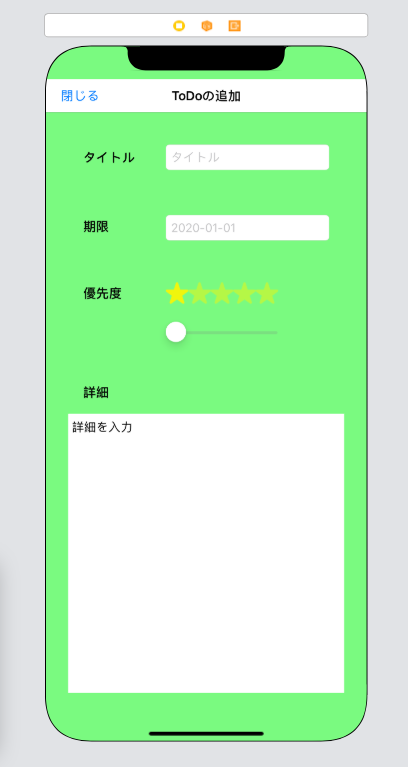
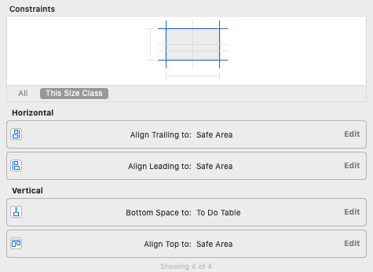
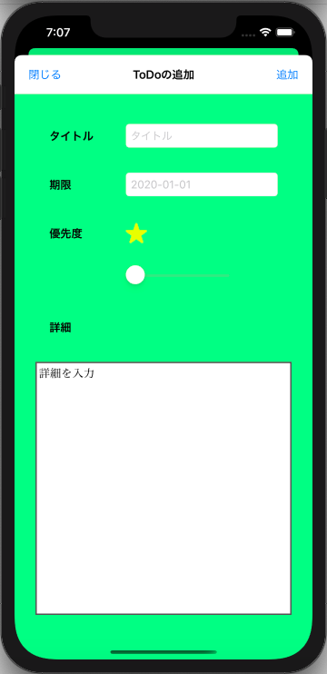

# ToDoデータの新規追加

セクション5ではコードの中でToDoを取り扱う方法を学びました。<br>
このセクションではユーザーから入力されたデータを用いてToDoを生成し、それを表示するところまで実装を進めます。<br>

## ToDo新規追加画面の作成

まず、ToDo新規作成作成用の画面を新しく作成します。<br>

### ViewControllerの配置

新しい画面を作るにはViewControllerを新しくMain.storyboardに追加します。<br>


### UIパーツを配置していく

以下のパーツを新しいViewControllerに配置していきます。(下図参考)<br>
- ナビゲーションバー: NavigationBar、Button
- タイトル: Label、TextField
- 期限: Label、TextFiled
- 優先度: Label、ImageView × 5、スライダー
- 詳細: Label、TextView


さらに制約をつけていきます。<br>

#### ナビゲーションバー

- NavigationBarのTranslucentのチェックを外す。
- Align Trailing: Safe Area
- Align Leading: Safe Area
- Align Top: Safe Area

#### タイトル(ラベル)

- 設定値: タイトル
- Width: 70
- Height: 20
- Top Spacing: ナビゲーションバー, 50
- Align Leading: Safe Area, 50

#### タイトル(テキストボックス)
 
- Placeholderに文字列を設定(タイトル)
- Align Center Y: タイトル(ラベル)
- Leading Space: タイトル(ラベル), 40
- Align Trailing: Safe Area, 50

#### 期限(ラベル)

- Width: 35 
- Height: 20
- Align Leading: タイトル(ラベル)

#### 期限(テキストボックス)

- Placeholderに日付を設定(2020-01-01)
- Align Center Y: 期限(ラベル)
- Align Leading: タイトル(テキストボックス)
- Align Trailing: タイトル(テキストボックス)

#### 優先度(ラベル)

- Width: 60 
- Height: 20
- Align Leading: 期限(ラベル)

#### 優先度(イメージ)

- 各イメージに星マークを設定
- 各イメージのHiddenにチェック ※ 一番左の優先度(イメージ)以外
- 各イメージの大きさ: 30 x 30
- Align Center Y: 優先度(ラベル) ※ 一番左の優先度(イメージ)のみ
- Align Center Y: 一番左の優先度(イメージ)のみ ※ 一番左の優先度(イメージ)以外
- Align Leading: 期限(テキストボックス) ※ 一番左の優先度(イメージ)のみ
- 各イメージの間隔: 0

#### 優先度(スライダー)

- Valueに1を設定
- Minimumに1を設定
- Maximumに5を設定
- Align Leading: 一番左の優先度(イメージ)
- Align Trailing: 一番右の優先度(イメージ)
- Top Space: 一番左の優先度(イメージ), 30

#### 詳細(ラベル)

- Width: 35 
- Height: 20
- Align Leading: 優先度(ラベル)

#### 詳細(テキストエリア)

- Textに文字列を設定(詳細を入力)
- Top Space: 詳細(ラベル), 40
- Align Leading: Safe Area, 30
- Align Trailing: Safe Area, 30
- Align Bottom: Safe Area, 30

#### その他

- Backgroundなどを指定して見た目を修正





#### AddToDoViewContorollerの作成

UIパーツの配置が完了したので、このViewControllerに対応するクラスを作成します。<br>
AddToDoViewController.swiftを作成し、以下のように編集します。<br>
(ここでファイル作成時に、Cocoa Toutch Classを選択すると以下の記述がデフォルトで挿入されます。)<br>

```swift
import UIKit

class AddToDoViewController: UIViewController {

    override func viewDidLoad() {
        super.viewDidLoad()
    }
}

```

ファイルができたら、配置したViewControllerのCustom ClassにAddToDoViewControllerを設定し、<br>
さらに他のUIパーツの紐づけを行います。最終的に以下のようなコードになります。<br>

```swift
import UIKit

class AddNewToDoViewController: UIViewController {

    @IBOutlet weak var titleTextField: UITextField! // タイトル入力用テキストフィールド
    @IBOutlet weak var limitDateTextField: UITextField! // 期限入力用テキストフィールド
    @IBOutlet var priorityStars: [UIImageView]! // 優先度の星マーク(配列)
    @IBOutlet weak var prioritySlider: UISlider! // 優先度設定用スライダー
    @IBOutlet weak var detailTextView: UITextView! // 詳細入力用テキストエリア
    @IBOutlet weak var backButton: UIBarButtonItem! // 戻るボタン

    override func viewDidLoad() {
        super.viewDidLoad()
    }

}
```

## 画面遷移を実装する

追加画面を作成したので、次にメイン画面からの画面遷移を実装します。<br>
画面遷移方法としては大きく分けて*プッシュ遷移*と*モーダル遷移*がありますが、<br>
プッシュ遷移はドリルダウン形式でどんどん深い情報を辿っていくようなUIに使われ、<br>
モーダル遷移はホップアップ形式で、現在の画面の前面に新しい画面が現れます。<br>
追加画面に関してはモーダル遷移が適切かと思われるので、こちらを使って画面遷移を実装していきます。<br>

### 追加画面の表示

まず、ViewControllerにNavigatonBarを配置します。この時、テーブルViewについているTopの制約を外し、新たにNavigationBarに制約をつけていきます。<br>
また、Backgroundなども指定して、見た目を整えておきましょう。<br>




NavigationBarが配置できたら、その中にボタンを配置します。<br>
また、System ItemをAddに設定します。<br>


パーツを配置し終えたら、StoryBoard上で画面遷移の設定を行います。<br>
以下のように配置したボタンをctrlを押しながら追加画面へ引っ張ってください。<br>
放すとメニューが出るので「PresentMordary」を選択します。(これで+ボタンを押すと追加画面が下から現れるようになります。)<br>


ここまでできたら、動作を確認してみましょう。+ボタンを押した時に下から追加画面が現れるようになるはずです。<br>
(画面遷移を表す線を<font color="red">セグエ(Segue)</font>と呼びます。)<br>

## 追加画面を閉じる

次に開いた画面を閉じる実装を行なっていきますが、<br>
モーダル遷移では画面を閉じる実装がやや面倒になります。<br>
まず、遷移元であるViewController.swfitに以下の記述を追加してください。<br>

```swift
// /ToDoList/ViewController.swift
// 省略

@IBAction func backToMain(for unwindSegue: UIStoryboardSegue, towards subsequentVC: UIViewController) {}

// 省略
```

このメソッドを定義することで、閉じるボタンからMain.storyboard上のAddToDoViewControllerのExitに対して紐付けを行えるようになります。<br>
ctrlを押しながら閉じるボタンをAddToDoViewControllerのExitに対して引っ張り、メニューから先ほどのメソッドを選びます。<br>


実行してみると、追加画面が閉じるようになります。<br>
(画面が戻る遷移を<font color="red">アンワインドセグエ(UnwindSegue)</font>と呼びます。)<br>

## ToDoの追加機能を実装する

追加画面の作成と画面遷移を実装できたので、あとは実際にToDoのデータを作成する機能を実装するだけです。<br>
まず、StoryBoard上で追加ボタンをAddToDoViewControllerに追加し、コードと紐付けを行います。<br>


```swift
// /ToDoList/AddToDoViewController.swift
// 省略

@IBOutlet weak var addButton: UIBarButtonItem! // 追加ボタン

// 省略
```

また、こちらも閉じるボタン同様にExitと紐付けを行なってください。<br>
次に画面の各UIパーツから値を受け取り、その各値を使ってToDoクラスのインスタンス化を行う処理を記述しますが、<br>
手順としてはそれぞれの画面遷移にIDを振り、画面遷移が発生した際に、画面遷移IDを判定して追加ボタンがトリガーとなる画面遷移だった場合にインスタンス化を行うという方法を使います。<br>
まずは、画面遷移(Segue)にIDを振っていきます。<br>
StoryBoardから追加ボタンのUnwindSegueのIdentifierにbackToMainByAddButtonを設定します。<br>
次に、画面上で画面遷移が発生するたびに呼び出されるprepareという関数を定義します。<br>
AddToDoViewController.swfitに以下の記述を追加してください。<br>

```swift
// /ToDoList/AddToDoViewController.swfit
// 省略

override func prepare(for segue: UIStoryboardSegue, sender: Any?) {
}

// 省略
```

この関数の中で、第一引数にSegueの情報が入ってくるので、この引数を使ってIDを判定します。<br>
prepare関数内を以下のように修正してください。<br>

```swift
// /ToDoList/AddToDoViewController.swfit
// 省略

override func prepare(for segue: UIStoryboardSegue, sender: Any?) {
    if let id = segue.identifier { // 1.オプショナルバインディング
        if (id == "backToMainByAddButton") { // 2.identifierの判定
            // 3.ToDoインスタンスの作成
            let toDo = ToDo()
            toDo.title = self.titleTextField.text ?? ""
            toDo.registrationDate = Date() // 当日の日付を取得
            toDo.limitDate = (self.limitDateTextField.text ?? "").toDateByAppDefStyle() ?? Date()
            toDo.priority = Int(self.prioritySlider.value) // スライダーの値は浮動小数点数のため、整数型に変換
            toDo.detail = self.detailTextView.text ?? ""
        }
    }
}

// 省略
```

segue.identifierはOptional<String>型なので、オプショナルバインディング(if let文)を利用し、idを判定した後、<br>
追加ボタンをトリガーとした遷移であれば、各プロパティの値を元にToDoのインスタンスを生成します。<br>
<br>
あとは、生成したToDoインスタンスはViewControllerに受け渡し、テーブルをリロードします。<br>
Segueはdestinationというプロパティも持っており、これを利用して遷移先のViewControllerにアクセス可能です。<br>
以下のようにprepare内を修正してください。<br>
※ ViewController側のToDo生成処理はあらかじめ削除しておいてください。<br>

```swift
// /ToDoList/AddToDoViewController.swfit
// 省略

override func prepare(for segue: UIStoryboardSegue, sender: Any?) {
    if let id = segue.identifier {
        if (id == "backToMainByAddButton") {
            // 1.segue.destination(遷移先)がViewControllerでToDoを作成
            if let vc = segue.destination as? ViewController {
                let toDo = ToDo()
                toDo.title = self.titleTextField.text ?? ""
                toDo.registrationDate = Date()
                toDo.limitDate = (self.limitDateTextField.text ?? "").toDateByAppDefStyle() ?? Date()
                toDo.priority = Int(self.prioritySlider.value)
                toDo.detail = self.detailTextView.text ?? ""
                vc.toDoList.append(toDo) // ViewControllerに持っているToDoの配列に生成したToDoを追加
                vc.toDoTable.reloadData()
            }
        }
    }
}

// 省略
```

ここまでできたら、動作確認を行なってみましょう。<br>
追加画面で作成したToDoが反映されるはずです。<br>

## 追加画面の改善

ひとまず、ToDoを新しく追加することができるようになりましたが、追加画面について、まだ不十分な点があるので、修正を行なっていきましょう。<br>

### 詳細TextViewの修正

簡単な手直しから始めましょう。<br>
現状の詳細TextViewは背景色との兼ね合いで編集領域かわかりづらくなることがあるため、borderを設定します。<br>
ただし、これらのプロパティはユーティリティエリアからは編集できないため、コードから設定します。<br>
以下のようにAddToDoViewController.swiftを修正してください。<br>

```swift
// /ToDoList/AddToDoViewController.swfit
// 省略

override func viewDidLoad() {
    super.viewDidLoad()
    // TextViewのBorder設定
    detailTextView.layer.borderColor = UIColor.darkGray.cgColor
    detailTextView.layer.borderWidth = 2
}

// 省略
```



### 課題: 優先度スライダーと星マークを連動させる

優先度スライダーと星マークを連動するようにします。<br>
まず、優先度スライダーが変更された場合に呼び出されるメソッドを定義し(Value Changedイベントに紐づくメソッド)、その中で星マークのisHiddenを操作します。<br>
少し難しいですが、ご自分で実装を行ってみてください。<br>

- ヒント
 - 全てのImageViewにHiddenを設定(OutletCollectionの紐づけも確認)
 - prioritySlider.maximumValueやprioritySlider.minimumValueでスライダーの最高値・最低値が取得できる。
 - 追加画面を開いた段階では星が表示されなくなるため、viewDidLoad内で表示させるようにしておく。

## ToDoデータの永続化

最後に追加したToDoデータの永続化について考えてみましょう。<br>
ここまでで作成したアプリでは、起動中は追加したデータを保持していますが、アプリを終了した場合に追加したToDoデータが消えてしまいます。<br>
アプリを終了しても、登録したデータを覚えておくようにアプリを修正してみましょう。<br>
<br>
データを永続化方法は複数存在しますが、今回は簡単のため、<font color="red">UserDefaults</font>を利用してToDoデータを永続化します。<br>
(本来、UserDefaultsはアプリの設定値などのデータを保存するために用意されているもので、今回のToDoデータなどのようにアプリのユーザーが作成するデータについては別の場所に保存します。(Documentsディレクトリ、 外部データベース))<br>
まずは、以下のようにToDo.swiftを修正してください。<br>

```swift
// /ToDoList/ToDo.swift
class ToDo: Codable { // : Codableを追記

// 省略
```

ToDoデータ(クラスインスタンス)をUserDefaultsに保存するためには、<font color="red">エンコード</font>と呼ばれる処理を行わなくてはなりません。<br>
エンコードではアプリ上で扱うデータ形式から保存するデータ形式への変換処理を記述する必要がありますが、<br>
クラス定義にCodableを追加することによって、その変換処理の記述を省略できます。<br>
次に、エンコード処理とUserDefaultsへの保存処理を記述します。以下のようにViewController.swift, AddToDoViewController.swiftを修正してください。<br>

```swift
// /ToDoList/ViewController.swift
// 省略

  // ToDoデータの保存処理
  func saveToDoList() {
    if let toDoListData = try? JSONEncoder().encode(self.toDoList) { // ToDoListのエンコード処理。Codableをつけたクラスの配列は自動的にエンコード処理が行われる。
        UserDefaults.standard.set(toDoListData, forKey: "ToDoList") // UserDefaultsへの保存処理
    }
  }

// 省略
```

```swift
// /ToDoList/AddToDoViewController.swift
// 省略

override func prepare(for segue: UIStoryboardSegue, sender: Any?) {
  if let id = segue.identifier {
    if (id == "backToMainByAddButton") {
      let toDo = ToDo()
      toDo.title = self.titleTextField.text ?? ""
      toDo.registrationDate = Date() // 当日の日付を取得
      toDo.limitDate = (self.limitDateTextField.text ?? "").toDateByAppDefStyle() ?? Date()
      toDo.priority = Int(self.prioritySlider.value) // スライダーの値は浮動小数点数のため、整数型に変換
      toDo.detail = self.detailTextView.text ?? ""
      if let vc = segue.destination as? ViewController {
        vc.toDoList.append(toDo)
        vc.saveToDoList() // 保存処理の呼び出し
        vc.toDoTable.reloadData()
      }
    }
  }
}

// 省略
```

これでToDoデータは永続化されましたが、アプリ起動時には保存してあるデータを読み込む必要があります。<br>
しかし、保存時と逆の変換処理が必要となるため、合わせて記述を行います。(<font color="red">デコード</font>)<br>
以下のようにViewController.swiftを修正してください。<br>

```swift
// /ToDoList/ViewController.swift
// 省略

override func viewDidLoad() {
  super.viewDidLoad()
  toDoTable.delegate = self
  toDoTable.dataSource = self
  self.loadToDoList() // 2. 読み込み処理の呼び出し
}

// 省略

// 1. 関数の記述
// ToDoデータの読み込み処理
func loadToDoList() {
  if let storedData = UserDefaults.standard.data(forKey: "ToDoList"),
   let decodedData = try? JSONDecoder().decode([ToDo].self, from: storedData) {
      self.toDoList = decodedData
  }
}

// 省略
```

ここまで記述できたら、動作確認を行なってみましょう。<br>
