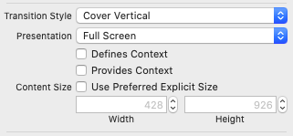

# ToDoデータの削除・編集

ToDoデータを削除・編集も実装を行なってみましょう。<br>

## ToDoデータの削除機能の実装

まず、ToDoデータの削除機能を実装していきます。<br>
削除方法としては、テーブルセルをスライドした時に削除ボタンが現れるようにします。<br>
以下のようにViewController.swiftを修正してください。<br>

```swift
// /ToDoList/ViewController.swift
func tableView(_ tableView: UITableView, commit editingStyle: UITableViewCell.EditingStyle, forRowAt indexPath: IndexPath) {
    self.toDoList.remove(at: indexPath.row) // 配列の要素削除
    self.saveToDoList()
    self.toDoTable.deleteRows(at: [indexPath], with: .fade) // テーブルの行削除
}
```


## ToDoデータの編集機能の実装

次にToDoデータの編集機能を実装します。<br>

### 編集画面への画面遷移の実装

まずは、StoryBoard上で追加画面と同じように編集画面を作成し、<br>
対応するコード(UpdateToDoViewController.swift)も作成してください。(内容はAddNewToDoViewControllerをそのままコピーすればよいですが、prepare関数の中身は全て削除し、フィールド名も調整します。)<br>
<br>
次に画面遷移の設定ですが、Segueは"Present Modally"を選択し、UpdateToDoViewController側のPresentationを"FullScreen"に設定します。<br>



この状態で実行すると、下から上に編集画面が表示されるようになります。<br>


このままでも良いのですが、セルをタップしたときは横から画面が表示されるのが自然な気がします。<br>
横からの遷移を実現するためには<font color="red">NavigationController</font>と呼ばれる、特殊なUIパーツを使用します。<br>
まず、ほかのUIパーツを配置する時のようにNavigationControllerをStoryBoard上に配置します。<br>
(この時、RootViewControllerも一緒に作成されるのでそちらは削除します。)<br>
<br>
配置し終えたら、NavigationControllerから、ViewControllerに向けてCtrlを押しながらドラッグ&ドロップし、root view controllerを選択します。<br>
また、StoryBoard上でNavigationControllerを選択し、ユーティリティエリアから以下を設定します。<br>

- Shows Navigation Barのチェックを外す
- is Initial View Controllerにチェックを入れる。


この状態で実行すると、横からに編集画面が表示されるようになります。<br>

### 選択されたToDoの情報をUIパーツへ反映

次に選択されたToDoの情報を編集画面へ受け渡し、その情報でUIパーツの値を初期化します。<br>
受け渡しは画面遷移時に行うため、prepareを使用しますが、下準備としてSegue, Unwind Segueに対してidentifierを設定しておきましょう。<br>

- メイン画面 → 編集画面: showUpdateToDo  
- 編集画面 → メイン画面(保存ボタン押下時): backToMainBySaveButton

設定できたら、UpdateToDoViewController.swift, ViewController.swiftに以下の記述を追加します。<br>

```swift
// /ToDoList/UpdateToDoViewController.swift
// 省略

var toDo: ToDo = ToDo() // 編集するToDoインスタンスの格納用変数

// 省略
```

```swift
// /ToDoList/ViewController.swift
// 省略

override func prepare(for segue: UIStoryboardSegue, sender: Any?) {
  if let id = segue.identifier {
    if(id == "showUpdateToDo") {
      if let vc = segue.destination as? UpdateToDoViewController,
         let indexPath = self.toDoTable.indexPathForSelectedRow // indexPathForSelectedRowで現在選択されているテーブルセルのindexPathを取得できる
      {
        // 選択されたToDoを取得して、編集画面のtoDo変数に設定
        let selectedToDo = self.toDoList[indexPath.row]
        self.toDoTable.deselectRow(at: indexPath, animated: true) // セルの選択を解除
        vc.toDo = selectedToDo
      }
    }
  }
}

// 省略
```

メイン画面から編集画面へのToDoの情報を受け渡せたので、UIパーツに初期値を設定します。<br>
UpdateToDoViewController.swiftに以下のように修正してください。<br>

```swift
// /ToDoList/ViewController.swift
// 省略

// 1. 画面が表示される直前に呼ばれる処理の中で、UIパーツの初期化処理を記述
override func viewWillAppear(_ animated: Bool) {
  super.viewWillAppear(animated)
  self.titleTextField.text! = toDo.title
  self.limitDateTextField.text! = toDo.limitDate.toStrByAppDefStyle()
  self.prioritySlider.value = Float(toDo.priority)
  self.detailTextView.text! = toDo.detail
  self.updatePriorityStars() // 3. 星マークアップデート処理の呼びだし
}

// 省略

@IBAction func onChangePrioritySlider(_ sender: Any) {
  self.updatePriorityStars() // 3. 星マークアップデート処理の呼びだし
}

// 省略

// 2.星マークのアップデート処理を切り出す
// 星マークのアップデート処理
func updatePriorityStars() {
  let priority = Int(self.prioritySlider.value)
  for i in 0..<5 {
    self.priorityStars[i].isHidden = i < priority ? false : true
  }
}

// 省略
```

### 課題: ToDoデータの更新処理

UpdateToDoViewController.swiftのprepareを修正して、ToDoデータにUIパーツの入力値を設定してください。<br>

- ヒント:
  - UpdateToDoViewControllerに定義したtoDo変数のプロパティにUIパーツの入力値を設定すれば、ToDoデータの更新が行えます。これはtoDoに設定したクラスインスタンスが参照型であるためです。


以上でToDoリストアプリは完成です。お疲れ様でした。<br>

## 改善点

今回作成したToDoリストアプリは一旦完成ですが、以下のような改善点が考えられます。<br>

- UI
  - 期限は手動で入力を行なっていますが、使い勝手や入力ミスを考えると、日付の入力はセレクトボックスにするのが良さそうです。
  - 追加したToDoはリストの一番下に表示されるため、ToDoが多くなってくると埋もれてしまいます。フィルタや並び替えができると便利そうです。

- コード
  - UpdateToDoViewController.swfitの星マーク更新処理は関数に切り出しましたが、メイン画面や新規追加画面でも同じ処理を行なっています。共通化できないでしょうか?(Extension, クラス継承など)

- 内部仕様
  - ユーザーが作成したToDoデータはUserDefaultsに保存していますが、実用性を考えると、別の場所に保存するべきです。(iOSないのDocumentsディレクトリ配下など)